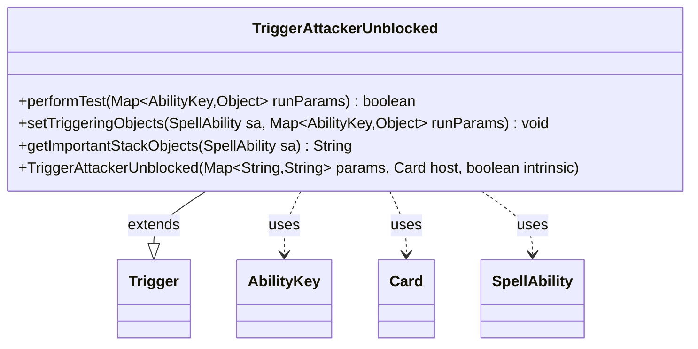

---
aliases:
  - TriggerAttackerUnblocked
tags:
  - java/class
  - module/forge-game
  - pkg/forge/game/trigger
fqn: forge.game.trigger.TriggerAttackerUnblocked
package: forge.game.trigger
module: forge-game
kind: Class
---

# TriggerAttackerUnblocked

**Package:** `forge.game.trigger` &nbsp; **Module:** `forge-game` &nbsp; **Kind:** Class



## Relationships
**Extends:**
- [[forge.game.trigger.Trigger|Trigger]]
**Uses:**
- [[forge.game.ability.AbilityKey|AbilityKey]]
- [[forge.game.card.Card|Card]]
- [[forge.game.spellability.SpellAbility|SpellAbility]]

## Design Description

TriggerAttackerUnblocked is a concrete trigger that fires when an attacking creature goes unblocked in combat. Extending the abstract Trigger base class, it specializes that framework for the "attacker unblocked" event by implementing the standard three hooks: performTest gates the trigger by validating the attacker (ValidCard) and defender (ValidDefender) against the trigger's parameters, setTriggeringObjects exposes the Attacker, Defender, and DefendingPlayer to the resulting SpellAbility, and getImportantStackObjects produces a localized stack description naming the attacker.

It collaborates with AbilityKey to address combat participants within the untyped runParams map, with Card as its host, and with SpellAbility as the effect populated when the trigger resolves. The design follows Forge's data-driven trigger pattern: behavior is configured through string params and delegated to inherited matching logic, keeping the subclass a thin, declarative mapping between a combat event and its triggering objects.

## Source
`forge-game/src/main/java/forge/game/trigger/TriggerAttackerUnblocked.java`

```java
/*
 * Forge: Play Magic: the Gathering.
 * Copyright (C) 2011  Forge Team
 *
 * This program is free software: you can redistribute it and/or modify
 * it under the terms of the GNU General Public License as published by
 * the Free Software Foundation, either version 3 of the License, or
 * (at your option) any later version.
 * 
 * This program is distributed in the hope that it will be useful,
 * but WITHOUT ANY WARRANTY; without even the implied warranty of
 * MERCHANTABILITY or FITNESS FOR A PARTICULAR PURPOSE.  See the
 * GNU General Public License for more details.
 * 
 * You should have received a copy of the GNU General Public License
 * along with this program.  If not, see <http://www.gnu.org/licenses/>.
 */
package forge.game.trigger;

import java.util.Map;

import forge.game.ability.AbilityKey;
import forge.game.card.Card;
import forge.game.spellability.SpellAbility;
import forge.util.Localizer;

/**
 * <p>
 * Trigger_AttackerUnblocked class.
 * </p>
 * 
 * @author Forge
 * @version $Id$
 */
public class TriggerAttackerUnblocked extends Trigger {

    /**
     * <p>
     * Constructor for Trigger_AttackerUnblocked.
     * </p>
     * 
     * @param params
     *            a {@link java.util.HashMap} object.
     * @param host
     *            a {@link forge.game.card.Card} object.
     * @param intrinsic
     *            the intrinsic
     */
    public TriggerAttackerUnblocked(final Map<String, String> params, final Card host, final boolean intrinsic) {
        super(params, host, intrinsic);
    }

    /** {@inheritDoc}
     * @param runParams*/
    @Override
    public final boolean performTest(final Map<AbilityKey, Object> runParams) {
        if (!matchesValidParam("ValidCard", runParams.get(AbilityKey.Attacker))) {
            return false;
        }
        if (!matchesValidParam("ValidDefender", runParams.get(AbilityKey.Defender))) {
            return false;
        }

        return true;
    }

    /** {@inheritDoc} */
    @Override
    public final void setTriggeringObjects(final SpellAbility sa, Map<AbilityKey, Object> runParams) {
        sa.setTriggeringObjectsFrom(runParams, AbilityKey.Attacker, AbilityKey.Defender, AbilityKey.DefendingPlayer);
    }

    @Override
    public String getImportantStackObjects(SpellAbility sa) {
        StringBuilder sb = new StringBuilder();
        sb.append(Localizer.getInstance().getMessage("lblAttacker")).append(": ").append(sa.getTriggeringObject(AbilityKey.Attacker));
        return sb.toString();
    }
}
```

## Python
`forge/game/trigger/TriggerAttackerUnblocked.py`

```python
from forge.game.trigger.Trigger import Trigger
from forge.game.ability.AbilityKey import AbilityKey
from forge.game.card.Card import Card
from forge.game.spellability.SpellAbility import SpellAbility
from forge.util.Localizer import Localizer


class TriggerAttackerUnblocked(Trigger):
    """
    Trigger_AttackerUnblocked class.

    @author Forge
    @version $Id$
    """

    def __init__(self, params: dict[str, str], host: Card, intrinsic: bool):
        super().__init__(params, host, intrinsic)

    def performTest(self, runParams: dict[AbilityKey, object]) -> bool:
        if not self.matchesValidParam("ValidCard", runParams.get(AbilityKey.Attacker)):
            return False
        if not self.matchesValidParam("ValidDefender", runParams.get(AbilityKey.Defender)):
            return False

        return True

    def setTriggeringObjects(self, sa: SpellAbility, runParams: dict[AbilityKey, object]) -> None:
        sa.setTriggeringObjectsFrom(runParams, AbilityKey.Attacker, AbilityKey.Defender, AbilityKey.DefendingPlayer)

    def getImportantStackObjects(self, sa: SpellAbility) -> str:
        sb = []
        sb.append(Localizer.getInstance().getMessage("lblAttacker"))
        sb.append(": ")
        sb.append(str(sa.getTriggeringObject(AbilityKey.Attacker)))
        return "".join(sb)
```
