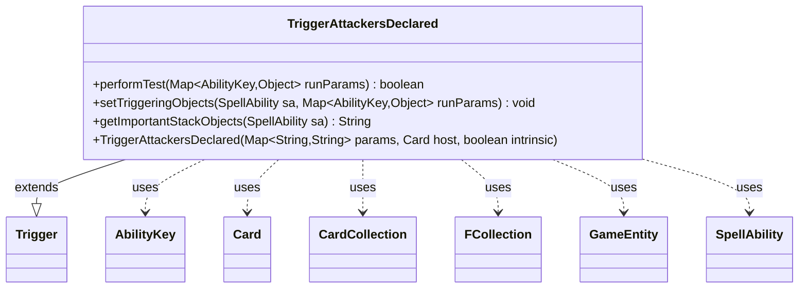

---
aliases:
  - TriggerAttackersDeclared
tags:
  - java/class
  - module/forge-game
  - pkg/forge/game/trigger
fqn: forge.game.trigger.TriggerAttackersDeclared
package: forge.game.trigger
module: forge-game
kind: Class
---

# TriggerAttackersDeclared

**Package:** `forge.game.trigger`   **Module:** `forge-game`   **Kind:** Class



## Relationships
**Extends:**
- [[forge.game.trigger.Trigger|Trigger]]
**Uses:**
- [[forge.game.GameEntity|GameEntity]]
- [[forge.game.ability.AbilityKey|AbilityKey]]
- [[forge.game.card.Card|Card]]
- [[forge.game.card.CardCollection|CardCollection]]
- [[forge.game.spellability.SpellAbility|SpellAbility]]
- [[forge.util.collect.FCollection|FCollection]]

## Design Description

TriggerAttackersDeclared is a concrete trigger that fires when attackers are declared in combat, allowing card abilities to respond to the attack step. As a subclass of Trigger, it implements the framework's template-method contract: performTest gates the trigger by validating the attacking player, the attacked target, and an optional count of valid attackers (using Expressions to compare against a configurable amount), while setTriggeringObjects populates the SpellAbility with the relevant attackers and their defenders for downstream resolution.

It collaborates with the combat system through GameEntity defenders—resolved per attacker via the game's Combat—and uses CardCollection and FCollection to filter and assemble those game objects. Filtering is keyed off declarative params ("ValidAttackers", "AttackedTarget") interpreted through AbilityKey lookups, reflecting Forge's data-driven design where trigger behavior is configured by card script parameters rather than hardcoded. getImportantStackObjects supplies a localized summary of the attacker count for UI display.

## Source
`forge-game/src/main/java/forge/game/trigger/TriggerAttackersDeclared.java`

```java
/*
 * Forge: Play Magic: the Gathering.
 * Copyright (C) 2011  Forge Team
 *
 * This program is free software: you can redistribute it and/or modify
 * it under the terms of the GNU General Public License as published by
 * the Free Software Foundation, either version 3 of the License, or
 * (at your option) any later version.
 * 
 * This program is distributed in the hope that it will be useful,
 * but WITHOUT ANY WARRANTY; without even the implied warranty of
 * MERCHANTABILITY or FITNESS FOR A PARTICULAR PURPOSE.  See the
 * GNU General Public License for more details.
 * 
 * You should have received a copy of the GNU General Public License
 * along with this program.  If not, see <http://www.gnu.org/licenses/>.
 */
package forge.game.trigger;

import java.util.*;

import forge.game.GameEntity;
import forge.game.GameObjectPredicates;
import forge.game.ability.AbilityKey;
import forge.game.ability.AbilityUtils;
import forge.game.card.Card;
import forge.game.card.CardCollection;
import forge.game.card.CardLists;
import forge.game.spellability.SpellAbility;
import forge.util.Expressions;
import forge.util.IterableUtil;
import forge.util.Localizer;
import forge.util.collect.FCollection;

/**
 * TODO Write javadoc for this type.
 * 
 */
public class TriggerAttackersDeclared extends Trigger {

    /**
     * Instantiates a new trigger_ attackers declared.
     * 
     * @param params
     *            the params
     * @param host
     *            the host
     * @param intrinsic
     *            the intrinsic
     */
    public TriggerAttackersDeclared(final Map<String, String> params, final Card host, final boolean intrinsic) {
        super(params, host, intrinsic);
    }

    /** {@inheritDoc}
     * @param runParams*/
    @Override
    public final boolean performTest(final Map<AbilityKey, Object> runParams) {
        if (!matchesValidParam("AttackingPlayer", runParams.get(AbilityKey.AttackingPlayer))) {
            return false;
        }
        if (!matchesValidParam("AttackedTarget", runParams.get(AbilityKey.AttackedTarget))) {
            return false;
        }
        if (hasParam("ValidAttackers")) {
            String param = getParamOrDefault("ValidAttackersAmount", "GE1");
            int attackers = CardLists.getValidCardCount((CardCollection) runParams.get(AbilityKey.Attackers), getParam("ValidAttackers"), getHostCard().getController(), getHostCard(), this);
            int amount = AbilityUtils.calculateAmount(getHostCard(), param.substring(2), this);
            if (!Expressions.compare(attackers, param, amount)) {
                return false;
            }
        }

        return true;
    }

    /** {@inheritDoc} */
    @Override
    public final void setTriggeringObjects(final SpellAbility sa, Map<AbilityKey, Object> runParams) {
        Iterable<GameEntity> attackedTarget = (Iterable<GameEntity>) runParams.get(AbilityKey.AttackedTarget);

        CardCollection attackers = (CardCollection) runParams.get(AbilityKey.Attackers);
        if (hasParam("ValidAttackers")) {
            attackers = CardLists.getValidCards(attackers, getParam("ValidAttackers"), getHostCard().getController(), getHostCard(), this);
            FCollection<GameEntity> defenders = new FCollection<>();
            for (Card attacker : attackers) {
                defenders.add(attacker.getGame().getCombat().getDefenderByAttacker(attacker));
            }
            attackedTarget = defenders;
        }
        sa.setTriggeringObject(AbilityKey.Attackers, attackers);

        if (hasParam("AttackedTarget")) {
            attackedTarget = IterableUtil.filter(attackedTarget, GameObjectPredicates.restriction(getParam("AttackedTarget").split(","), getHostCard().getController(), getHostCard(), this));
        }
        sa.setTriggeringObject(AbilityKey.AttackedTarget, attackedTarget);

        sa.setTriggeringObjectsFrom(runParams, AbilityKey.AttackingPlayer);
    }

    @Override
    public String getImportantStackObjects(SpellAbility sa) {
        StringBuilder sb = new StringBuilder();
        sb.append(Localizer.getInstance().getMessage("lblNumberAttackers")).append(": ").append(sa.getTriggeringObject(AbilityKey.Attackers));
        return sb.toString();
    }
}
```

## Python
`forge/game/trigger/TriggerAttackersDeclared.py`

```python
from forge.game.GameEntity import GameEntity
from forge.game.GameObjectPredicates import GameObjectPredicates
from forge.game.ability.AbilityKey import AbilityKey
from forge.game.ability.AbilityUtils import AbilityUtils
from forge.game.card.Card import Card
from forge.game.card.CardCollection import CardCollection
from forge.game.card.CardLists import CardLists
from forge.game.spellability.SpellAbility import SpellAbility
from forge.game.trigger.Trigger import Trigger
from forge.util.Expressions import Expressions
from forge.util.IterableUtil import IterableUtil
from forge.util.Localizer import Localizer
from forge.util.collect.FCollection import FCollection


# TODO Write javadoc for this type.
class TriggerAttackersDeclared(Trigger):
    """
    Instantiates a new trigger_ attackers declared.

    @param params
               the params
    @param host
               the host
    @param intrinsic
               the intrinsic
    """

    def __init__(self, params: dict[str, str], host: Card, intrinsic: bool):
        super().__init__(params, host, intrinsic)

    def performTest(self, runParams: dict[AbilityKey, object]) -> bool:
        if not self.matchesValidParam("AttackingPlayer", runParams.get(AbilityKey.AttackingPlayer)):
            return False
        if not self.matchesValidParam("AttackedTarget", runParams.get(AbilityKey.AttackedTarget)):
            return False
        if self.hasParam("ValidAttackers"):
            param = self.getParamOrDefault("ValidAttackersAmount", "GE1")
            attackers = CardLists.getValidCardCount(runParams.get(AbilityKey.Attackers), self.getParam("ValidAttackers"), self.getHostCard().getController(), self.getHostCard(), self)
            amount = AbilityUtils.calculateAmount(self.getHostCard(), param[2:], self)
            if not Expressions.compare(attackers, param, amount):
                return False

        return True

    def setTriggeringObjects(self, sa: SpellAbility, runParams: dict[AbilityKey, object]) -> None:
        attackedTarget = runParams.get(AbilityKey.AttackedTarget)

        attackers = runParams.get(AbilityKey.Attackers)
        if self.hasParam("ValidAttackers"):
            attackers = CardLists.getValidCards(attackers, self.getParam("ValidAttackers"), self.getHostCard().getController(), self.getHostCard(), self)
            defenders = FCollection()
            for attacker in attackers:
                defenders.add(attacker.getGame().getCombat().getDefenderByAttacker(attacker))
            attackedTarget = defenders
        sa.setTriggeringObject(AbilityKey.Attackers, attackers)

        if self.hasParam("AttackedTarget"):
            attackedTarget = IterableUtil.filter(attackedTarget, GameObjectPredicates.restriction(self.getParam("AttackedTarget").split(","), self.getHostCard().getController(), self.getHostCard(), self))
        sa.setTriggeringObject(AbilityKey.AttackedTarget, attackedTarget)

        sa.setTriggeringObjectsFrom(runParams, AbilityKey.AttackingPlayer)

    def getImportantStackObjects(self, sa: SpellAbility) -> str:
        sb = []
        sb.append(Localizer.getInstance().getMessage("lblNumberAttackers"))
        sb.append(": ")
        sb.append(str(sa.getTriggeringObject(AbilityKey.Attackers)))
        return "".join(sb)
```
