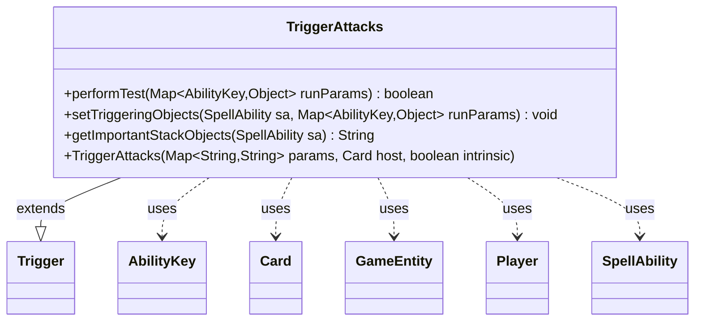

---
aliases:
  - TriggerAttacks
tags:
  - java/class
  - module/forge-game
  - pkg/forge/game/trigger
fqn: forge.game.trigger.TriggerAttacks
package: forge.game.trigger
module: forge-game
kind: Class
---

# TriggerAttacks

**Package:** `forge.game.trigger`   **Module:** `forge-game`   **Kind:** Class



## Relationships
**Extends:**
- [[forge.game.trigger.Trigger|Trigger]]
**Uses:**
- [[forge.game.GameEntity|GameEntity]]
- [[forge.game.ability.AbilityKey|AbilityKey]]
- [[forge.game.card.Card|Card]]
- [[forge.game.player.Player|Player]]
- [[forge.game.spellability.SpellAbility|SpellAbility]]

## Design Description

TriggerAttacks is a concrete trigger that fires when a creature is declared as an attacker, encapsulating the conditions under which an attack-based triggered ability should respond. Extending the abstract `Trigger` base class, it overrides `performTest` to evaluate optional restrictions—the attacker and defender validity, whether the creature attacked alone or among others, whether it is the first attack this turn, defending-player poison, and attacks spread across different players—returning whether the game-state run parameters satisfy the trigger. It collaborates with the engine through the `AbilityKey`-keyed `runParams` map, reading `Card`, `Player`, and `GameEntity` participants, and on success `setTriggeringObjects` binds the attacker, defenders, and defending player onto the resolving `SpellAbility`. The design keeps all matching logic declarative and parameter-driven, so combat trigger variants are expressed as data rather than subclasses, while `getImportantStackObjects` supplies a localized attacker label for stack display.

## Source
`forge-game/src/main/java/forge/game/trigger/TriggerAttacks.java`

```java
/*
 * Forge: Play Magic: the Gathering.
 * Copyright (C) 2011  Forge Team
 *
 * This program is free software: you can redistribute it and/or modify
 * it under the terms of the GNU General Public License as published by
 * the Free Software Foundation, either version 3 of the License, or
 * (at your option) any later version.
 * 
 * This program is distributed in the hope that it will be useful,
 * but WITHOUT ANY WARRANTY; without even the implied warranty of
 * MERCHANTABILITY or FITNESS FOR A PARTICULAR PURPOSE.  See the
 * GNU General Public License for more details.
 * 
 * You should have received a copy of the GNU General Public License
 * along with this program.  If not, see <http://www.gnu.org/licenses/>.
 */
package forge.game.trigger;

import java.util.List;
import java.util.Map;

import forge.game.GameEntity;
import forge.game.ability.AbilityKey;
import forge.game.card.Card;
import forge.game.player.Player;
import forge.game.spellability.SpellAbility;
import forge.util.Localizer;

/**
 * <p>
 * Trigger_Attacks class.
 * </p>
 * 
 * @author Forge
 * @version $Id$
 */
public class TriggerAttacks extends Trigger {

    /**
     * <p>
     * Constructor for Trigger_Attacks.
     * </p>
     * 
     * @param params
     *            a {@link java.util.HashMap} object.
     * @param host
     *            a {@link forge.game.card.Card} object.
     * @param intrinsic
     *            the intrinsic
     */
    public TriggerAttacks(final Map<String, String> params, final Card host, final boolean intrinsic) {
        super(params, host, intrinsic);
    }

    /** {@inheritDoc}
     * @param runParams*/
    @Override
    public final boolean performTest(final Map<AbilityKey, Object> runParams) {
        if (!matchesValidParam("ValidCard", runParams.get(AbilityKey.Attacker))) {
            return false;
        }

        if (!matchesValidParam("Attacked", runParams.get(AbilityKey.Attacked))) {
            return false;
        }

        if (hasParam("Alone")) {
            @SuppressWarnings("unchecked")
            final List<Card> otherAttackers = (List<Card>) runParams.get(AbilityKey.OtherAttackers);
            if (otherAttackers == null) {
                return false;
            }
            if (getParam("Alone").equals("True")) {
                if (otherAttackers.size() != 0) {
                    return false;
                }
            } else {
                if (otherAttackers.size() == 0) {
                    return false;
                }
            }
        }

        if (hasParam("FirstAttack")) {
            Card attacker = (Card) runParams.get(AbilityKey.Attacker);
            if (attacker.getDamageHistory().getCreatureAttacksThisTurn() > 1) {
                return false;
            }
        }

        if (hasParam("DefendingPlayerPoisoned")) {
            Player defendingPlayer = (Player) runParams.get(AbilityKey.DefendingPlayer);
        	if (defendingPlayer.getPoisonCounters() == 0) {
        		return false;
        	}
        }

        if (hasParam("AttackDifferentPlayers")) {
            GameEntity attacked = (GameEntity) runParams.get(AbilityKey.Attacked);
            boolean found = false;
            if (attacked instanceof Player) {
                @SuppressWarnings("unchecked")
                List<GameEntity> list = (List<GameEntity>) runParams.get(AbilityKey.Defenders);
                for (GameEntity e : list) {
                    if (e instanceof Player && !e.equals(attacked)) {
                        found = true;
                        break;
                    }
                }
            }
            if (!found) {
                return false;
            }
        }

        return true;
    }

    /** {@inheritDoc} */
    @Override
    public final void setTriggeringObjects(final SpellAbility sa, Map<AbilityKey, Object> runParams) {
        sa.setTriggeringObject(AbilityKey.Defender, runParams.get(AbilityKey.Attacked));
        sa.setTriggeringObjectsFrom(
            runParams,
            AbilityKey.Attacker,
            AbilityKey.Defenders,
            AbilityKey.DefendingPlayer
        );
    }

    @Override
    public String getImportantStackObjects(SpellAbility sa) {
        StringBuilder sb = new StringBuilder();

        sb.append(Localizer.getInstance().getMessage("lblAttacker")).append(": ").append(sa.getTriggeringObject(AbilityKey.Attacker));
        return sb.toString();
    }
}
```

## Python
`forge/game/trigger/TriggerAttacks.py`

```python
from forge.game.trigger.Trigger import Trigger
from forge.game.GameEntity import GameEntity
from forge.game.ability.AbilityKey import AbilityKey
from forge.game.card.Card import Card
from forge.game.player.Player import Player
from forge.game.spellability.SpellAbility import SpellAbility
from forge.util.Localizer import Localizer


class TriggerAttacks(Trigger):
    """
    Trigger_Attacks class.

    @author Forge
    @version $Id$
    """

    def __init__(self, params: dict[str, str], host: Card, intrinsic: bool):
        """
        Constructor for Trigger_Attacks.

        @param params a {@link java.util.HashMap} object.
        @param host a {@link forge.game.card.Card} object.
        @param intrinsic the intrinsic
        """
        super().__init__(params, host, intrinsic)

    def performTest(self, runParams: dict[AbilityKey, object]) -> bool:
        if not self.matchesValidParam("ValidCard", runParams.get(AbilityKey.Attacker)):
            return False

        if not self.matchesValidParam("Attacked", runParams.get(AbilityKey.Attacked)):
            return False

        if self.hasParam("Alone"):
            otherAttackers = runParams.get(AbilityKey.OtherAttackers)
            if otherAttackers is None:
                return False
            if self.getParam("Alone") == "True":
                if len(otherAttackers) != 0:
                    return False
            else:
                if len(otherAttackers) == 0:
                    return False

        if self.hasParam("FirstAttack"):
            attacker = runParams.get(AbilityKey.Attacker)
            if attacker.getDamageHistory().getCreatureAttacksThisTurn() > 1:
                return False

        if self.hasParam("DefendingPlayerPoisoned"):
            defendingPlayer = runParams.get(AbilityKey.DefendingPlayer)
            if defendingPlayer.getPoisonCounters() == 0:
                return False

        if self.hasParam("AttackDifferentPlayers"):
            attacked = runParams.get(AbilityKey.Attacked)
            found = False
            if isinstance(attacked, Player):
                list = runParams.get(AbilityKey.Defenders)
                for e in list:
                    if isinstance(e, Player) and not e.equals(attacked):
                        found = True
                        break
            if not found:
                return False

        return True

    def setTriggeringObjects(self, sa: SpellAbility, runParams: dict[AbilityKey, object]) -> None:
        sa.setTriggeringObject(AbilityKey.Defender, runParams.get(AbilityKey.Attacked))
        sa.setTriggeringObjectsFrom(
            runParams,
            AbilityKey.Attacker,
            AbilityKey.Defenders,
            AbilityKey.DefendingPlayer
        )

    def getImportantStackObjects(self, sa: SpellAbility) -> str:
        sb = []

        sb.append(Localizer.getInstance().getMessage("lblAttacker"))
        sb.append(": ")
        sb.append(str(sa.getTriggeringObject(AbilityKey.Attacker)))
        return "".join(sb)
```
