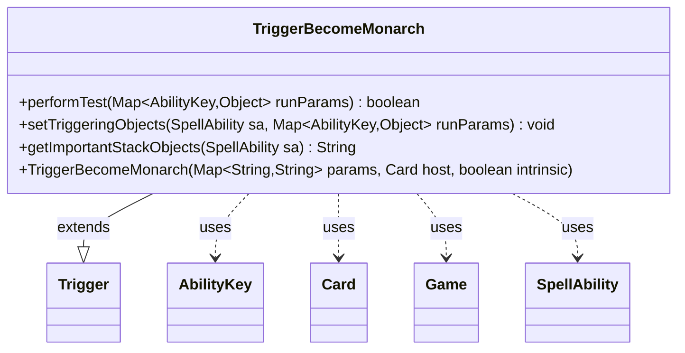

---
aliases:
  - TriggerBecomeMonarch
tags:
  - java/class
  - module/forge-game
  - pkg/forge/game/trigger
fqn: forge.game.trigger.TriggerBecomeMonarch
package: forge.game.trigger
module: forge-game
kind: Class
---

# TriggerBecomeMonarch

**Package:** `forge.game.trigger` &nbsp; **Module:** `forge-game` &nbsp; **Kind:** Class



## Relationships
**Extends:**
- [[forge.game.trigger.Trigger|Trigger]]
**Uses:**
- [[forge.game.Game|Game]]
- [[forge.game.ability.AbilityKey|AbilityKey]]
- [[forge.game.card.Card|Card]]
- [[forge.game.spellability.SpellAbility|SpellAbility]]

## Design Description

The class represents a Magic: The Gathering trigger that fires when a player becomes the monarch. It extends `Trigger`, supplying the abstract behavior the engine's trigger framework requires: `performTest` evaluates whether a monarch-change event satisfies the trigger's restrictions, while `setTriggeringObjects` and `getImportantStackObjects` bind and describe the affected player when the trigger resolves on the stack.

Filtering is delegated to the inherited `matchesValidParam` helper, checking the new monarch against the `ValidPlayer` parameter and the optional `BeginTurn` condition obtained from `Game`. Collaborating with `Card` (the host), `Game` (monarch state), `SpellAbility`, and `AbilityKey` (the typed run-parameter keys), the class keeps its logic minimal and data-driven, deriving all behavior from the script-supplied parameter map rather than hardcoded rules. Player-facing text is localized via `Localizer`.

## Source
`forge-game/src/main/java/forge/game/trigger/TriggerBecomeMonarch.java`

```java
package forge.game.trigger;

import java.util.Map;

import forge.game.Game;
import forge.game.ability.AbilityKey;
import forge.game.card.Card;
import forge.game.spellability.SpellAbility;
import forge.util.Localizer;

public class TriggerBecomeMonarch extends Trigger {

    public TriggerBecomeMonarch(Map<String, String> params, Card host, boolean intrinsic) {
        super(params, host, intrinsic);
    }

    @Override
    public boolean performTest(Map<AbilityKey, Object> runParams) {
        final Card host = getHostCard();
        final Game game = host.getGame();

        if (!matchesValidParam("ValidPlayer", runParams.get(AbilityKey.Player))) {
            return false;
        }
        if (!matchesValidParam("BeginTurn", game.getMonarchBeginTurn())) {
            return false;
        }
        return true;
    }

    /** {@inheritDoc} */
    @Override
    public final void setTriggeringObjects(final SpellAbility sa, Map<AbilityKey, Object> runParams) {
        sa.setTriggeringObjectsFrom(runParams, AbilityKey.Player);
    }

    @Override
    public String getImportantStackObjects(SpellAbility sa) {
        StringBuilder sb = new StringBuilder();
        sb.append(Localizer.getInstance().getMessage("lblPlayer")).append(": ").append(sa.getTriggeringObject(AbilityKey.Player)).append(", ");
        return sb.toString();
    }
}
```

## Python
`forge/game/trigger/TriggerBecomeMonarch.py`

```python
from forge.game.Game import Game
from forge.game.ability.AbilityKey import AbilityKey
from forge.game.card.Card import Card
from forge.game.spellability.SpellAbility import SpellAbility
from forge.game.trigger.Trigger import Trigger
from forge.util.Localizer import Localizer


class TriggerBecomeMonarch(Trigger):

    def __init__(self, params: dict[str, str], host: Card, intrinsic: bool):
        super().__init__(params, host, intrinsic)

    def performTest(self, runParams: dict[AbilityKey, object]) -> bool:
        host = self.getHostCard()
        game = host.getGame()

        if not self.matchesValidParam("ValidPlayer", runParams.get(AbilityKey.Player)):
            return False
        if not self.matchesValidParam("BeginTurn", game.getMonarchBeginTurn()):
            return False
        return True

    def setTriggeringObjects(self, sa: SpellAbility, runParams: dict[AbilityKey, object]) -> None:
        sa.setTriggeringObjectsFrom(runParams, AbilityKey.Player)

    def getImportantStackObjects(self, sa: SpellAbility) -> str:
        sb = []
        sb.append(Localizer.getInstance().getMessage("lblPlayer"))
        sb.append(": ")
        sb.append(str(sa.getTriggeringObject(AbilityKey.Player)))
        sb.append(", ")
        return "".join(sb)
```
