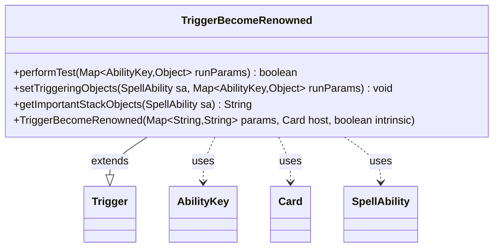

---
aliases:
  - TriggerBecomeRenowned
tags:
  - java/class
  - module/forge-game
  - pkg/forge/game/trigger
fqn: forge.game.trigger.TriggerBecomeRenowned
package: forge.game.trigger
module: forge-game
kind: Class
---

# TriggerBecomeRenowned

**Package:** `forge.game.trigger` &nbsp; **Module:** `forge-game` &nbsp; **Kind:** Class



## Relationships
**Extends:**
- [[forge.game.trigger.Trigger|Trigger]]
**Uses:**
- [[forge.game.ability.AbilityKey|AbilityKey]]
- [[forge.game.card.Card|Card]]
- [[forge.game.spellability.SpellAbility|SpellAbility]]

## Design Description

Renowned is a card that becomes renowned when it deals combat damage to a player.

TriggerBecomeRenowned is a concrete trigger that fires when a creature becomes renowned. Extending the abstract `Trigger` base class, it specializes the generic trigger machinery for this single event type. Its `performTest` filters firings against the optional `ValidCard` restriction by examining the `AbilityKey.Card` entry in the run-parameter map, while `setTriggeringObjects` forwards that card into the resolving `SpellAbility` so downstream effects can reference it. `getImportantStackObjects` produces a localized, human-readable stack summary naming the renowned card. The design follows the engine's data-driven trigger pattern: behavior is configured through the `params` map passed to the superclass constructor, and the class collaborates with `AbilityKey`, `Card`, and `SpellAbility` purely to route the triggering creature through Forge's shared event-resolution pipeline.

## Source
`forge-game/src/main/java/forge/game/trigger/TriggerBecomeRenowned.java`

```java
/*
 * Forge: Play Magic: the Gathering.
 * Copyright (C) 2011  Forge Team
 *
 * This program is free software: you can redistribute it and/or modify
 * it under the terms of the GNU General Public License as published by
 * the Free Software Foundation, either version 3 of the License, or
 * (at your option) any later version.
 * 
 * This program is distributed in the hope that it will be useful,
 * but WITHOUT ANY WARRANTY; without even the implied warranty of
 * MERCHANTABILITY or FITNESS FOR A PARTICULAR PURPOSE.  See the
 * GNU General Public License for more details.
 * 
 * You should have received a copy of the GNU General Public License
 * along with this program.  If not, see <http://www.gnu.org/licenses/>.
 */
package forge.game.trigger;

import java.util.Map;

import forge.game.ability.AbilityKey;
import forge.game.card.Card;
import forge.game.spellability.SpellAbility;
import forge.util.Localizer;

/**
 * <p>
 * Trigger_BecomeRenowned class.
 * </p>
 * 
 * @author Forge
 * @version $Id: TriggerBecomeRenowned.java 21543 2013-05-19 21:35:20Z Max mtg $
 */
public class TriggerBecomeRenowned extends Trigger {

    /**
     * <p>
     * Constructor for Trigger_BecomeRenowned.
     * </p>
     * 
     * @param params
     *            a {@link java.util.HashMap} object.
     * @param host
     *            a {@link forge.game.card.Card} object.
     * @param intrinsic
     *            the intrinsic
     */
    public TriggerBecomeRenowned(final Map<String, String> params, final Card host, final boolean intrinsic) {
        super(params, host, intrinsic);
    }

    /** {@inheritDoc}
     * @param runParams*/
    @Override
    public final boolean performTest(final Map<AbilityKey, Object> runParams) {
        if (!matchesValidParam("ValidCard", runParams.get(AbilityKey.Card))) {
            return false;
        }

        return true;
    }

    /** {@inheritDoc} */
    @Override
    public final void setTriggeringObjects(final SpellAbility sa, Map<AbilityKey, Object> runParams) {
        sa.setTriggeringObjectsFrom(runParams, AbilityKey.Card);
    }

    @Override
    public String getImportantStackObjects(SpellAbility sa) {
        StringBuilder sb = new StringBuilder();
        sb.append(Localizer.getInstance().getMessage("lblRenowned")).append(": ").append(sa.getTriggeringObject(AbilityKey.Card));
        return sb.toString();
    }
}
```

## Python
`forge/game/trigger/TriggerBecomeRenowned.py`

```python
package forge.game.trigger

from typing import Optional

from forge.game.trigger.Trigger import Trigger
from forge.game.ability.AbilityKey import AbilityKey
from forge.game.card.Card import Card
from forge.game.spellability.SpellAbility import SpellAbility
from forge.util.Localizer import Localizer


class TriggerBecomeRenowned(Trigger):
    """
    Trigger_BecomeRenowned class.

    @author Forge
    @version $Id: TriggerBecomeRenowned.java 21543 2013-05-19 21:35:20Z Max mtg $
    """

    def __init__(self, params: dict[str, str], host: Card, intrinsic: bool):
        """
        Constructor for Trigger_BecomeRenowned.

        :param params: a dict object.
        :param host: a Card object.
        :param intrinsic: the intrinsic
        """
        super().__init__(params, host, intrinsic)

    def performTest(self, runParams: dict[AbilityKey, object]) -> bool:
        if not self.matchesValidParam("ValidCard", runParams.get(AbilityKey.Card)):
            return False

        return True

    def setTriggeringObjects(self, sa: SpellAbility, runParams: dict[AbilityKey, object]) -> None:
        sa.setTriggeringObjectsFrom(runParams, AbilityKey.Card)

    def getImportantStackObjects(self, sa: SpellAbility) -> str:
        sb = []
        sb.append(Localizer.getInstance().getMessage("lblRenowned"))
        sb.append(": ")
        sb.append(str(sa.getTriggeringObject(AbilityKey.Card)))
        return "".join(sb)
```
