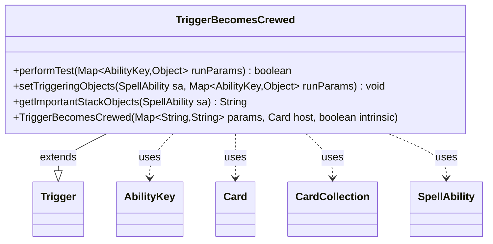

---
aliases:
  - TriggerBecomesCrewed
tags:
  - java/class
  - module/forge-game
  - pkg/forge/game/trigger
fqn: forge.game.trigger.TriggerBecomesCrewed
package: forge.game.trigger
module: forge-game
kind: Class
---

# TriggerBecomesCrewed

**Package:** `forge.game.trigger` &nbsp; **Module:** `forge-game` &nbsp; **Kind:** Class



## Relationships
**Extends:**
- [[forge.game.trigger.Trigger|Trigger]]
**Uses:**
- [[forge.game.ability.AbilityKey|AbilityKey]]
- [[forge.game.card.Card|Card]]
- [[forge.game.card.CardCollection|CardCollection]]
- [[forge.game.spellability.SpellAbility|SpellAbility]]

## Source
`forge-game/src/main/java/forge/game/trigger/TriggerBecomesCrewed.java`

```java
package forge.game.trigger;

import java.util.Map;

import forge.game.ability.AbilityKey;
import forge.game.ability.AbilityUtils;
import forge.game.card.Card;
import forge.game.card.CardCollection;
import forge.game.spellability.SpellAbility;
import forge.util.Localizer;

public class TriggerBecomesCrewed extends Trigger {

    public TriggerBecomesCrewed(final Map<String, String> params, final Card host, final boolean intrinsic) {
        super(params, host, intrinsic);
    }

    @Override
    public boolean performTest(Map<AbilityKey, Object> runParams) {
        if (!matchesValidParam("ValidCard", runParams.get(AbilityKey.Card))) {
            return false;
        }
        if (!matchesValidParam("ValidCrew", runParams.get(AbilityKey.Crew))) {
            return false;
        }
        if (hasParam("FirstTimeCrewed")) {
            Card v = (Card) runParams.get(AbilityKey.Card);
            if (v.getTimesCrewedThisTurn() != 1) {
                return false;
            }
        }
        if (hasParam("ValidCrewAmount")) {
            Card v = (Card) runParams.get(AbilityKey.Card);
            CardCollection crews = (CardCollection) runParams.get(AbilityKey.Crew);
            if (crews == null) {
                return false;
            }
            int amount = AbilityUtils.calculateAmount(v, getParam("ValidCrewAmount"), null);
            if (amount != crews.size()) {
                return false;
            }
        }
        return true;
    }

    @Override
    public void setTriggeringObjects(SpellAbility sa, Map<AbilityKey, Object> runParams) {
        sa.setTriggeringObjectsFrom(runParams, AbilityKey.Card, AbilityKey.Crew);
    }

    @Override
    public String getImportantStackObjects(SpellAbility sa) {
        StringBuilder sb = new StringBuilder();
        sb.append(Localizer.getInstance().getMessage("lblVehicle")).append(": ").append(sa.getTriggeringObject(AbilityKey.Card));
        sb.append("  ");
        sb.append(Localizer.getInstance().getMessage("lblCrew")).append(": ").append(sa.getTriggeringObject(AbilityKey.Crew));
        return sb.toString();
    }
}
```
