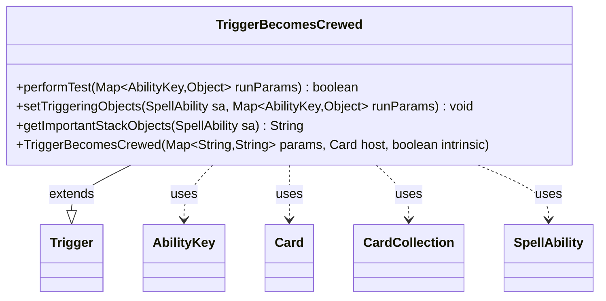

---
aliases:
  - TriggerBecomesCrewed
tags:
  - java/class
  - module/forge-game
  - pkg/forge/game/trigger
fqn: forge.game.trigger.TriggerBecomesCrewed
package: forge.game.trigger
module: forge-game
kind: Class
---

# TriggerBecomesCrewed

**Package:** `forge.game.trigger`   **Module:** `forge-game`   **Kind:** Class



## Relationships
**Extends:**
- [[forge.game.trigger.Trigger|Trigger]]
**Uses:**
- [[forge.game.ability.AbilityKey|AbilityKey]]
- [[forge.game.card.Card|Card]]
- [[forge.game.card.CardCollection|CardCollection]]
- [[forge.game.spellability.SpellAbility|SpellAbility]]

## Design Description

TriggerBecomesCrewed is a concrete trigger that fires when a Vehicle becomes crewed, encapsulating the matching logic that decides whether a crew event satisfies a card's triggered ability. Extending the abstract Trigger base class, it overrides performTest to filter events against optional parameters—ValidCard, ValidCrew, FirstTimeCrewed, and a computed ValidCrewAmount—returning false as soon as any constraint fails. It collaborates with AbilityKey to read the triggering Card and Crew from the run parameters, uses CardCollection to inspect the crewing creatures, and AbilityUtils to resolve dynamic amounts. setTriggeringObjects binds those objects onto the SpellAbility, while getImportantStackObjects produces a localized stack description. The design follows Forge's data-driven trigger pattern: behavior is configured through string parameters rather than subclass-specific fields, keeping the class a focused, declarative condition-checker.

## Source
`forge-game/src/main/java/forge/game/trigger/TriggerBecomesCrewed.java`

```java
package forge.game.trigger;

import java.util.Map;

import forge.game.ability.AbilityKey;
import forge.game.ability.AbilityUtils;
import forge.game.card.Card;
import forge.game.card.CardCollection;
import forge.game.spellability.SpellAbility;
import forge.util.Localizer;

public class TriggerBecomesCrewed extends Trigger {

    public TriggerBecomesCrewed(final Map<String, String> params, final Card host, final boolean intrinsic) {
        super(params, host, intrinsic);
    }

    @Override
    public boolean performTest(Map<AbilityKey, Object> runParams) {
        if (!matchesValidParam("ValidCard", runParams.get(AbilityKey.Card))) {
            return false;
        }
        if (!matchesValidParam("ValidCrew", runParams.get(AbilityKey.Crew))) {
            return false;
        }
        if (hasParam("FirstTimeCrewed")) {
            Card v = (Card) runParams.get(AbilityKey.Card);
            if (v.getTimesCrewedThisTurn() != 1) {
                return false;
            }
        }
        if (hasParam("ValidCrewAmount")) {
            Card v = (Card) runParams.get(AbilityKey.Card);
            CardCollection crews = (CardCollection) runParams.get(AbilityKey.Crew);
            if (crews == null) {
                return false;
            }
            int amount = AbilityUtils.calculateAmount(v, getParam("ValidCrewAmount"), null);
            if (amount != crews.size()) {
                return false;
            }
        }
        return true;
    }

    @Override
    public void setTriggeringObjects(SpellAbility sa, Map<AbilityKey, Object> runParams) {
        sa.setTriggeringObjectsFrom(runParams, AbilityKey.Card, AbilityKey.Crew);
    }

    @Override
    public String getImportantStackObjects(SpellAbility sa) {
        StringBuilder sb = new StringBuilder();
        sb.append(Localizer.getInstance().getMessage("lblVehicle")).append(": ").append(sa.getTriggeringObject(AbilityKey.Card));
        sb.append("  ");
        sb.append(Localizer.getInstance().getMessage("lblCrew")).append(": ").append(sa.getTriggeringObject(AbilityKey.Crew));
        return sb.toString();
    }
}
```

## Python
`forge/game/trigger/TriggerBecomesCrewed.py`

```python
from forge.game.ability.AbilityKey import AbilityKey
from forge.game.ability.AbilityUtils import AbilityUtils
from forge.game.card.Card import Card
from forge.game.card.CardCollection import CardCollection
from forge.game.spellability.SpellAbility import SpellAbility
from forge.util.Localizer import Localizer

from forge.game.trigger.Trigger import Trigger


class TriggerBecomesCrewed(Trigger):

    def __init__(self, params: dict[str, str], host: Card, intrinsic: bool):
        super().__init__(params, host, intrinsic)

    def performTest(self, runParams: dict[AbilityKey, object]) -> bool:
        if not self.matchesValidParam("ValidCard", runParams.get(AbilityKey.Card)):
            return False
        if not self.matchesValidParam("ValidCrew", runParams.get(AbilityKey.Crew)):
            return False
        if self.hasParam("FirstTimeCrewed"):
            v = runParams.get(AbilityKey.Card)
            if v.getTimesCrewedThisTurn() != 1:
                return False
        if self.hasParam("ValidCrewAmount"):
            v = runParams.get(AbilityKey.Card)
            crews = runParams.get(AbilityKey.Crew)
            if crews is None:
                return False
            amount = AbilityUtils.calculateAmount(v, self.getParam("ValidCrewAmount"), None)
            if amount != crews.size():
                return False
        return True

    def setTriggeringObjects(self, sa: SpellAbility, runParams: dict[AbilityKey, object]) -> None:
        sa.setTriggeringObjectsFrom(runParams, AbilityKey.Card, AbilityKey.Crew)

    def getImportantStackObjects(self, sa: SpellAbility) -> str:
        sb = []
        sb.append(Localizer.getInstance().getMessage("lblVehicle"))
        sb.append(": ")
        sb.append(str(sa.getTriggeringObject(AbilityKey.Card)))
        sb.append("  ")
        sb.append(Localizer.getInstance().getMessage("lblCrew"))
        sb.append(": ")
        sb.append(str(sa.getTriggeringObject(AbilityKey.Crew)))
        return "".join(sb)
```
