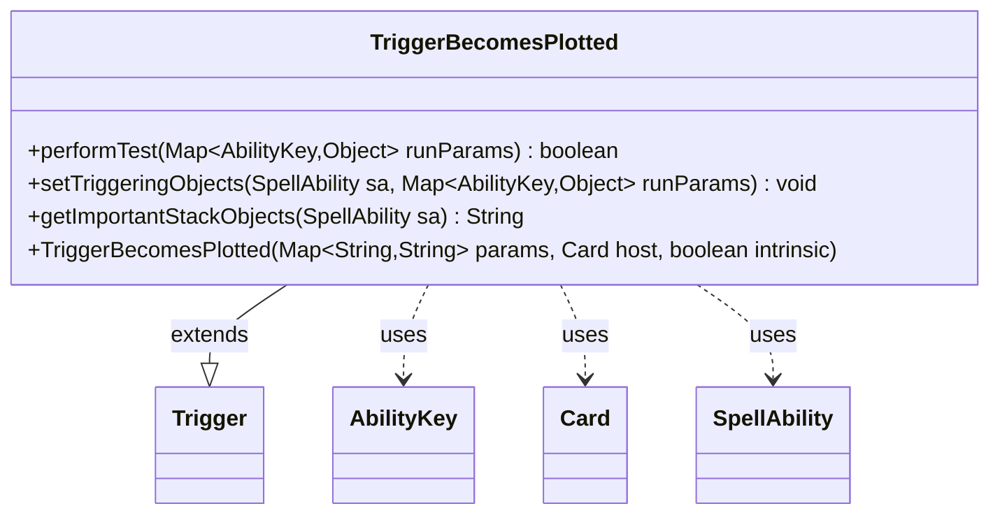

---
aliases:
  - TriggerBecomesPlotted
tags:
  - java/class
  - module/forge-game
  - pkg/forge/game/trigger
fqn: forge.game.trigger.TriggerBecomesPlotted
package: forge.game.trigger
module: forge-game
kind: Class
---

# TriggerBecomesPlotted

**Package:** `forge.game.trigger`   **Module:** `forge-game`   **Kind:** Class



## Relationships
**Extends:**
- [[forge.game.trigger.Trigger|Trigger]]
**Uses:**
- [[forge.game.ability.AbilityKey|AbilityKey]]
- [[forge.game.card.Card|Card]]
- [[forge.game.spellability.SpellAbility|SpellAbility]]

## Design Description

TriggerBecomesPlotted defines the firing condition for the "becomes plotted" event in Forge's trigger subsystem. As a concrete subclass of Trigger, it overrides the engine's template-method hooks—performTest, setTriggeringObjects, and getImportantStackObjects—to specialize generic trigger handling for the plotting of a card. Its responsibility is narrow: confirm that the plotted Card satisfies the configured "ValidCard" restriction, expose that card as the triggering object, and render a localized stack description.

The class collaborates with AbilityKey to key into the runtime parameter map, with Card as the subject of the event, and with SpellAbility as the trigger's executing ability. Its design follows the data-driven, per-event pattern shared across the trigger package: behavior is supplied through the params map and host card rather than hardcoded, and localization via Localizer keeps the stack text presentation-ready.

## Source
`forge-game/src/main/java/forge/game/trigger/TriggerBecomesPlotted.java`

```java
package forge.game.trigger;

import java.util.Map;

import forge.game.ability.AbilityKey;
import forge.game.card.Card;
import forge.game.spellability.SpellAbility;
import forge.util.Localizer;

public class TriggerBecomesPlotted extends Trigger {

    public TriggerBecomesPlotted(final Map<String, String> params, final Card host, final boolean intrinsic) {
        super(params, host, intrinsic);
    }

    @Override
    public boolean performTest(Map<AbilityKey, Object> runParams) {
        if (!matchesValidParam("ValidCard", runParams.get(AbilityKey.Card))) {
            return false;
        }
        
        return true;
    }

    @Override
    public void setTriggeringObjects(SpellAbility sa, Map<AbilityKey, Object> runParams) {
        sa.setTriggeringObjectsFrom(runParams, AbilityKey.Card);
    }

    @Override
    public String getImportantStackObjects(SpellAbility sa) {
        StringBuilder sb = new StringBuilder();
        sb.append(Localizer.getInstance().getMessage("lblPlotted")).append(": ");
        sb.append(sa.getTriggeringObject(AbilityKey.Card));
        return sb.toString();
    }
 
}
```

## Python
`forge/game/trigger/TriggerBecomesPlotted.py`

```python
from typing import Map

from forge.game.ability.AbilityKey import AbilityKey
from forge.game.card.Card import Card
from forge.game.spellability.SpellAbility import SpellAbility
from forge.game.trigger.Trigger import Trigger
from forge.util.Localizer import Localizer


class TriggerBecomesPlotted(Trigger):

    def __init__(self, params: dict[str, str], host: Card, intrinsic: bool):
        super().__init__(params, host, intrinsic)

    def performTest(self, runParams: dict[AbilityKey, object]) -> bool:
        if not self.matchesValidParam("ValidCard", runParams.get(AbilityKey.Card)):
            return False

        return True

    def setTriggeringObjects(self, sa: SpellAbility, runParams: dict[AbilityKey, object]) -> None:
        sa.setTriggeringObjectsFrom(runParams, AbilityKey.Card)

    def getImportantStackObjects(self, sa: SpellAbility) -> str:
        sb = []
        sb.append(Localizer.getInstance().getMessage("lblPlotted"))
        sb.append(": ")
        sb.append(str(sa.getTriggeringObject(AbilityKey.Card)))
        return "".join(sb)
```
