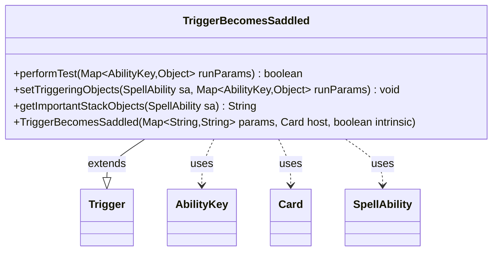

---
aliases:
  - TriggerBecomesSaddled
tags:
  - java/class
  - module/forge-game
  - pkg/forge/game/trigger
fqn: forge.game.trigger.TriggerBecomesSaddled
package: forge.game.trigger
module: forge-game
kind: Class
---

# TriggerBecomesSaddled

**Package:** `forge.game.trigger` &nbsp; **Module:** `forge-game` &nbsp; **Kind:** Class



## Relationships
**Extends:**
- [[forge.game.trigger.Trigger|Trigger]]
**Uses:**
- [[forge.game.ability.AbilityKey|AbilityKey]]
- [[forge.game.card.Card|Card]]
- [[forge.game.spellability.SpellAbility|SpellAbility]]

## Design Description

TriggerBecomesSaddled is a concrete trigger that fires when a permanent becomes saddled, a vehicle-style mechanic in the Forge MTG engine. Extending the abstract Trigger base class, it implements the standard trigger contract: performTest gates firing by validating the saddled card against the ValidSaddled parameter and, when FirstTimeSaddled is set, restricting to the first saddle of the turn via getTimesSaddledThisTurn. It collaborates with Card as the triggering permanent, SpellAbility to carry triggering objects, and AbilityKey to key those objects in the runParams map.

Notably, the design reuses AbilityKey.Crew rather than a dedicated saddle key, reflecting an intentional shortcut that treats Saddle as mechanically analogous to Crew. setTriggeringObjects maps the saddled card and its saddler into the ability, and getImportantStackObjects produces a localized stack description, keeping the class aligned with Forge's data-driven, parameterized trigger framework.

## Source
`forge-game/src/main/java/forge/game/trigger/TriggerBecomesSaddled.java`

```java
package forge.game.trigger;

import java.util.Map;

import forge.game.ability.AbilityKey;
import forge.game.card.Card;
import forge.game.spellability.SpellAbility;
import forge.util.Localizer;

public class TriggerBecomesSaddled extends Trigger {

    public TriggerBecomesSaddled(final Map<String, String> params, final Card host, final boolean intrinsic) {
        super(params, host, intrinsic);
    }

    @Override
    public boolean performTest(Map<AbilityKey, Object> runParams) {
        if (!matchesValidParam("ValidSaddled", runParams.get(AbilityKey.Card))) {
            return false;
        }
        if (hasParam("FirstTimeSaddled")) {
            Card v = (Card) runParams.get(AbilityKey.Card);
            if (v.getTimesSaddledThisTurn() != 1) {
                return false;
            }
        }
        return true;
    }

    // For now, since Saddled is so much like Crew, just use AbilityKey.Crew for cards that tap to saddle 

    @Override
    public void setTriggeringObjects(SpellAbility sa, Map<AbilityKey, Object> runParams) {
        sa.setTriggeringObjectsFrom(runParams, AbilityKey.Card, AbilityKey.Crew);
    }

    @Override
    public String getImportantStackObjects(SpellAbility sa) {
        StringBuilder sb = new StringBuilder();
        sb.append(Localizer.getInstance().getMessage("lblSaddled")).append(": ").append(sa.getTriggeringObject(AbilityKey.Card));
        sb.append("  ");
        sb.append(Localizer.getInstance().getMessage("lblSaddledBy")).append(": ").append(sa.getTriggeringObject(AbilityKey.Crew));
        return sb.toString();
    }
}
```

## Python
`forge/game/trigger/TriggerBecomesSaddled.py`

```python
from typing import Map

from forge.game.trigger.Trigger import Trigger
from forge.game.ability.AbilityKey import AbilityKey
from forge.game.card.Card import Card
from forge.game.spellability.SpellAbility import SpellAbility
from forge.util.Localizer import Localizer


class TriggerBecomesSaddled(Trigger):

    def __init__(self, params: dict[str, str], host: Card, intrinsic: bool):
        super().__init__(params, host, intrinsic)

    def performTest(self, runParams: dict[AbilityKey, object]) -> bool:
        if not self.matchesValidParam("ValidSaddled", runParams.get(AbilityKey.Card)):
            return False
        if self.hasParam("FirstTimeSaddled"):
            v = runParams.get(AbilityKey.Card)
            if v.getTimesSaddledThisTurn() != 1:
                return False
        return True

    # For now, since Saddled is so much like Crew, just use AbilityKey.Crew for cards that tap to saddle

    def setTriggeringObjects(self, sa: SpellAbility, runParams: dict[AbilityKey, object]) -> None:
        sa.setTriggeringObjectsFrom(runParams, AbilityKey.Card, AbilityKey.Crew)

    def getImportantStackObjects(self, sa: SpellAbility) -> str:
        sb = []
        sb.append(Localizer.getInstance().getMessage("lblSaddled"))
        sb.append(": ")
        sb.append(str(sa.getTriggeringObject(AbilityKey.Card)))
        sb.append("  ")
        sb.append(Localizer.getInstance().getMessage("lblSaddledBy"))
        sb.append(": ")
        sb.append(str(sa.getTriggeringObject(AbilityKey.Crew)))
        return "".join(sb)
```
