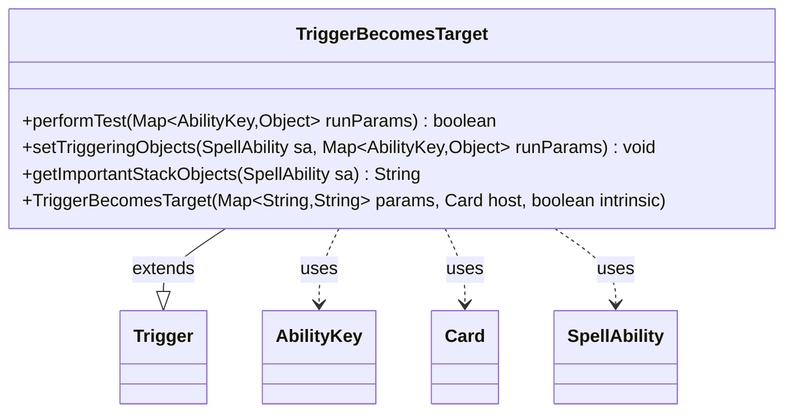

---
aliases:
  - TriggerBecomesTarget
tags:
  - java/class
  - module/forge-game
  - pkg/forge/game/trigger
fqn: forge.game.trigger.TriggerBecomesTarget
package: forge.game.trigger
module: forge-game
kind: Class
---

# TriggerBecomesTarget

**Package:** `forge.game.trigger`   **Module:** `forge-game`   **Kind:** Class



## Relationships
**Extends:**
- [[forge.game.trigger.Trigger|Trigger]]
**Uses:**
- [[forge.game.ability.AbilityKey|AbilityKey]]
- [[forge.game.card.Card|Card]]
- [[forge.game.spellability.SpellAbility|SpellAbility]]

## Design Description

TriggerBecomesTarget is a concrete trigger that fires when a spell or ability targets a qualifying object. Extending the abstract Trigger base class, it specializes the framework's template-method contract by implementing performTest to gate firing against ValidSource and ValidTarget filters plus optional FirstTime and Valiant conditions, drawing candidate objects from the AbilityKey-keyed runParams map. It populates the triggered SpellAbility's context in setTriggeringObjects—resolving the source card from the targeting SpellAbility and forwarding the source and target—and builds a localized, human-readable summary of the relevant stack objects via getImportantStackObjects. The design keeps the class a thin, declarative rule over the shared Trigger machinery, collaborating with Card, SpellAbility, and AbilityKey purely through inherited parameter-matching helpers.

## Source
`forge-game/src/main/java/forge/game/trigger/TriggerBecomesTarget.java`

```java
/*
 * Forge: Play Magic: the Gathering.
 * Copyright (C) 2011  Forge Team
 *
 * This program is free software: you can redistribute it and/or modify
 * it under the terms of the GNU General Public License as published by
 * the Free Software Foundation, either version 3 of the License, or
 * (at your option) any later version.
 * 
 * This program is distributed in the hope that it will be useful,
 * but WITHOUT ANY WARRANTY; without even the implied warranty of
 * MERCHANTABILITY or FITNESS FOR A PARTICULAR PURPOSE.  See the
 * GNU General Public License for more details.
 * 
 * You should have received a copy of the GNU General Public License
 * along with this program.  If not, see <http://www.gnu.org/licenses/>.
 */
package forge.game.trigger;

import java.util.Map;

import forge.game.ability.AbilityKey;
import forge.game.card.Card;
import forge.game.spellability.SpellAbility;
import forge.util.Localizer;

/**
 * <p>
 * Trigger_BecomesTarget class.
 * </p>
 * 
 * @author Forge
 * @version $Id$
 * @since 1.0.15
 */
public class TriggerBecomesTarget extends Trigger {

    /**
     * <p>
     * Constructor for Trigger_BecomesTarget.
     * </p>
     * 
     * @param params
     *            a {@link java.util.HashMap} object.
     * @param host
     *            a {@link forge.game.card.Card} object.
     * @param intrinsic
     *            the intrinsic
     */
    public TriggerBecomesTarget(final Map<String, String> params, final Card host, final boolean intrinsic) {
        super(params, host, intrinsic);
    }

    /** {@inheritDoc}
     * @param runParams*/
    @Override
    public final boolean performTest(final Map<AbilityKey, Object> runParams) {
        if (!matchesValidParam("ValidSource", runParams.get(AbilityKey.SourceSA))) {
            return false;
        }

        if (!matchesValidParam("ValidTarget", runParams.get(AbilityKey.Target))) {
            return false;
        }

        if (hasParam("FirstTime")) {
            if (!runParams.containsKey(AbilityKey.FirstTime)) {
                return false;
            }
        }

        if (hasParam("Valiant")) {
            if (!runParams.containsKey(AbilityKey.Valiant)) {
                return false;
            }
        }

        return true;
    }

    /** {@inheritDoc} */
    @Override
    public final void setTriggeringObjects(final SpellAbility sa, Map<AbilityKey, Object> runParams) {
        sa.setTriggeringObject(AbilityKey.Source, ((SpellAbility) runParams.get(AbilityKey.SourceSA)).getHostCard());
        sa.setTriggeringObjectsFrom(runParams, AbilityKey.SourceSA, AbilityKey.Target);
    }

    @Override
    public String getImportantStackObjects(SpellAbility sa) {
        StringBuilder sb = new StringBuilder();
        sb.append(Localizer.getInstance().getMessage("lblSource")).append(": ").append(((SpellAbility) sa.getTriggeringObject(AbilityKey.SourceSA)).getHostCard()).append(", ");
        sb.append(Localizer.getInstance().getMessage("lblTarget")).append(": ").append(sa.getTriggeringObject(AbilityKey.Target));
        return sb.toString();
    }
}
```

## Python
`forge/game/trigger/TriggerBecomesTarget.py`

```python
from typing import Map  # placeholder

from forge.game.trigger.Trigger import Trigger
from forge.game.ability.AbilityKey import AbilityKey
from forge.game.card.Card import Card
from forge.game.spellability.SpellAbility import SpellAbility
from forge.util.Localizer import Localizer


class TriggerBecomesTarget(Trigger):
    """
    Trigger_BecomesTarget class.

    @author Forge
    @version $Id$
    @since 1.0.15
    """

    def __init__(self, params: dict[str, str], host: Card, intrinsic: bool):
        super().__init__(params, host, intrinsic)

    def performTest(self, runParams: dict[AbilityKey, object]) -> bool:
        if not self.matchesValidParam("ValidSource", runParams.get(AbilityKey.SourceSA)):
            return False

        if not self.matchesValidParam("ValidTarget", runParams.get(AbilityKey.Target)):
            return False

        if self.hasParam("FirstTime"):
            if AbilityKey.FirstTime not in runParams:
                return False

        if self.hasParam("Valiant"):
            if AbilityKey.Valiant not in runParams:
                return False

        return True

    def setTriggeringObjects(self, sa: SpellAbility, runParams: dict[AbilityKey, object]) -> None:
        sa.setTriggeringObject(AbilityKey.Source, runParams.get(AbilityKey.SourceSA).getHostCard())
        sa.setTriggeringObjectsFrom(runParams, AbilityKey.SourceSA, AbilityKey.Target)

    def getImportantStackObjects(self, sa: SpellAbility) -> str:
        sb = []
        sb.append(Localizer.getInstance().getMessage("lblSource"))
        sb.append(": ")
        sb.append(str(sa.getTriggeringObject(AbilityKey.SourceSA).getHostCard()))
        sb.append(", ")
        sb.append(Localizer.getInstance().getMessage("lblTarget"))
        sb.append(": ")
        sb.append(str(sa.getTriggeringObject(AbilityKey.Target)))
        return "".join(sb)
```
