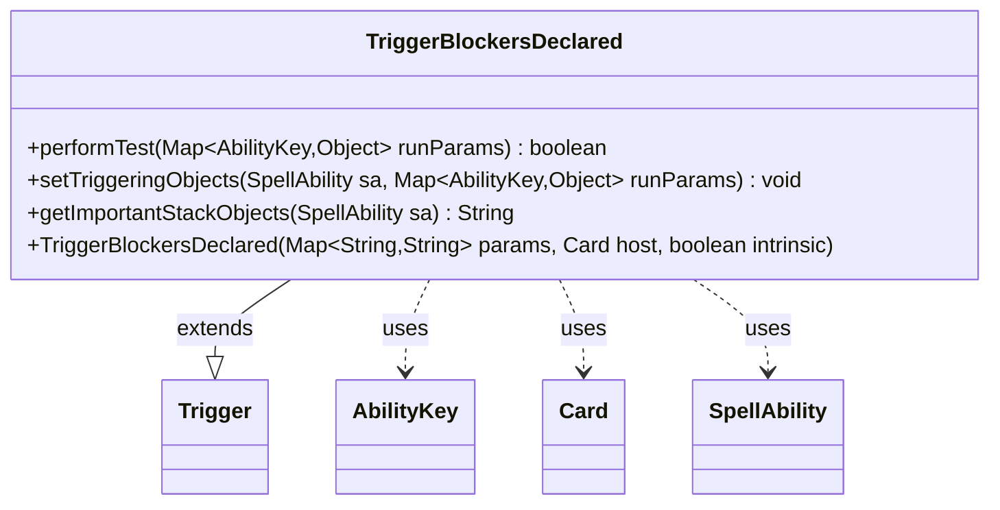

---
aliases:
  - TriggerBlockersDeclared
tags:
  - java/class
  - module/forge-game
  - pkg/forge/game/trigger
fqn: forge.game.trigger.TriggerBlockersDeclared
package: forge.game.trigger
module: forge-game
kind: Class
---

# TriggerBlockersDeclared

**Package:** `forge.game.trigger` &nbsp; **Module:** `forge-game` &nbsp; **Kind:** Class



## Relationships
**Extends:**
- [[forge.game.trigger.Trigger|Trigger]]
**Uses:**
- [[forge.game.ability.AbilityKey|AbilityKey]]
- [[forge.game.card.Card|Card]]
- [[forge.game.spellability.SpellAbility|SpellAbility]]

## Design Description

TriggerBlockersDeclared is a concrete trigger that fires when blockers are declared during combat, extending the abstract `Trigger` base class to plug into Forge's event-driven triggered-ability system. Its `performTest` unconditionally returns true, so the trigger always responds whenever the engine signals the blockers-declared event; gating is left to other conditions rather than the test itself. On firing, `setTriggeringObjects` populates the `SpellAbility` with the declared `Blockers` and `Attackers` drawn from the run parameters via `AbilityKey`, exposing them to downstream ability resolution. `getImportantStackObjects` builds a localized, human-readable summary of the blocking creatures for stack display. The class collaborates with `Card` (the trigger's host), `SpellAbility`, and the `AbilityKey`-keyed parameter map, reflecting Forge's data-driven pattern where each combat event has a thin, specialized Trigger subclass.

## Source
`forge-game/src/main/java/forge/game/trigger/TriggerBlockersDeclared.java`

```java
/*
 * Forge: Play Magic: the Gathering.
 * Copyright (C) 2011  Forge Team
 *
 * This program is free software: you can redistribute it and/or modify
 * it under the terms of the GNU General Public License as published by
 * the Free Software Foundation, either version 3 of the License, or
 * (at your option) any later version.
 * 
 * This program is distributed in the hope that it will be useful,
 * but WITHOUT ANY WARRANTY; without even the implied warranty of
 * MERCHANTABILITY or FITNESS FOR A PARTICULAR PURPOSE.  See the
 * GNU General Public License for more details.
 * 
 * You should have received a copy of the GNU General Public License
 * along with this program.  If not, see <http://www.gnu.org/licenses/>.
 */
package forge.game.trigger;

import java.util.Map;

import forge.game.ability.AbilityKey;
import forge.game.card.Card;
import forge.game.spellability.SpellAbility;
import forge.util.Localizer;

/**
 * TODO Write javadoc for this type.
 * 
 */
public class TriggerBlockersDeclared extends Trigger {

    /**
     * Instantiates a new trigger_ blockers declared.
     * 
     * @param params
     *            the params
     * @param host
     *            the host
     * @param intrinsic
     *            the intrinsic
     */
    public TriggerBlockersDeclared(final Map<String, String> params, final Card host, final boolean intrinsic) {
        super(params, host, intrinsic);
    }

    /** {@inheritDoc}
     * @param runParams*/
    @Override
    public final boolean performTest(final Map<AbilityKey, Object> runParams) {
        return true;
    }

    /** {@inheritDoc} */
    @Override
    public final void setTriggeringObjects(final SpellAbility sa, Map<AbilityKey, Object> runParams) {
        sa.setTriggeringObjectsFrom(runParams, AbilityKey.Blockers, AbilityKey.Attackers);
    }

    @Override
    public String getImportantStackObjects(SpellAbility sa) {
        StringBuilder sb = new StringBuilder();
        sb.append(Localizer.getInstance().getMessage("lblBlockers")).append(": ").append(sa.getTriggeringObject(AbilityKey.Blockers));
        return sb.toString();
    }
}
```

## Python
`forge/game/trigger/TriggerBlockersDeclared.py`

```python
from forge.game.trigger.Trigger import Trigger
from forge.game.ability.AbilityKey import AbilityKey
from forge.game.card.Card import Card
from forge.game.spellability.SpellAbility import SpellAbility
from forge.util.Localizer import Localizer


# TODO Write javadoc for this type.
class TriggerBlockersDeclared(Trigger):

    def __init__(self, params: dict[str, str], host: Card, intrinsic: bool):
        super().__init__(params, host, intrinsic)

    def performTest(self, runParams: dict[AbilityKey, object]) -> bool:
        return True

    def setTriggeringObjects(self, sa: SpellAbility, runParams: dict[AbilityKey, object]) -> None:
        sa.setTriggeringObjectsFrom(runParams, AbilityKey.Blockers, AbilityKey.Attackers)

    def getImportantStackObjects(self, sa: SpellAbility) -> str:
        sb = []
        sb.append(Localizer.getInstance().getMessage("lblBlockers"))
        sb.append(": ")
        sb.append(str(sa.getTriggeringObject(AbilityKey.Blockers)))
        return "".join(sb)
```
