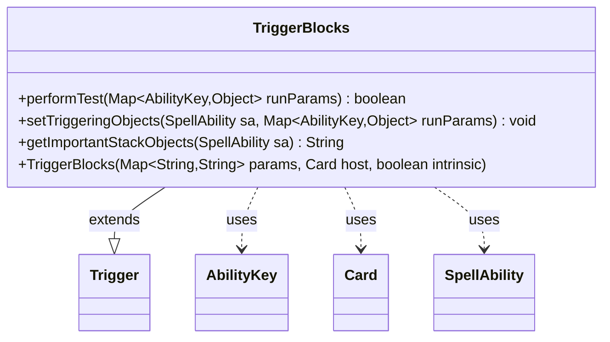

---
aliases:
  - TriggerBlocks
tags:
  - java/class
  - module/forge-game
  - pkg/forge/game/trigger
fqn: forge.game.trigger.TriggerBlocks
package: forge.game.trigger
module: forge-game
kind: Class
---

# TriggerBlocks

**Package:** `forge.game.trigger` &nbsp; **Module:** `forge-game` &nbsp; **Kind:** Class



## Relationships
**Extends:**
- [[forge.game.trigger.Trigger|Trigger]]
**Uses:**
- [[forge.game.ability.AbilityKey|AbilityKey]]
- [[forge.game.card.Card|Card]]
- [[forge.game.spellability.SpellAbility|SpellAbility]]

## Design Description

Trigger Blocks is a concrete trigger that fires when a creature is declared as a blocker during combat. Extending the abstract `Trigger` base class, it specializes the generic trigger machinery for the block event by implementing the three template hooks its parent defines: `performTest` validates the firing conditions against the `ValidCard` and `ValidBlocked` parameters (matching the blocker and the attackers it blocks), `setTriggeringObjects` populates the resolving `SpellAbility` with the `Blocker` and `Attackers` drawn from the run parameters, and `getImportantStackObjects` produces a localized, human-readable summary naming the blocker.

The class collaborates with `AbilityKey` to key into the typed run-parameter map, with `Card` and the inherited parameter map at construction, and with `SpellAbility` to wire triggering objects through to the ability that executes. Its design intent is narrow and declarative: it holds no state, delegates construction to the supertype, and confines all block-specific knowledge to the overridden hooks, keeping the trigger taxonomy uniform and data-driven.

## Source
`forge-game/src/main/java/forge/game/trigger/TriggerBlocks.java`

```java
/*
 * Forge: Play Magic: the Gathering.
 * Copyright (C) 2011  Forge Team
 *
 * This program is free software: you can redistribute it and/or modify
 * it under the terms of the GNU General Public License as published by
 * the Free Software Foundation, either version 3 of the License, or
 * (at your option) any later version.
 * 
 * This program is distributed in the hope that it will be useful,
 * but WITHOUT ANY WARRANTY; without even the implied warranty of
 * MERCHANTABILITY or FITNESS FOR A PARTICULAR PURPOSE.  See the
 * GNU General Public License for more details.
 * 
 * You should have received a copy of the GNU General Public License
 * along with this program.  If not, see <http://www.gnu.org/licenses/>.
 */
package forge.game.trigger;

import java.util.Map;

import forge.game.ability.AbilityKey;
import forge.game.card.Card;
import forge.game.spellability.SpellAbility;
import forge.util.Localizer;

/**
 * <p>
 * Trigger_Blocks class.
 * </p>
 * 
 * @author Forge
 * @version $Id$
 */
public class TriggerBlocks extends Trigger {

    /**
     * <p>
     * Constructor for Trigger_Blocks.
     * </p>
     * 
     * @param params
     *            a {@link java.util.HashMap} object.
     * @param host
     *            a {@link forge.game.card.Card} object.
     * @param intrinsic
     *            the intrinsic
     */
    public TriggerBlocks(final Map<String, String> params, final Card host, final boolean intrinsic) {
        super(params, host, intrinsic);
    }

    /** {@inheritDoc}
     * @param runParams*/
    @Override
    public final boolean performTest(final Map<AbilityKey, Object> runParams) {
        if (!matchesValidParam("ValidCard", runParams.get(AbilityKey.Blocker))) {
            return false;
        }

        if (!matchesValidParam("ValidBlocked", runParams.get(AbilityKey.Attackers))) {
            return false;
        }

        return true;
    }

    /** {@inheritDoc} */
    @Override
    public final void setTriggeringObjects(final SpellAbility sa, Map<AbilityKey, Object> runParams) {
        sa.setTriggeringObjectsFrom(runParams, AbilityKey.Blocker, AbilityKey.Attackers);
    }

    @Override
    public String getImportantStackObjects(SpellAbility sa) {
        StringBuilder sb = new StringBuilder();
        sb.append(Localizer.getInstance().getMessage("lblBlocker")).append(": ").append(sa.getTriggeringObject(AbilityKey.Blocker));
        return sb.toString();
    }
}
```

## Python
`forge/game/trigger/TriggerBlocks.py`

```python
from forge.game.trigger.Trigger import Trigger
from forge.game.ability.AbilityKey import AbilityKey
from forge.game.card.Card import Card
from forge.game.spellability.SpellAbility import SpellAbility
from forge.util.Localizer import Localizer


class TriggerBlocks(Trigger):

    def __init__(self, params: dict[str, str], host: Card, intrinsic: bool):
        super().__init__(params, host, intrinsic)

    def performTest(self, runParams: dict[AbilityKey, object]) -> bool:
        if not self.matchesValidParam("ValidCard", runParams.get(AbilityKey.Blocker)):
            return False

        if not self.matchesValidParam("ValidBlocked", runParams.get(AbilityKey.Attackers)):
            return False

        return True

    def setTriggeringObjects(self, sa: SpellAbility, runParams: dict[AbilityKey, object]) -> None:
        sa.setTriggeringObjectsFrom(runParams, AbilityKey.Blocker, AbilityKey.Attackers)

    def getImportantStackObjects(self, sa: SpellAbility) -> str:
        sb = []
        sb.append(Localizer.getInstance().getMessage("lblBlocker"))
        sb.append(": ")
        sb.append(str(sa.getTriggeringObject(AbilityKey.Blocker)))
        return "".join(sb)
```
