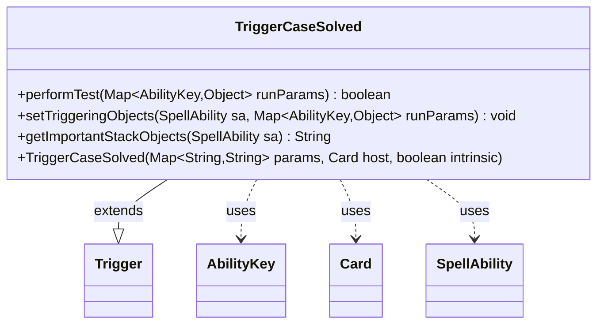

---
aliases:
  - TriggerCaseSolved
tags:
  - java/class
  - module/forge-game
  - pkg/forge/game/trigger
fqn: forge.game.trigger.TriggerCaseSolved
package: forge.game.trigger
module: forge-game
kind: Class
---

# TriggerCaseSolved

**Package:** `forge.game.trigger` &nbsp; **Module:** `forge-game` &nbsp; **Kind:** Class



## Relationships
**Extends:**
- [[forge.game.trigger.Trigger|Trigger]]
**Uses:**
- [[forge.game.ability.AbilityKey|AbilityKey]]
- [[forge.game.card.Card|Card]]
- [[forge.game.spellability.SpellAbility|SpellAbility]]

## Design Description

TriggerCaseSolved is a concrete trigger that fires when a "Case" is solved, a mechanic in Magic: The Gathering. As a subclass of Trigger, it implements the engine's trigger contract by overriding performTest to gate firing on optional ValidCard and ValidPlayer parameter filters, and setTriggeringObjects to bind the solving Card and Player into the spell ability's triggering context. It collaborates with AbilityKey to key into the runtime parameter map and with SpellAbility to expose triggering objects. The getImportantStackObjects override builds a localized, human-readable summary of the triggering card for stack display. The design follows Forge's data-driven trigger pattern: construction takes a string parameter map, behavior is configured declaratively, and the class stays a thin, focused specialization that delegates validation and object-transfer plumbing to inherited helper methods.

## Source
`forge-game/src/main/java/forge/game/trigger/TriggerCaseSolved.java`

```java
package forge.game.trigger;

import java.util.Map;

import forge.game.ability.AbilityKey;
import forge.game.card.Card;
import forge.game.spellability.SpellAbility;
import forge.util.Localizer;

public class TriggerCaseSolved extends Trigger {

    public TriggerCaseSolved(Map<String, String> params, final Card host, final boolean intrinsic) {
        super(params, host, intrinsic);
    }

    @Override
    public final boolean performTest(Map<AbilityKey, Object> runParams) {
        if (!matchesValidParam("ValidCard", runParams.get(AbilityKey.Card))) {
            return false;
        }

        if (!matchesValidParam("ValidPlayer", runParams.get(AbilityKey.Player))) {
            return false;
        }

        return true;
    }

    @Override
        public final void setTriggeringObjects(final SpellAbility sa, Map<AbilityKey, Object> runParams) {
        sa.setTriggeringObjectsFrom(runParams, AbilityKey.Card, AbilityKey.Player);
    }

    public String getImportantStackObjects(SpellAbility sa) {
        StringBuilder sb = new StringBuilder();
        sb.append(Localizer.getInstance().getMessage("lblCard")).append(": ");
        sb.append(sa.getTriggeringObject(AbilityKey.Card));
        return sb.toString();
    }
}
```

## Python
`forge/game/trigger/TriggerCaseSolved.py`

```python
from typing import Map  # noqa
import typing

from forge.game.trigger.Trigger import Trigger
from forge.game.ability.AbilityKey import AbilityKey
from forge.game.card.Card import Card
from forge.game.spellability.SpellAbility import SpellAbility
from forge.util.Localizer import Localizer


class TriggerCaseSolved(Trigger):

    def __init__(self, params: dict[str, str], host: Card, intrinsic: bool):
        super().__init__(params, host, intrinsic)

    def performTest(self, runParams: dict[AbilityKey, object]) -> bool:
        if not self.matchesValidParam("ValidCard", runParams.get(AbilityKey.Card)):
            return False

        if not self.matchesValidParam("ValidPlayer", runParams.get(AbilityKey.Player)):
            return False

        return True

    def setTriggeringObjects(self, sa: SpellAbility, runParams: dict[AbilityKey, object]) -> None:
        sa.setTriggeringObjectsFrom(runParams, AbilityKey.Card, AbilityKey.Player)

    def getImportantStackObjects(self, sa: SpellAbility) -> str:
        sb = []
        sb.append(Localizer.getInstance().getMessage("lblCard"))
        sb.append(": ")
        sb.append(str(sa.getTriggeringObject(AbilityKey.Card)))
        return "".join(sb)
```
