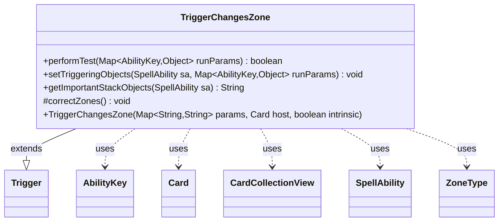

---
aliases:
  - TriggerChangesZone
tags:
  - java/class
  - module/forge-game
  - pkg/forge/game/trigger
fqn: forge.game.trigger.TriggerChangesZone
package: forge.game.trigger
module: forge-game
kind: Class
---

# TriggerChangesZone

**Package:** `forge.game.trigger`   **Module:** `forge-game`   **Kind:** Class



## Relationships
**Extends:**
- [[forge.game.trigger.Trigger|Trigger]]
**Uses:**
- [[forge.game.ability.AbilityKey|AbilityKey]]
- [[forge.game.card.Card|Card]]
- [[forge.game.card.CardCollectionView|CardCollectionView]]
- [[forge.game.spellability.SpellAbility|SpellAbility]]
- [[forge.game.zone.ZoneType|ZoneType]]

## Design Description

TriggerChangesZone is a concrete trigger that fires on zone-change events, extending the abstract `Trigger` base class to implement the engine's standard trigger contract (`performTest`, `setTriggeringObjects`, `getImportantStackObjects`). Its core responsibility is `performTest`, which gates a card's zone movement against the trigger's declarative parameters — Origin/Destination zones, exclusions, `ValidCard`/`ValidCause` filters, fizzle state, and count conditions — returning whether the observed move (read from the `runParams` map keyed by `AbilityKey`) should fire the ability.

Notable design intent is its careful handling of MTG's "last-known-information" rules: it substitutes `CardLKI` for cards leaving the battlefield or graveyard (CR 603.10a) and exposes both the old and new card to the resolving `SpellAbility`. The protected `correctZones()` helper pre-computes the host's active zones (via `ZoneType`/`CardCollectionView`) so leave-battlefield and self-enter triggers are correctly scoped, reflecting a parameter-driven, data-configured trigger design rather than per-card code.

## Source
`forge-game/src/main/java/forge/game/trigger/TriggerChangesZone.java`

```java
/*
 * Forge: Play Magic: the Gathering.
 * Copyright (C) 2011  Forge Team
 *
 * This program is free software: you can redistribute it and/or modify
 * it under the terms of the GNU General Public License as published by
 * the Free Software Foundation, either version 3 of the License, or
 * (at your option) any later version.
 *
 * This program is distributed in the hope that it will be useful,
 * but WITHOUT ANY WARRANTY; without even the implied warranty of
 * MERCHANTABILITY or FITNESS FOR A PARTICULAR PURPOSE.  See the
 * GNU General Public License for more details.
 *
 * You should have received a copy of the GNU General Public License
 * along with this program.  If not, see <http://www.gnu.org/licenses/>.
 */
package forge.game.trigger;

import java.util.EnumSet;
import java.util.List;
import java.util.Map;
import java.util.function.Predicate;

import forge.util.IterableUtil;
import org.apache.commons.lang3.ArrayUtils;

import com.google.common.collect.Sets;

import forge.game.ability.AbilityKey;
import forge.game.ability.AbilityUtils;
import forge.game.card.Card;
import forge.game.card.CardCollectionView;
import forge.game.card.CardLists;
import forge.game.card.CardPredicates;
import forge.game.spellability.SpellAbility;
import forge.game.zone.ZoneType;
import forge.util.Expressions;
import forge.util.Localizer;

/**
 * <p>
 * Trigger_ChangesZone class.
 * </p>
 *
 * @author Forge
 * @version $Id$
 */
public class TriggerChangesZone extends Trigger {

    /**
     * <p>
     * Constructor for Trigger_ChangesZone.
     * </p>
     *
     * @param params
     *            a {@link java.util.HashMap} object.
     * @param host
     *            a {@link forge.game.card.Card} object.
     * @param intrinsic
     *            the intrinsic
     */
    public TriggerChangesZone(final Map<String, String> params, final Card host, final boolean intrinsic) {
        super(params, host, intrinsic);
        correctZones();
    }

    /** {@inheritDoc}
     * @param runParams*/
    @Override
    public final boolean performTest(final Map<AbilityKey, Object> runParams) {
        if (hasParam("Origin")) {
            if (!getParam("Origin").equals("Any")) {
                if (getParam("Origin") == null) {
                    return false;
                }
                if (!ArrayUtils.contains(
                    getParam("Origin").split(","), runParams.get(AbilityKey.Origin)
                )) {
                    return false;
                }
            }
        }

        if (hasParam("Destination")) {
            if (!getParam("Destination").equals("Any")) {
                if (!ArrayUtils.contains(
                    getParam("Destination").split(","), runParams.get(AbilityKey.Destination)
                )) {
                    return false;
                }
            }
        }

        if (hasParam("ExcludedOrigins")) {
            if (ArrayUtils.contains(
                    getParam("ExcludedOrigins").split(","), runParams.get(AbilityKey.Origin)
            )) {
                return false;
            }
        }

        if (hasParam("ExcludedDestinations")) {
            if (ArrayUtils.contains(
                getParam("ExcludedDestinations").split(","), runParams.get(AbilityKey.Destination)
            )) {
                return false;
            }
        }

        if ("Battlefield".equals(getParam("Origin")) && getActiveZone() != null && getActiveZone().contains(ZoneType.Graveyard)) {
            // extra check for Boneyard Scourge
            CardCollectionView lastState = (CardCollectionView) runParams.get(AbilityKey.LastStateGraveyard);
            if (!lastState.contains(getHostCard())) {
                return false;
            }
        }

        Card moved = (Card) runParams.get(AbilityKey.Card);
        if (hasParam("ValidCard")) {
            // CR 603.10a leaves battlefield or GY look back in time
            if ("Battlefield".equals(getParam("Origin"))
                    || ("Graveyard".equals(getParam("Origin")) && !"Battlefield".equals(getParam("Destination")))) {
                moved = (Card) runParams.get(AbilityKey.CardLKI);
            } else if ("Battlefield".equals(runParams.get(AbilityKey.Destination))) {
                List<Card> etbLKI = moved.getController().getZone(ZoneType.Battlefield).getCardsAddedThisTurn(null);
                etbLKI.sort(CardPredicates.compareByGameTimestamp());
                moved = etbLKI.get(etbLKI.lastIndexOf(moved));
            }

            if (!matchesValidParam("ValidCard", moved)) {
                return false;
            }
        }

        if (hasParam("CheckOnTriggeredCard")) {
            final String[] condition = getParam("CheckOnTriggeredCard").split(" ", 2);

            final String comparator = condition.length < 2 ? "GE1" : condition[1];
            final int referenceValue = AbilityUtils.calculateAmount(getHostCard(), comparator.substring(2), this);
            final int actualValue = AbilityUtils.calculateAmount(moved, condition[0], this);
            if (!Expressions.compare(actualValue, comparator.substring(0, 2), referenceValue)) {
                return false;
            }
        }

        if (!matchesValidParam("ValidCause", runParams.get(AbilityKey.Cause))) {
            return false;
        }

        if (hasParam("Fizzle")) {
            if (!runParams.containsKey(AbilityKey.Fizzle)) {
                return false;
            }
            Boolean val = (Boolean) runParams.get(AbilityKey.Fizzle);
            if ("True".equals(getParam("Fizzle")) != val) {
                return false;
            }
        }

        if (hasParam("NotThisAbility")) {
            if (runParams.containsKey(AbilityKey.Cause)) {
                SpellAbility cause = (SpellAbility) runParams.get(AbilityKey.Cause);
                if (cause != null && this.equals(cause.getRootAbility().getTrigger())) {
                    return false;
                }
            }
        }

        /* this trigger only activates for the nth spell you cast this turn */
        if (hasParam("ConditionYouCastThisTurn")) {
            final String compare = getParam("ConditionYouCastThisTurn");
            List<Card> thisTurnCast = getHostCard().getGame().getStack().getSpellsCastThisTurn();
            thisTurnCast = CardLists.filterControlledByAsList(thisTurnCast, getHostCard().getController());

            // checks which card this spell was the castSA
            SpellAbility castSA = getHostCard().getCastSA();
            int left = IterableUtil.indexOf(thisTurnCast, CardPredicates.castSA(Predicate.isEqual(castSA)));
            int right = Integer.parseInt(compare.substring(2));
            if (!Expressions.compare(left + 1, compare, right)) {
                return false;
            }
        }

        return true;
    }

    /** {@inheritDoc} */
    @Override
    public final void setTriggeringObjects(final SpellAbility sa, Map<AbilityKey, Object> runParams) {
        // TODO use better way to always copy both Card and CardLKI
        if ("Battlefield".equals(getParam("Origin"))) {
            sa.setTriggeringObject(AbilityKey.Card, runParams.get(AbilityKey.CardLKI));
            sa.setTriggeringObject(AbilityKey.NewCard, runParams.get(AbilityKey.Card));
        } else {
            sa.setTriggeringObjectsFrom(runParams, AbilityKey.Card, AbilityKey.CardLKI);
        }
    }

    @Override
    public String getImportantStackObjects(SpellAbility sa) {
        StringBuilder sb = new StringBuilder();
        sb.append(Localizer.getInstance().getMessage("lblZoneChanger")).append(": ").append(sa.getTriggeringObject(AbilityKey.Card));
        return sb.toString();
    }

    protected void correctZones() {
        // only if host zones isn't set
        if (validHostZones != null) {
            return;
        }

        // in case the game is null (for GUI) the later check does fail
        if (getHostCard().getGame() == null) {
            return;
        }

        if (!hasParam("ValidCard")) {
            return;
        }

        if (hasParam("Origin")) {
            // leave battlefield
            boolean leavesBattlefield = ArrayUtils.contains(
                getParam("Origin").split(","), ZoneType.Battlefield.toString()
            );
            // Static triggers aren't triggered abilities rules-wise
            if (leavesBattlefield && !isStatic()) {
                setActiveZone(EnumSet.of(ZoneType.Battlefield));
            }
        }

        // enter Zone Effect only for Self
        if (getParam("ValidCard").contains("Self") && (!hasParam("Origin") || "Any".equals(getParam("Origin")))) {
            setActiveZone(Sets.newEnumSet(ZoneType.listValueOf(getParam("Destination")), ZoneType.class));
        }
    }

}
```

## Python
`forge/game/trigger/TriggerChangesZone.py`

```python
from forge.game.trigger.Trigger import Trigger
from forge.game.ability.AbilityKey import AbilityKey
from forge.game.ability.AbilityUtils import AbilityUtils
from forge.game.card.Card import Card
from forge.game.card.CardCollectionView import CardCollectionView
from forge.game.card.CardLists import CardLists
from forge.game.card.CardPredicates import CardPredicates
from forge.game.spellability.SpellAbility import SpellAbility
from forge.game.zone.ZoneType import ZoneType
from forge.util.Expressions import Expressions
from forge.util.Localizer import Localizer
from forge.util.IterableUtil import IterableUtil


class TriggerChangesZone(Trigger):
    """
    Trigger_ChangesZone class.

    @author Forge
    """

    def __init__(self, params: dict[str, str], host: Card, intrinsic: bool):
        super().__init__(params, host, intrinsic)
        self.correctZones()

    def performTest(self, runParams: dict[AbilityKey, object]) -> bool:
        if self.hasParam("Origin"):
            if self.getParam("Origin") != "Any":
                if self.getParam("Origin") is None:
                    return False
                if runParams.get(AbilityKey.Origin) not in self.getParam("Origin").split(","):
                    return False

        if self.hasParam("Destination"):
            if self.getParam("Destination") != "Any":
                if runParams.get(AbilityKey.Destination) not in self.getParam("Destination").split(","):
                    return False

        if self.hasParam("ExcludedOrigins"):
            if runParams.get(AbilityKey.Origin) in self.getParam("ExcludedOrigins").split(","):
                return False

        if self.hasParam("ExcludedDestinations"):
            if runParams.get(AbilityKey.Destination) in self.getParam("ExcludedDestinations").split(","):
                return False

        if "Battlefield" == self.getParam("Origin") and self.getActiveZone() is not None and self.getActiveZone().contains(ZoneType.Graveyard):
            # extra check for Boneyard Scourge
            lastState = runParams.get(AbilityKey.LastStateGraveyard)
            if not lastState.contains(self.getHostCard()):
                return False

        moved = runParams.get(AbilityKey.Card)
        if self.hasParam("ValidCard"):
            # CR 603.10a leaves battlefield or GY look back in time
            if ("Battlefield" == self.getParam("Origin")
                    or ("Graveyard" == self.getParam("Origin") and "Battlefield" != self.getParam("Destination"))):
                moved = runParams.get(AbilityKey.CardLKI)
            elif "Battlefield" == runParams.get(AbilityKey.Destination):
                etbLKI = moved.getController().getZone(ZoneType.Battlefield).getCardsAddedThisTurn(None)
                etbLKI.sort(key=CardPredicates.compareByGameTimestamp())
                lastIndex = len(etbLKI) - 1 - etbLKI[::-1].index(moved)
                moved = etbLKI[lastIndex]

            if not self.matchesValidParam("ValidCard", moved):
                return False

        if self.hasParam("CheckOnTriggeredCard"):
            condition = self.getParam("CheckOnTriggeredCard").split(" ", 1)

            comparator = "GE1" if len(condition) < 2 else condition[1]
            referenceValue = AbilityUtils.calculateAmount(self.getHostCard(), comparator[2:], self)
            actualValue = AbilityUtils.calculateAmount(moved, condition[0], self)
            if not Expressions.compare(actualValue, comparator[0:2], referenceValue):
                return False

        if not self.matchesValidParam("ValidCause", runParams.get(AbilityKey.Cause)):
            return False

        if self.hasParam("Fizzle"):
            if AbilityKey.Fizzle not in runParams:
                return False
            val = runParams.get(AbilityKey.Fizzle)
            if ("True" == self.getParam("Fizzle")) != val:
                return False

        if self.hasParam("NotThisAbility"):
            if AbilityKey.Cause in runParams:
                cause = runParams.get(AbilityKey.Cause)
                if cause is not None and self == cause.getRootAbility().getTrigger():
                    return False

        # this trigger only activates for the nth spell you cast this turn
        if self.hasParam("ConditionYouCastThisTurn"):
            compare = self.getParam("ConditionYouCastThisTurn")
            thisTurnCast = self.getHostCard().getGame().getStack().getSpellsCastThisTurn()
            thisTurnCast = CardLists.filterControlledByAsList(thisTurnCast, self.getHostCard().getController())

            # checks which card this spell was the castSA
            castSA = self.getHostCard().getCastSA()
            left = IterableUtil.indexOf(thisTurnCast, CardPredicates.castSA(lambda x: x == castSA))
            right = int(compare[2:])
            if not Expressions.compare(left + 1, compare, right):
                return False

        return True

    def setTriggeringObjects(self, sa: SpellAbility, runParams: dict[AbilityKey, object]) -> None:
        # TODO use better way to always copy both Card and CardLKI
        if "Battlefield" == self.getParam("Origin"):
            sa.setTriggeringObject(AbilityKey.Card, runParams.get(AbilityKey.CardLKI))
            sa.setTriggeringObject(AbilityKey.NewCard, runParams.get(AbilityKey.Card))
        else:
            sa.setTriggeringObjectsFrom(runParams, AbilityKey.Card, AbilityKey.CardLKI)

    def getImportantStackObjects(self, sa: SpellAbility) -> str:
        sb = []
        sb.append(Localizer.getInstance().getMessage("lblZoneChanger"))
        sb.append(": ")
        sb.append(str(sa.getTriggeringObject(AbilityKey.Card)))
        return "".join(sb)

    def correctZones(self) -> None:
        # only if host zones isn't set
        if self.validHostZones is not None:
            return

        # in case the game is null (for GUI) the later check does fail
        if self.getHostCard().getGame() is None:
            return

        if not self.hasParam("ValidCard"):
            return

        if self.hasParam("Origin"):
            # leave battlefield
            leavesBattlefield = ZoneType.Battlefield.toString() in self.getParam("Origin").split(",")
            # Static triggers aren't triggered abilities rules-wise
            if leavesBattlefield and not self.isStatic():
                self.setActiveZone({ZoneType.Battlefield})

        # enter Zone Effect only for Self
        if "Self" in self.getParam("ValidCard") and (not self.hasParam("Origin") or "Any" == self.getParam("Origin")):
            self.setActiveZone(set(ZoneType.listValueOf(self.getParam("Destination"))))
```
