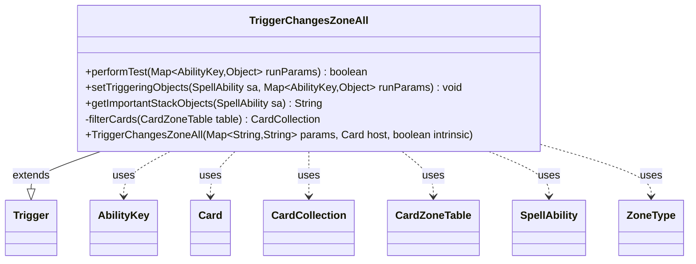

---
aliases:
  - TriggerChangesZoneAll
tags:
  - java/class
  - module/forge-game
  - pkg/forge/game/trigger
fqn: forge.game.trigger.TriggerChangesZoneAll
package: forge.game.trigger
module: forge-game
kind: Class
---

# TriggerChangesZoneAll

**Package:** `forge.game.trigger`   **Module:** `forge-game`   **Kind:** Class



## Relationships
**Extends:**
- [[forge.game.trigger.Trigger|Trigger]]
**Uses:**
- [[forge.game.ability.AbilityKey|AbilityKey]]
- [[forge.game.card.Card|Card]]
- [[forge.game.card.CardCollection|CardCollection]]
- [[forge.game.card.CardZoneTable|CardZoneTable]]
- [[forge.game.spellability.SpellAbility|SpellAbility]]
- [[forge.game.zone.ZoneType|ZoneType]]

## Design Description

TriggerChangesZoneAll is a concrete trigger that fires in response to bulk zone-change events, where many cards move between zones simultaneously (e.g. a mass mill or board wipe) rather than a single card. Extending the abstract Trigger base class, it overrides performTest to decide whether the event satisfies the trigger's conditions—filtering the moved cards by origin/destination zones and a ValidCards predicate, and supporting refinements such as ValidCause, ValidAmount comparisons, and a FirstTime guard. Its private filterCards helper centralizes this logic against the CardZoneTable supplied through the AbilityKey.Cards run parameter. On success, setTriggeringObjects exposes the matched CardCollection and its count to the resolving SpellAbility, while getImportantStackObjects surfaces the localized amount. The design favors data-driven configuration via string parameters, keeping zone-change matching reusable across many cards.

## Source
`forge-game/src/main/java/forge/game/trigger/TriggerChangesZoneAll.java`

```java
package forge.game.trigger;

import java.util.List;
import java.util.Map;

import forge.game.ability.AbilityKey;
import forge.game.ability.AbilityUtils;
import forge.game.card.Card;
import forge.game.card.CardCollection;
import forge.game.card.CardUtil;
import forge.game.card.CardZoneTable;
import forge.game.spellability.SpellAbility;
import forge.game.zone.ZoneType;
import forge.util.Expressions;
import forge.util.Localizer;

public class TriggerChangesZoneAll extends Trigger {

    public TriggerChangesZoneAll(Map<String, String> params, Card host, boolean intrinsic) {
        super(params, host, intrinsic);
    }

    @Override
    public boolean performTest(Map<AbilityKey, Object> runParams) {
        final CardZoneTable table = (CardZoneTable) runParams.get(AbilityKey.Cards);

        // leaves the GY trigger look back in time
        if (getActiveZone().contains(ZoneType.Battlefield) && "Graveyard".equals(getParam("Origin"))
                && !table.getLastStateBattlefield().contains(getHostCard())) {
            return false;
        }

        if (hasParam("FirstTime")) {
            // currently only for Crawling Sensation
            List<Card> entered = CardUtil.getThisTurnEntered(ZoneType.smartValueOf(getParam("Destination")), null, getParam("ValidCards"), getHostCard(), this, getHostCard().getController());
            entered.removeAll(filterCards(table));
            if (!entered.isEmpty()) {
                return false;
            }
        }

        if (!matchesValidParam("ValidCause", runParams.get(AbilityKey.Cause))) {
            return false;
        }

        if (hasParam("ValidAmount")) {
            int right = AbilityUtils.calculateAmount(hostCard, getParam("ValidAmount").substring(2), this);
            if (!Expressions.compare(this.filterCards(table).size(), getParam("ValidAmount").substring(0, 2), right)) {
                return false;
            }
        }

        return !filterCards(table).isEmpty();
    }

    @Override
    public void setTriggeringObjects(SpellAbility sa, Map<AbilityKey, Object> runParams) {
        final CardZoneTable table = (CardZoneTable) runParams.get(AbilityKey.Cards);

        CardCollection allCards = this.filterCards(table);

        sa.setTriggeringObject(AbilityKey.Cards, allCards);
        sa.setTriggeringObject(AbilityKey.Amount, allCards.size());
        sa.setTriggeringObjectsFrom(runParams, AbilityKey.Cause);
    }

    @Override
    public String getImportantStackObjects(SpellAbility sa) {
        StringBuilder sb = new StringBuilder();
        sb.append(Localizer.getInstance().getMessage("lblAmount")).append(": ").append(sa.getTriggeringObject(AbilityKey.Amount));
        return sb.toString();
    }

    private CardCollection filterCards(CardZoneTable table) {
        List<ZoneType> destination = null;
        List<ZoneType> origin = null;

        if (hasParam("Destination") && !getParam("Destination").equals("Any")) {
            destination = ZoneType.listValueOf(getParam("Destination"));
        }

        if (hasParam("Origin") && !getParam("Origin").equals("Any")) {
            origin = ZoneType.listValueOf(getParam("Origin"));
        }

        final String valid = this.getParam("ValidCards");

        return table.filterCards(origin, destination, valid, getHostCard(), this);
    }
}
```

## Python
`forge/game/trigger/TriggerChangesZoneAll.py`

```python
from forge.game.trigger.Trigger import Trigger
from forge.game.ability.AbilityKey import AbilityKey
from forge.game.ability.AbilityUtils import AbilityUtils
from forge.game.card.Card import Card
from forge.game.card.CardCollection import CardCollection
from forge.game.card.CardUtil import CardUtil
from forge.game.card.CardZoneTable import CardZoneTable
from forge.game.spellability.SpellAbility import SpellAbility
from forge.game.zone.ZoneType import ZoneType
from forge.util.Expressions import Expressions
from forge.util.Localizer import Localizer


class TriggerChangesZoneAll(Trigger):

    def __init__(self, params: dict[str, str], host: Card, intrinsic: bool):
        super().__init__(params, host, intrinsic)

    def performTest(self, runParams: dict[AbilityKey, object]) -> bool:
        table = runParams.get(AbilityKey.Cards)

        # leaves the GY trigger look back in time
        if self.getActiveZone().contains(ZoneType.Battlefield) and "Graveyard" == self.getParam("Origin") \
                and not table.getLastStateBattlefield().contains(self.getHostCard()):
            return False

        if self.hasParam("FirstTime"):
            # currently only for Crawling Sensation
            entered = CardUtil.getThisTurnEntered(ZoneType.smartValueOf(self.getParam("Destination")), None, self.getParam("ValidCards"), self.getHostCard(), self, self.getHostCard().getController())
            entered.removeAll(self.filterCards(table))
            if entered:
                return False

        if not self.matchesValidParam("ValidCause", runParams.get(AbilityKey.Cause)):
            return False

        if self.hasParam("ValidAmount"):
            right = AbilityUtils.calculateAmount(self.hostCard, self.getParam("ValidAmount")[2:], self)
            if not Expressions.compare(self.filterCards(table).size(), self.getParam("ValidAmount")[0:2], right):
                return False

        return not self.filterCards(table).isEmpty()

    def setTriggeringObjects(self, sa: SpellAbility, runParams: dict[AbilityKey, object]) -> None:
        table = runParams.get(AbilityKey.Cards)

        allCards = self.filterCards(table)

        sa.setTriggeringObject(AbilityKey.Cards, allCards)
        sa.setTriggeringObject(AbilityKey.Amount, allCards.size())
        sa.setTriggeringObjectsFrom(runParams, AbilityKey.Cause)

    def getImportantStackObjects(self, sa: SpellAbility) -> str:
        sb = []
        sb.append(Localizer.getInstance().getMessage("lblAmount"))
        sb.append(": ")
        sb.append(str(sa.getTriggeringObject(AbilityKey.Amount)))
        return "".join(sb)

    def filterCards(self, table: CardZoneTable) -> CardCollection:
        destination = None
        origin = None

        if self.hasParam("Destination") and self.getParam("Destination") != "Any":
            destination = ZoneType.listValueOf(self.getParam("Destination"))

        if self.hasParam("Origin") and self.getParam("Origin") != "Any":
            origin = ZoneType.listValueOf(self.getParam("Origin"))

        valid = self.getParam("ValidCards")

        return table.filterCards(origin, destination, valid, self.getHostCard(), self)
```
