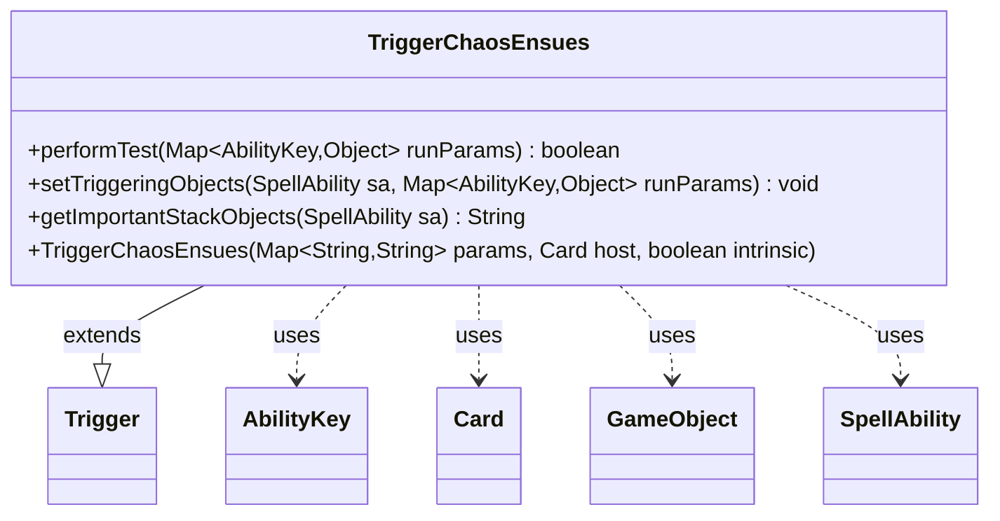

---
aliases:
  - TriggerChaosEnsues
tags:
  - java/class
  - module/forge-game
  - pkg/forge/game/trigger
fqn: forge.game.trigger.TriggerChaosEnsues
package: forge.game.trigger
module: forge-game
kind: Class
---

# TriggerChaosEnsues

**Package:** `forge.game.trigger` &nbsp; **Module:** `forge-game` &nbsp; **Kind:** Class



## Relationships
**Extends:**
- [[forge.game.trigger.Trigger|Trigger]]
**Uses:**
- [[forge.game.GameObject|GameObject]]
- [[forge.game.ability.AbilityKey|AbilityKey]]
- [[forge.game.card.Card|Card]]
- [[forge.game.spellability.SpellAbility|SpellAbility]]

## Source
`forge-game/src/main/java/forge/game/trigger/TriggerChaosEnsues.java`

```java
package forge.game.trigger;

import forge.game.GameObject;
import forge.game.ability.AbilityKey;
import forge.game.card.Card;
import forge.game.spellability.SpellAbility;

import java.util.Map;

public class TriggerChaosEnsues extends Trigger {

    /**
     * <p>
     * Constructor for Trigger_ChaosEnsues
     * </p>
     *
     * @param params
     *            a {@link java.util.HashMap} object.
     * @param host
     *            a {@link forge.game.card.Card} object.
     * @param intrinsic
     *            the intrinsic
     */
    public TriggerChaosEnsues(final Map<String, String> params, final Card host, final boolean intrinsic) {
        super(params, host, intrinsic);
    }

    /* (non-Javadoc)
     * @see forge.card.trigger.Trigger#performTest(java.util.Map)
     */
    @Override
    public boolean performTest(Map<AbilityKey, Object> runParams) {
        if (!matchesValidParam("ValidPlayer", runParams.get(AbilityKey.Player))) {
            return false;
        }
        if (runParams.containsKey(AbilityKey.Affected)) {
            final Object o = runParams.get(AbilityKey.Affected);
            if (o instanceof GameObject) {
                final GameObject c = (GameObject) o;
                if (!c.equals(this.getHostCard())) {
                    return false;
                }
            } else if (o instanceof Iterable<?>) {
                for (Object o2 : (Iterable<?>) o) {
                    if (!o2.equals(this.getHostCard())) {
                        return false;
                    }
                }
            }
        }
        return true;
    }

    @Override
    public void setTriggeringObjects(SpellAbility sa, Map<AbilityKey, Object> runParams) {
        sa.setTriggeringObjectsFrom(runParams, AbilityKey.Player);
    }

    @Override
    public String getImportantStackObjects(SpellAbility sa) {
        return "";
    }
}
```
