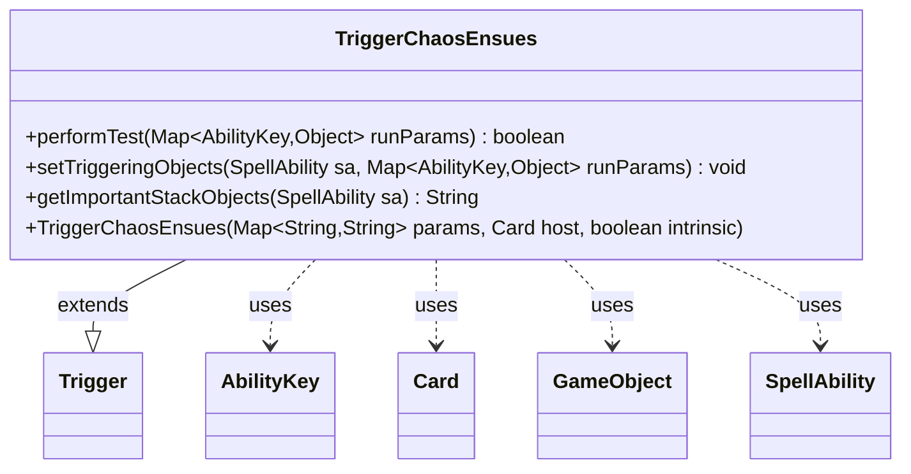

---
aliases:
  - TriggerChaosEnsues
tags:
  - java/class
  - module/forge-game
  - pkg/forge/game/trigger
fqn: forge.game.trigger.TriggerChaosEnsues
package: forge.game.trigger
module: forge-game
kind: Class
---

# TriggerChaosEnsues

**Package:** `forge.game.trigger` &nbsp; **Module:** `forge-game` &nbsp; **Kind:** Class



## Relationships
**Extends:**
- [[forge.game.trigger.Trigger|Trigger]]
**Uses:**
- [[forge.game.GameObject|GameObject]]
- [[forge.game.ability.AbilityKey|AbilityKey]]
- [[forge.game.card.Card|Card]]
- [[forge.game.spellability.SpellAbility|SpellAbility]]

## Design Description

Trigger ChaosEnsues fires when the chaos ability of the host card resolves, modeling the planar die's "chaos ensues" event in the Planechase format. As a concrete subclass of `Trigger`, it overrides the trigger lifecycle hooks: `performTest` validates the run-time parameters, accepting the event only when the triggering player matches the `ValidPlayer` restriction and any `Affected` game object (or collection thereof) is the host card itself.

The class collaborates with `AbilityKey` to key into the run-parameter map, `GameObject`/`Card` for identity comparison against the host, and `SpellAbility` for binding triggering objects. `setTriggeringObjects` forwards only the triggering `Player` onto the ability, while `getImportantStackObjects` returns an empty string, signalling the trigger contributes no distinguishing stack description. The design follows Forge's data-driven trigger pattern, where behavior is parameterized through the constructor's string map rather than hard-coded logic.

## Source
`forge-game/src/main/java/forge/game/trigger/TriggerChaosEnsues.java`

```java
package forge.game.trigger;

import forge.game.GameObject;
import forge.game.ability.AbilityKey;
import forge.game.card.Card;
import forge.game.spellability.SpellAbility;

import java.util.Map;

public class TriggerChaosEnsues extends Trigger {

    /**
     * <p>
     * Constructor for Trigger_ChaosEnsues
     * </p>
     *
     * @param params
     *            a {@link java.util.HashMap} object.
     * @param host
     *            a {@link forge.game.card.Card} object.
     * @param intrinsic
     *            the intrinsic
     */
    public TriggerChaosEnsues(final Map<String, String> params, final Card host, final boolean intrinsic) {
        super(params, host, intrinsic);
    }

    /* (non-Javadoc)
     * @see forge.card.trigger.Trigger#performTest(java.util.Map)
     */
    @Override
    public boolean performTest(Map<AbilityKey, Object> runParams) {
        if (!matchesValidParam("ValidPlayer", runParams.get(AbilityKey.Player))) {
            return false;
        }
        if (runParams.containsKey(AbilityKey.Affected)) {
            final Object o = runParams.get(AbilityKey.Affected);
            if (o instanceof GameObject) {
                final GameObject c = (GameObject) o;
                if (!c.equals(this.getHostCard())) {
                    return false;
                }
            } else if (o instanceof Iterable<?>) {
                for (Object o2 : (Iterable<?>) o) {
                    if (!o2.equals(this.getHostCard())) {
                        return false;
                    }
                }
            }
        }
        return true;
    }

    @Override
    public void setTriggeringObjects(SpellAbility sa, Map<AbilityKey, Object> runParams) {
        sa.setTriggeringObjectsFrom(runParams, AbilityKey.Player);
    }

    @Override
    public String getImportantStackObjects(SpellAbility sa) {
        return "";
    }
}
```

## Python
`forge/game/trigger/TriggerChaosEnsues.py`

```python
from forge.game.GameObject import GameObject
from forge.game.ability.AbilityKey import AbilityKey
from forge.game.card.Card import Card
from forge.game.spellability.SpellAbility import SpellAbility
from forge.game.trigger.Trigger import Trigger

from typing import Any


class TriggerChaosEnsues(Trigger):

    def __init__(self, params: dict[str, str], host: Card, intrinsic: bool):
        super().__init__(params, host, intrinsic)

    def performTest(self, runParams: dict[AbilityKey, Any]) -> bool:
        if not self.matchesValidParam("ValidPlayer", runParams.get(AbilityKey.Player)):
            return False
        if AbilityKey.Affected in runParams:
            o = runParams.get(AbilityKey.Affected)
            if isinstance(o, GameObject):
                c = o
                if not c.equals(self.getHostCard()):
                    return False
            elif hasattr(o, "__iter__"):
                for o2 in o:
                    if not o2.equals(self.getHostCard()):
                        return False
        return True

    def setTriggeringObjects(self, sa: SpellAbility, runParams: dict[AbilityKey, Any]) -> None:
        sa.setTriggeringObjectsFrom(runParams, AbilityKey.Player)

    def getImportantStackObjects(self, sa: SpellAbility) -> str:
        return ""
```
