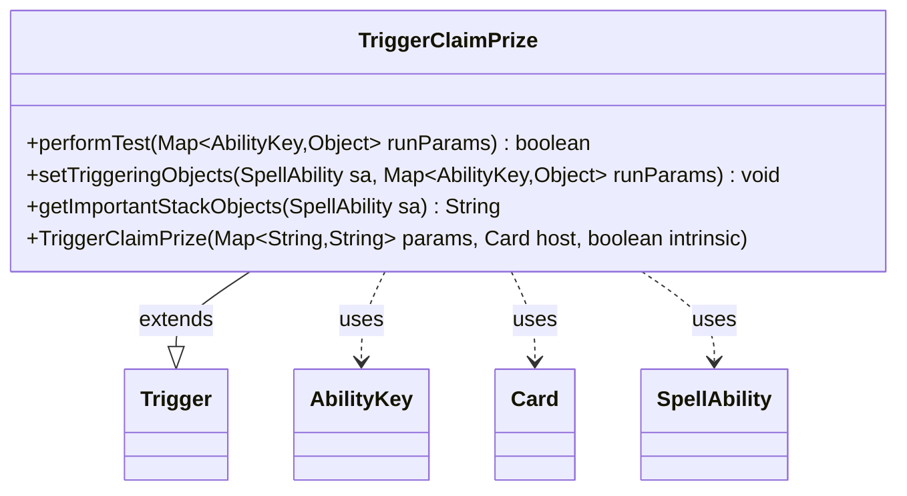

---
aliases:
  - TriggerClaimPrize
tags:
  - java/class
  - module/forge-game
  - pkg/forge/game/trigger
fqn: forge.game.trigger.TriggerClaimPrize
package: forge.game.trigger
module: forge-game
kind: Class
---

# TriggerClaimPrize

**Package:** `forge.game.trigger` &nbsp; **Module:** `forge-game` &nbsp; **Kind:** Class



## Relationships
**Extends:**
- [[forge.game.trigger.Trigger|Trigger]]
**Uses:**
- [[forge.game.ability.AbilityKey|AbilityKey]]
- [[forge.game.card.Card|Card]]
- [[forge.game.spellability.SpellAbility|SpellAbility]]

## Design Description

TriggerClaimPrize is a concrete trigger that fires when a player claims a prize, extending the abstract Trigger base class within Forge's event-driven triggered-ability framework. It overrides performTest to gate activation on optional ValidPlayer and ValidCard restrictions, matched against the firing event's run parameters keyed by AbilityKey. When the trigger resolves, setTriggeringObjects copies the relevant Player and Card from those parameters onto the SpellAbility so downstream effects can reference them, and getImportantStackObjects supplies a localized, player-focused description for stack display.

Its design mirrors the engine's many sibling Trigger subclasses: behavior is data-driven through the params map passed to the constructor, with type-safe AbilityKey lookups and Localizer-based messaging keeping the class small, declarative, and consistent with Forge's trigger conventions.

## Source
`forge-game/src/main/java/forge/game/trigger/TriggerClaimPrize.java`

```java
package forge.game.trigger;

import forge.game.ability.AbilityKey;
import forge.game.card.Card;
import forge.game.spellability.SpellAbility;
import forge.util.Localizer;

import java.util.Map;

public class TriggerClaimPrize extends Trigger{
    public TriggerClaimPrize(Map<String, String> params, Card host, boolean intrinsic) {
        super(params, host, intrinsic);
    }

    @Override
    public boolean performTest(Map<AbilityKey, Object> runParams) {
        if (!matchesValidParam("ValidPlayer", runParams.get(AbilityKey.Player))) {
            return false;
        }
        if (!matchesValidParam("ValidCard", runParams.get(AbilityKey.Card))) {
            return false;
        }
        return true;
    }

    @Override
    public void setTriggeringObjects(SpellAbility sa, Map<AbilityKey, Object> runParams) {
        sa.setTriggeringObjectsFrom(runParams, AbilityKey.Player, AbilityKey.Card);
    }

    @Override
    public String getImportantStackObjects(SpellAbility sa) {
        return Localizer.getInstance().getMessage("lblPlayer") + ": " +
                sa.getTriggeringObject(AbilityKey.Player);
    }
}
```

## Python
`forge/game/trigger/TriggerClaimPrize.py`

```python
from forge.game.trigger.Trigger import Trigger
from forge.game.ability.AbilityKey import AbilityKey
from forge.game.card.Card import Card
from forge.game.spellability.SpellAbility import SpellAbility
from forge.util.Localizer import Localizer

from typing import Mapping


class TriggerClaimPrize(Trigger):
    def __init__(self, params: dict[str, str], host: Card, intrinsic: bool):
        super().__init__(params, host, intrinsic)

    def performTest(self, runParams: dict[AbilityKey, object]) -> bool:
        if not self.matchesValidParam("ValidPlayer", runParams.get(AbilityKey.Player)):
            return False
        if not self.matchesValidParam("ValidCard", runParams.get(AbilityKey.Card)):
            return False
        return True

    def setTriggeringObjects(self, sa: SpellAbility, runParams: dict[AbilityKey, object]) -> None:
        sa.setTriggeringObjectsFrom(runParams, AbilityKey.Player, AbilityKey.Card)

    def getImportantStackObjects(self, sa: SpellAbility) -> str:
        return Localizer.getInstance().getMessage("lblPlayer") + ": " + \
            str(sa.getTriggeringObject(AbilityKey.Player))
```
