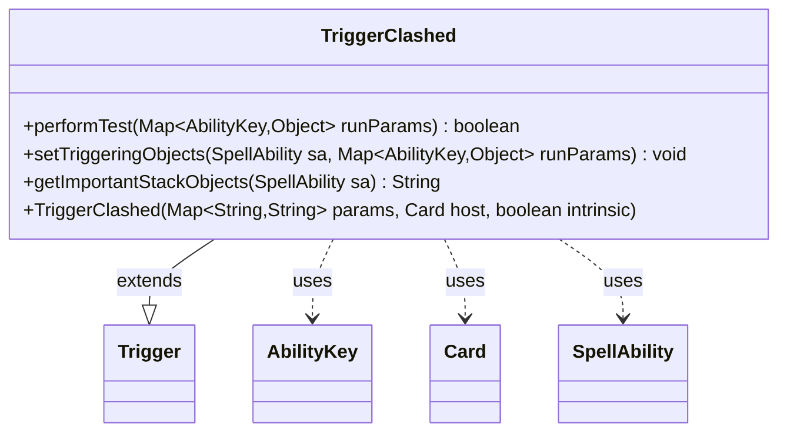

---
aliases:
  - TriggerClashed
tags:
  - java/class
  - module/forge-game
  - pkg/forge/game/trigger
fqn: forge.game.trigger.TriggerClashed
package: forge.game.trigger
module: forge-game
kind: Class
---

# TriggerClashed

**Package:** `forge.game.trigger`   **Module:** `forge-game`   **Kind:** Class



## Relationships
**Extends:**
- [[forge.game.trigger.Trigger|Trigger]]
**Uses:**
- [[forge.game.ability.AbilityKey|AbilityKey]]
- [[forge.game.card.Card|Card]]
- [[forge.game.spellability.SpellAbility|SpellAbility]]

## Design Description

TriggerClashed is a concrete trigger that fires in response to a clash event in Magic: the Gathering, encapsulating the condition-matching logic for "when a player clashes." As a subclass of `Trigger`, it plugs into Forge's event-driven triggered-ability framework, overriding `performTest` to validate run-time parameters—checking the clashing `Player` against a `ValidPlayer` filter and optionally matching a `Won` outcome—using `AbilityKey`-keyed run parameters. It is constructed from a parameter map, a host `Card`, and an intrinsic flag, mirroring its siblings in the trigger hierarchy.

The design intent is deliberately minimal: `setTriggeringObjects` exposes no triggered variables and `getImportantStackObjects` returns an empty string, signalling that a clash trigger carries no contextual data downstream to its `SpellAbility`. This keeps the class a thin, declarative predicate, delegating all shared lifecycle and parsing behavior to the `Trigger` base class.

## Source
`forge-game/src/main/java/forge/game/trigger/TriggerClashed.java`

```java
/*
 * Forge: Play Magic: the Gathering.
 * Copyright (C) 2011  Forge Team
 *
 * This program is free software: you can redistribute it and/or modify
 * it under the terms of the GNU General Public License as published by
 * the Free Software Foundation, either version 3 of the License, or
 * (at your option) any later version.
 * 
 * This program is distributed in the hope that it will be useful,
 * but WITHOUT ANY WARRANTY; without even the implied warranty of
 * MERCHANTABILITY or FITNESS FOR A PARTICULAR PURPOSE.  See the
 * GNU General Public License for more details.
 * 
 * You should have received a copy of the GNU General Public License
 * along with this program.  If not, see <http://www.gnu.org/licenses/>.
 */
package forge.game.trigger;

import java.util.Map;

import forge.game.ability.AbilityKey;
import forge.game.card.Card;
import forge.game.spellability.SpellAbility;

/**
 * <p>
 * Trigger_Clashed class.
 * </p>
 * 
 * @author Forge
 * @version $Id$
 */
public class TriggerClashed extends Trigger {

    /**
     * <p>
     * Constructor for Trigger_Clashed.
     * </p>
     * 
     * @param params
     *            a {@link java.util.HashMap} object.
     * @param host
     *            a {@link forge.game.card.Card} object.
     * @param intrinsic
     *            the intrinsic
     */
    public TriggerClashed(final Map<String, String> params, final Card host, final boolean intrinsic) {
        super(params, host, intrinsic);
    }

    /** {@inheritDoc}
     * @param runParams*/
    @Override
    public final boolean performTest(final Map<AbilityKey, Object> runParams) {
        if (!matchesValidParam("ValidPlayer", runParams.get(AbilityKey.Player))) {
            return false;
        }

        if (hasParam("Won")) {
            if (!getParam("Won").equals(runParams.get(AbilityKey.Won))) {
                return false;
            }
        }

        return true;
    }

    /** {@inheritDoc} */
    @Override
    public void setTriggeringObjects(final SpellAbility sa, Map<AbilityKey, Object> runParams) {
        // No triggered-variables for you :(
    }

    @Override
    public String getImportantStackObjects(SpellAbility sa) {
        return "";
    }
}
```

## Python
`forge/game/trigger/TriggerClashed.py`

```python
from typing import Map

from forge.game.trigger.Trigger import Trigger
from forge.game.ability.AbilityKey import AbilityKey
from forge.game.card.Card import Card
from forge.game.spellability.SpellAbility import SpellAbility


class TriggerClashed(Trigger):
    """
    Trigger_Clashed class.

    @author Forge
    @version $Id$
    """

    def __init__(self, params: dict[str, str], host: Card, intrinsic: bool):
        super().__init__(params, host, intrinsic)

    def performTest(self, runParams: dict[AbilityKey, object]) -> bool:
        if not self.matchesValidParam("ValidPlayer", runParams.get(AbilityKey.Player)):
            return False

        if self.hasParam("Won"):
            if self.getParam("Won") != runParams.get(AbilityKey.Won):
                return False

        return True

    def setTriggeringObjects(self, sa: SpellAbility, runParams: dict[AbilityKey, object]) -> None:
        # No triggered-variables for you :(
        pass

    def getImportantStackObjects(self, sa: SpellAbility) -> str:
        return ""
```
