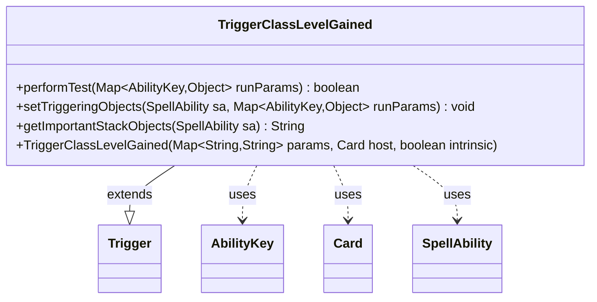

---
aliases:
  - TriggerClassLevelGained
tags:
  - java/class
  - module/forge-game
  - pkg/forge/game/trigger
fqn: forge.game.trigger.TriggerClassLevelGained
package: forge.game.trigger
module: forge-game
kind: Class
---

# TriggerClassLevelGained

**Package:** `forge.game.trigger` &nbsp; **Module:** `forge-game` &nbsp; **Kind:** Class



## Relationships
**Extends:**
- [[forge.game.trigger.Trigger|Trigger]]
**Uses:**
- [[forge.game.ability.AbilityKey|AbilityKey]]
- [[forge.game.card.Card|Card]]
- [[forge.game.spellability.SpellAbility|SpellAbility]]

## Design Description

TriggerClassLevelGained is a concrete trigger that fires when a Class permanent (the Dungeons & Dragons "Class" card type) advances to a new level, encapsulating the matching logic that decides whether such an event should activate a triggered ability. Extending the abstract Trigger base class, it overrides performTest to gate firing on an optional ValidCard filter and an optional exact ClassLevel match, and setTriggeringObjects to expose the gained level (via AbilityKey.ClassLevel) to the resulting SpellAbility. It collaborates with Card and AbilityKey to read run-time parameters and with SpellAbility to publish triggering objects. Following the engine's data-driven trigger pattern, its behavior is configured through the inherited String parameter map rather than hard-coded, and getImportantStackObjects formats the level for stack display, keeping presentation concerns local to the trigger.

## Source
`forge-game/src/main/java/forge/game/trigger/TriggerClassLevelGained.java`

```java
package forge.game.trigger;

import java.util.Map;

import forge.game.ability.AbilityKey;
import forge.game.card.Card;
import forge.game.spellability.SpellAbility;

public class TriggerClassLevelGained extends Trigger {

    public TriggerClassLevelGained(final Map<String, String> params, final Card host, final boolean intrinsic) {
        super(params, host, intrinsic);
    }

    @Override
    public final boolean performTest(final Map<AbilityKey, Object> runParams) {
        if (!matchesValidParam("ValidCard", runParams.get(AbilityKey.Card))) {
            return false;
        }

        if (hasParam("ClassLevel") && runParams.containsKey(AbilityKey.ClassLevel)) {
            final int levelCondition = Integer.parseInt(getParam("ClassLevel"));
            final int level = (Integer) runParams.get(AbilityKey.ClassLevel);

            if (levelCondition != level) {
                return false;
            }
        }

        return true;
    }

    @Override
    public final void setTriggeringObjects(final SpellAbility sa, Map<AbilityKey, Object> runParams) {
        sa.setTriggeringObjectsFrom(runParams, AbilityKey.ClassLevel);
    }

    public String getImportantStackObjects(SpellAbility sa) {
        Integer level = (Integer)sa.getTriggeringObject(AbilityKey.ClassLevel);
        StringBuilder sb = new StringBuilder("Class Level: ");
        sb.append(level);
        return sb.toString();
    }
}
```

## Python
`forge/game/trigger/TriggerClassLevelGained.py`

```python
from forge.game.trigger.Trigger import Trigger
from forge.game.ability.AbilityKey import AbilityKey
from forge.game.card.Card import Card
from forge.game.spellability.SpellAbility import SpellAbility


class TriggerClassLevelGained(Trigger):

    def __init__(self, params: dict[str, str], host: Card, intrinsic: bool):
        super().__init__(params, host, intrinsic)

    def performTest(self, runParams: dict[AbilityKey, object]) -> bool:
        if not self.matchesValidParam("ValidCard", runParams.get(AbilityKey.Card)):
            return False

        if self.hasParam("ClassLevel") and AbilityKey.ClassLevel in runParams:
            levelCondition = int(self.getParam("ClassLevel"))
            level = runParams.get(AbilityKey.ClassLevel)

            if levelCondition != level:
                return False

        return True

    def setTriggeringObjects(self, sa: SpellAbility, runParams: dict[AbilityKey, object]) -> None:
        sa.setTriggeringObjectsFrom(runParams, AbilityKey.ClassLevel)

    def getImportantStackObjects(self, sa: SpellAbility) -> str:
        level = sa.getTriggeringObject(AbilityKey.ClassLevel)
        sb = "Class Level: "
        sb += str(level)
        return sb
```
