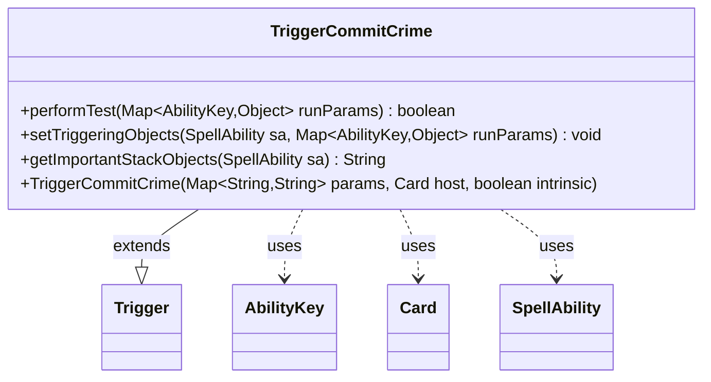

---
aliases:
  - TriggerCommitCrime
tags:
  - java/class
  - module/forge-game
  - pkg/forge/game/trigger
fqn: forge.game.trigger.TriggerCommitCrime
package: forge.game.trigger
module: forge-game
kind: Class
---

# TriggerCommitCrime

**Package:** `forge.game.trigger` &nbsp; **Module:** `forge-game` &nbsp; **Kind:** Class



## Relationships
**Extends:**
- [[forge.game.trigger.Trigger|Trigger]]
**Uses:**
- [[forge.game.ability.AbilityKey|AbilityKey]]
- [[forge.game.card.Card|Card]]
- [[forge.game.spellability.SpellAbility|SpellAbility]]

## Design Description

Players who commit a crime trigger this event-based trigger by targeting an opponent's permanent, player, or planeswalker.

A concrete `Trigger` subtype that fires when a player commits a crime, this class specializes the abstract `Trigger` base to the crime game event. `performTest` filters firings against the optional `ValidPlayer` parameter, matching the crime-committing player carried in the run parameters under `AbilityKey.Player`; absent that restriction it always fires. `setTriggeringObjects` exposes that player to the resulting `SpellAbility` via `setTriggeringObjectsFrom`, and `getImportantStackObjects` builds a localized stack description naming the player. Collaborating only with `AbilityKey`, `Card`, and `SpellAbility`, the class follows Forge's data-driven trigger pattern, keeping all behavior keyed off declarative parameter maps rather than hard-coded logic so card scripts can configure it.

## Source
`forge-game/src/main/java/forge/game/trigger/TriggerCommitCrime.java`

```java
package forge.game.trigger;

import java.util.Map;

import forge.game.ability.AbilityKey;
import forge.game.card.Card;
import forge.game.spellability.SpellAbility;
import forge.util.Localizer;

public class TriggerCommitCrime extends Trigger {

    public TriggerCommitCrime(Map<String, String> params, Card host, boolean intrinsic) {
        super(params, host, intrinsic);
    }

    @Override
    public boolean performTest(Map<AbilityKey, Object> runParams) {
        if (!matchesValidParam("ValidPlayer", runParams.get(AbilityKey.Player))) {
            return false;
        }

        return true;
    }

    @Override
    public void setTriggeringObjects(SpellAbility sa, Map<AbilityKey, Object> runParams) {
        sa.setTriggeringObjectsFrom(runParams, AbilityKey.Player);
    }

    @Override
    public String getImportantStackObjects(SpellAbility sa) {
        StringBuilder sb = new StringBuilder();
        sb.append(Localizer.getInstance().getMessage("lblPlayer")).append(": ").append(sa.getTriggeringObject(AbilityKey.Player));
        return sb.toString();
    }

}
```

## Python
`forge/game/trigger/TriggerCommitCrime.py`

```python
from typing import Map

from forge.game.ability.AbilityKey import AbilityKey
from forge.game.card.Card import Card
from forge.game.spellability.SpellAbility import SpellAbility
from forge.game.trigger.Trigger import Trigger
from forge.util.Localizer import Localizer


class TriggerCommitCrime(Trigger):

    def __init__(self, params: dict[str, str], host: Card, intrinsic: bool):
        super().__init__(params, host, intrinsic)

    def performTest(self, runParams: dict[AbilityKey, object]) -> bool:
        if not self.matchesValidParam("ValidPlayer", runParams.get(AbilityKey.Player)):
            return False

        return True

    def setTriggeringObjects(self, sa: SpellAbility, runParams: dict[AbilityKey, object]) -> None:
        sa.setTriggeringObjectsFrom(runParams, AbilityKey.Player)

    def getImportantStackObjects(self, sa: SpellAbility) -> str:
        sb = []
        sb.append(Localizer.getInstance().getMessage("lblPlayer"))
        sb.append(": ")
        sb.append(str(sa.getTriggeringObject(AbilityKey.Player)))
        return "".join(sb)
```
