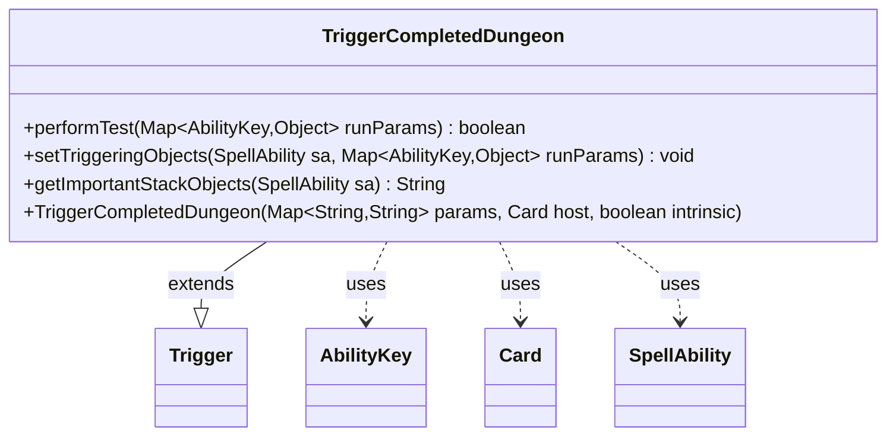

---
aliases:
  - TriggerCompletedDungeon
tags:
  - java/class
  - module/forge-game
  - pkg/forge/game/trigger
fqn: forge.game.trigger.TriggerCompletedDungeon
package: forge.game.trigger
module: forge-game
kind: Class
---

# TriggerCompletedDungeon

**Package:** `forge.game.trigger` &nbsp; **Module:** `forge-game` &nbsp; **Kind:** Class



## Relationships
**Extends:**
- [[forge.game.trigger.Trigger|Trigger]]
**Uses:**
- [[forge.game.ability.AbilityKey|AbilityKey]]
- [[forge.game.card.Card|Card]]
- [[forge.game.spellability.SpellAbility|SpellAbility]]

## Design Description

TriggerCompletedDungeon is a concrete trigger that fires when a player completes a dungeon, encapsulating the condition-matching and triggering-object wiring for that game event. As a subclass of Trigger, it overrides the framework's `performTest` to gate firing on the optional `ValidPlayer` restriction and `setTriggeringObjects` to expose the completing player to the resolving SpellAbility, using AbilityKey constants as the keys into the shared run-parameter map. Its `getImportantStackObjects` produces a localized, player-labeled summary for stack display.

The design follows the engine's data-driven trigger pattern: behavior is configured through the `params` map passed to the superclass constructor rather than hardcoded, and the class stays a thin, single-responsibility adapter between the generic Trigger machinery and the Player-centric semantics of dungeon completion, delegating object resolution to Card and SpellAbility collaborators.

## Source
`forge-game/src/main/java/forge/game/trigger/TriggerCompletedDungeon.java`

```java
package forge.game.trigger;

import java.util.Map;

import forge.game.ability.AbilityKey;
import forge.game.card.Card;
import forge.game.spellability.SpellAbility;
import forge.util.Localizer;

public class TriggerCompletedDungeon extends Trigger {

    public TriggerCompletedDungeon(final Map<String, String> params, final Card host, final boolean intrinsic) {
        super(params, host, intrinsic);
    }

    @Override
    public final boolean performTest(final Map<AbilityKey, Object> runParams) {
        if (!matchesValidParam("ValidPlayer", runParams.get(AbilityKey.Player))) {
            return false;
        }

        return true;
    }

    @Override
    public final void setTriggeringObjects(final SpellAbility sa, Map<AbilityKey, Object> runParams) {
        sa.setTriggeringObjectsFrom(runParams, AbilityKey.Player);
    }

    public String getImportantStackObjects(SpellAbility sa) {
        StringBuilder sb = new StringBuilder();
        sb.append(Localizer.getInstance().getMessage("lblPlayer")).append(": ").append(sa.getTriggeringObject(AbilityKey.Player));
        return sb.toString();
    }
}
```

## Python
`forge/game/trigger/TriggerCompletedDungeon.py`

```python
from typing import Map

from forge.game.trigger.Trigger import Trigger
from forge.game.ability.AbilityKey import AbilityKey
from forge.game.card.Card import Card
from forge.game.spellability.SpellAbility import SpellAbility
from forge.util.Localizer import Localizer


class TriggerCompletedDungeon(Trigger):

    def __init__(self, params: dict[str, str], host: Card, intrinsic: bool):
        super().__init__(params, host, intrinsic)

    def performTest(self, runParams: dict[AbilityKey, object]) -> bool:
        if not self.matchesValidParam("ValidPlayer", runParams.get(AbilityKey.Player)):
            return False

        return True

    def setTriggeringObjects(self, sa: SpellAbility, runParams: dict[AbilityKey, object]) -> None:
        sa.setTriggeringObjectsFrom(runParams, AbilityKey.Player)

    def getImportantStackObjects(self, sa: SpellAbility) -> str:
        sb = []
        sb.append(Localizer.getInstance().getMessage("lblPlayer"))
        sb.append(": ")
        sb.append(str(sa.getTriggeringObject(AbilityKey.Player)))
        return "".join(sb)
```
