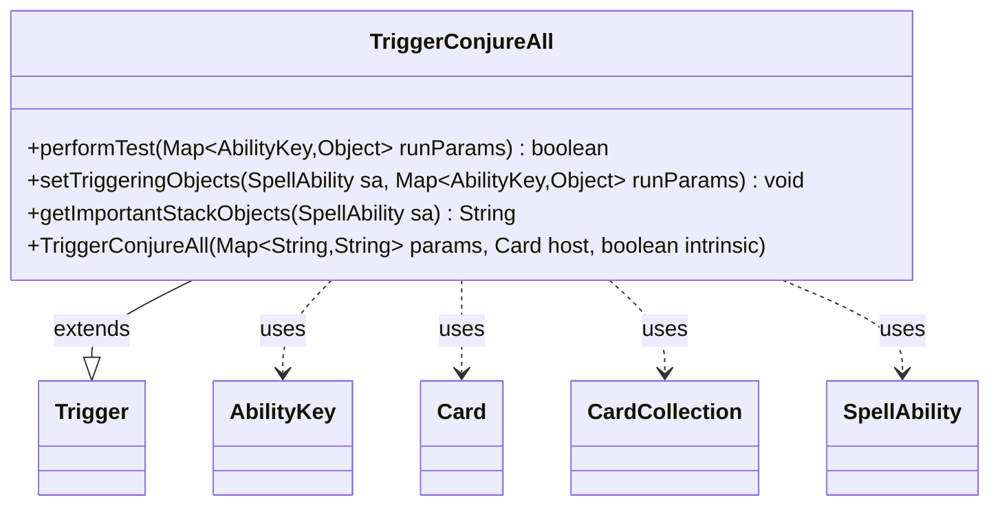

---
aliases:
  - TriggerConjureAll
tags:
  - java/class
  - module/forge-game
  - pkg/forge/game/trigger
fqn: forge.game.trigger.TriggerConjureAll
package: forge.game.trigger
module: forge-game
kind: Class
---

# TriggerConjureAll

**Package:** `forge.game.trigger`   **Module:** `forge-game`   **Kind:** Class



## Relationships
**Extends:**
- [[forge.game.trigger.Trigger|Trigger]]
**Uses:**
- [[forge.game.ability.AbilityKey|AbilityKey]]
- [[forge.game.card.Card|Card]]
- [[forge.game.card.CardCollection|CardCollection]]
- [[forge.game.spellability.SpellAbility|SpellAbility]]

## Design Description

Conjures matching cards onto the battlefield by firing when one or more cards are conjured, validating the triggering player and the conjured cards against the trigger's `ValidPlayer` and `ValidCard` parameters. As a concrete subclass of `Trigger`, it overrides the engine's template-method hooks—`performTest` to gate activation, `setTriggeringObjects` to expose the relevant data to the resulting `SpellAbility`, and `getImportantStackObjects` for stack display. It collaborates with the `AbilityKey`-keyed `runParams` map to extract a `CardCollection`, narrowing it through `CardLists.getValidCards` when a `ValidCard` filter is present, then publishes the filtered cards along with the player and cause to the spell ability. Commented-out `ValidCause` and `Amount` handling signals deliberately deferred functionality, keeping the class minimal until those values are needed.

## Source
`forge-game/src/main/java/forge/game/trigger/TriggerConjureAll.java`

```java
package forge.game.trigger;

import forge.game.ability.AbilityKey;
import forge.game.card.Card;
import forge.game.card.CardCollection;
import forge.game.card.CardLists;
import forge.game.spellability.SpellAbility;
import forge.util.Localizer;

import java.util.Map;

public class TriggerConjureAll extends Trigger {

    public TriggerConjureAll(Map<String, String> params, Card host, boolean intrinsic) {
        super(params, host, intrinsic);
    }

    @Override
    public boolean performTest(Map<AbilityKey, Object> runParams) {
        if (!matchesValidParam("ValidPlayer", runParams.get(AbilityKey.Player))) {
            return false;
        }
        // currently not used
        //if (!matchesValidParam("ValidCause", runParams.get(AbilityKey.Cause))) {
        //    return false;
        //}
        if (!matchesValidParam("ValidCard", runParams.get(AbilityKey.Cards))) {
            return false;
        }

        return true;
    }

    @Override
    public void setTriggeringObjects(SpellAbility sa, Map<AbilityKey, Object> runParams) {
        CardCollection cards = (CardCollection) runParams.get(AbilityKey.Cards);

        if (hasParam("ValidCard")) {
            cards = CardLists.getValidCards(cards, getParam("ValidCard"), getHostCard().getController(),
                    getHostCard(), this);
        }

        sa.setTriggeringObject(AbilityKey.Cards, cards);
        //sa.setTriggeringObject(AbilityKey.Amount, cards.size()) -- currently don't need
        sa.setTriggeringObjectsFrom(runParams, AbilityKey.Player, AbilityKey.Cause);
    }

    @Override
    public String getImportantStackObjects(SpellAbility sa) {
        StringBuilder sb = new StringBuilder();
        sb.append(Localizer.getInstance().getMessage("lblPlayer")).append(": ");
        sb.append(sa.getTriggeringObject(AbilityKey.Player));
        return sb.toString();
    }
}
```

## Python
`forge/game/trigger/TriggerConjureAll.py`

```python
package forge.game.trigger

from typing import Map

from forge.game.trigger.Trigger import Trigger
from forge.game.ability.AbilityKey import AbilityKey
from forge.game.card.Card import Card
from forge.game.card.CardCollection import CardCollection
from forge.game.card.CardLists import CardLists
from forge.game.spellability.SpellAbility import SpellAbility
from forge.util.Localizer import Localizer


class TriggerConjureAll(Trigger):

    def __init__(self, params: dict[str, str], host: Card, intrinsic: bool):
        super().__init__(params, host, intrinsic)

    def performTest(self, runParams: dict[AbilityKey, object]) -> bool:
        if not self.matchesValidParam("ValidPlayer", runParams.get(AbilityKey.Player)):
            return False
        # currently not used
        # if not self.matchesValidParam("ValidCause", runParams.get(AbilityKey.Cause)):
        #     return False
        if not self.matchesValidParam("ValidCard", runParams.get(AbilityKey.Cards)):
            return False

        return True

    def setTriggeringObjects(self, sa: SpellAbility, runParams: dict[AbilityKey, object]) -> None:
        cards = runParams.get(AbilityKey.Cards)

        if self.hasParam("ValidCard"):
            cards = CardLists.getValidCards(cards, self.getParam("ValidCard"), self.getHostCard().getController(),
                    self.getHostCard(), self)

        sa.setTriggeringObject(AbilityKey.Cards, cards)
        # sa.setTriggeringObject(AbilityKey.Amount, cards.size()) -- currently don't need
        sa.setTriggeringObjectsFrom(runParams, AbilityKey.Player, AbilityKey.Cause)

    def getImportantStackObjects(self, sa: SpellAbility) -> str:
        sb = []
        sb.append(Localizer.getInstance().getMessage("lblPlayer"))
        sb.append(": ")
        sb.append(str(sa.getTriggeringObject(AbilityKey.Player)))
        return "".join(sb)
```
