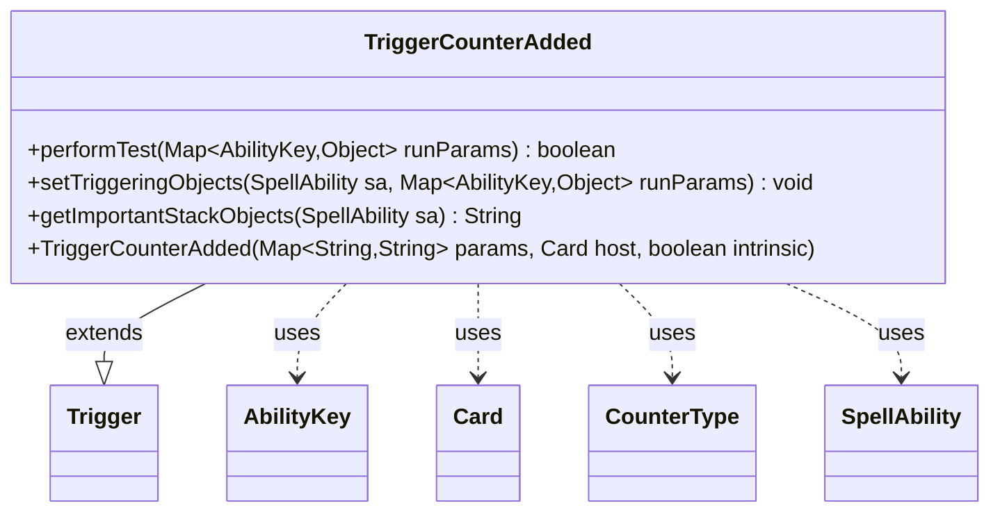

---
aliases:
  - TriggerCounterAdded
tags:
  - java/class
  - module/forge-game
  - pkg/forge/game/trigger
fqn: forge.game.trigger.TriggerCounterAdded
package: forge.game.trigger
module: forge-game
kind: Class
---

# TriggerCounterAdded

**Package:** `forge.game.trigger`   **Module:** `forge-game`   **Kind:** Class



## Relationships
**Extends:**
- [[forge.game.trigger.Trigger|Trigger]]
**Uses:**
- [[forge.game.ability.AbilityKey|AbilityKey]]
- [[forge.game.card.Card|Card]]
- [[forge.game.card.CounterType|CounterType]]
- [[forge.game.spellability.SpellAbility|SpellAbility]]

## Design Description

Counters added to a permanent.

The `TriggerCounterAdded` class is a concrete trigger that fires when one or more counters are placed on a card. Extending `Trigger`, it implements the framework's template-method contract: `performTest` evaluates the configured trigger conditions against the runtime parameters, while `setTriggeringObjects` and `getImportantStackObjects` expose the affected `Card` and `Player` to the resulting `SpellAbility`.

It collaborates with `AbilityKey` to read typed values from the run-parameter map, and uses `CounterType` to match a specific kind of counter. Notable design intent includes optional filtering via `ValidCard`/`ValidPlayer`/`ValidSource` predicates, and a `CounterAmount` comparison—parsed as a two-character operator plus operand and evaluated through `Expressions.compare`—specifically noted as supporting Saga cards, which trigger abilities based on their accumulated lore counters.

## Source
`forge-game/src/main/java/forge/game/trigger/TriggerCounterAdded.java`

```java
/*
 * Forge: Play Magic: the Gathering.
 * Copyright (C) 2011  Forge Team
 *
 * This program is free software: you can redistribute it and/or modify
 * it under the terms of the GNU General Public License as published by
 * the Free Software Foundation, either version 3 of the License, or
 * (at your option) any later version.
 * 
 * This program is distributed in the hope that it will be useful,
 * but WITHOUT ANY WARRANTY; without even the implied warranty of
 * MERCHANTABILITY or FITNESS FOR A PARTICULAR PURPOSE.  See the
 * GNU General Public License for more details.
 * 
 * You should have received a copy of the GNU General Public License
 * along with this program.  If not, see <http://www.gnu.org/licenses/>.
 */
package forge.game.trigger;

import java.util.Map;

import forge.game.ability.AbilityKey;
import forge.game.card.Card;
import forge.game.card.CounterType;
import forge.game.spellability.SpellAbility;
import forge.util.Expressions;
import forge.util.Localizer;

/**
 * <p>
 * Trigger_CounterAdded class.
 * </p>
 * 
 * @author Forge
 * @version $Id$
 */
public class TriggerCounterAdded extends Trigger {

    /**
     * <p>
     * Constructor for Trigger_CounterAdded.
     * </p>
     * 
     * @param params
     *            a {@link java.util.HashMap} object.
     * @param host
     *            a {@link forge.game.card.Card} object.
     * @param intrinsic
     *            the intrinsic
     */
    public TriggerCounterAdded(final Map<String, String> params, final Card host, final boolean intrinsic) {
        super(params, host, intrinsic);
    }

    /** {@inheritDoc} */
    @Override
    public final boolean performTest(final Map<AbilityKey, Object> runParams) {
        final CounterType addedType = (CounterType) runParams.get(AbilityKey.CounterType);

        if (!matchesValidParam("ValidCard", runParams.get(AbilityKey.Card))) {
            return false;
        }

        if (!matchesValidParam("ValidPlayer", runParams.get(AbilityKey.Player))) {
            return false;
        }

        if (!matchesValidParam("ValidSource", runParams.get(AbilityKey.Source))) {
            return false;
        }

        if (hasParam("CounterType")) {
            final String type = getParam("CounterType");
            if (!type.equals(addedType.toString())) {
                return false;
            }
        }
        if (hasParam("CounterAmount") && runParams.containsKey(AbilityKey.CounterAmount)) {
            // this one is for Saga to trigger
            // the right ability for the counters on the card
            final String fullParam = getParam("CounterAmount");

            final String operator = fullParam.substring(0, 2);
            final int operand = Integer.parseInt(fullParam.substring(2));
            final int actualAmount = (Integer) runParams.get(AbilityKey.CounterAmount);

            if (!Expressions.compare(actualAmount, operator, operand)) {
                return false;
            }
        }

        return true;
    }

    /** {@inheritDoc} */
    @Override
    public final void setTriggeringObjects(final SpellAbility sa, Map<AbilityKey, Object> runParams) {
        sa.setTriggeringObjectsFrom(runParams, AbilityKey.Card, AbilityKey.Player);
    }

    @Override
    public String getImportantStackObjects(SpellAbility sa) {
        StringBuilder sb = new StringBuilder();
        sb.append(Localizer.getInstance().getMessage("lblAddedOnce")).append(": ");
        if (sa.hasTriggeringObject(AbilityKey.Card))
            sb.append(sa.getTriggeringObject(AbilityKey.Card));
        if (sa.hasTriggeringObject(AbilityKey.Player))
            sb.append(sa.getTriggeringObject(AbilityKey.Player));
        return sb.toString();
    }
}
```

## Python
`forge/game/trigger/TriggerCounterAdded.py`

```python
from forge.game.trigger.Trigger import Trigger
from forge.game.ability.AbilityKey import AbilityKey
from forge.game.card.Card import Card
from forge.game.card.CounterType import CounterType
from forge.game.spellability.SpellAbility import SpellAbility
from forge.util.Expressions import Expressions
from forge.util.Localizer import Localizer


class TriggerCounterAdded(Trigger):
    """
    Trigger_CounterAdded class.

    @author Forge
    @version $Id$
    """

    def __init__(self, params: dict[str, str], host: Card, intrinsic: bool):
        super().__init__(params, host, intrinsic)

    def performTest(self, runParams: dict[AbilityKey, object]) -> bool:
        addedType = runParams.get(AbilityKey.CounterType)

        if not self.matchesValidParam("ValidCard", runParams.get(AbilityKey.Card)):
            return False

        if not self.matchesValidParam("ValidPlayer", runParams.get(AbilityKey.Player)):
            return False

        if not self.matchesValidParam("ValidSource", runParams.get(AbilityKey.Source)):
            return False

        if self.hasParam("CounterType"):
            type = self.getParam("CounterType")
            if type != str(addedType):
                return False

        if self.hasParam("CounterAmount") and AbilityKey.CounterAmount in runParams:
            # this one is for Saga to trigger
            # the right ability for the counters on the card
            fullParam = self.getParam("CounterAmount")

            operator = fullParam[0:2]
            operand = int(fullParam[2:])
            actualAmount = runParams.get(AbilityKey.CounterAmount)

            if not Expressions.compare(actualAmount, operator, operand):
                return False

        return True

    def setTriggeringObjects(self, sa: SpellAbility, runParams: dict[AbilityKey, object]) -> None:
        sa.setTriggeringObjectsFrom(runParams, AbilityKey.Card, AbilityKey.Player)

    def getImportantStackObjects(self, sa: SpellAbility) -> str:
        sb = []
        sb.append(Localizer.getInstance().getMessage("lblAddedOnce"))
        sb.append(": ")
        if sa.hasTriggeringObject(AbilityKey.Card):
            sb.append(str(sa.getTriggeringObject(AbilityKey.Card)))
        if sa.hasTriggeringObject(AbilityKey.Player):
            sb.append(str(sa.getTriggeringObject(AbilityKey.Player)))
        return "".join(sb)
```
