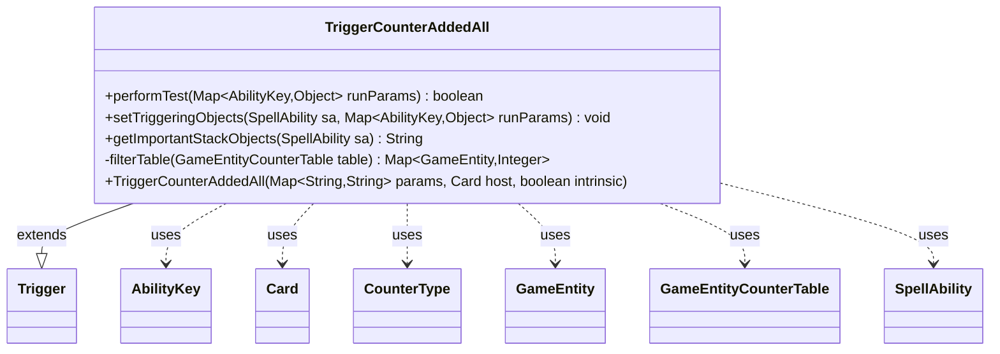

---
aliases:
  - TriggerCounterAddedAll
tags:
  - java/class
  - module/forge-game
  - pkg/forge/game/trigger
fqn: forge.game.trigger.TriggerCounterAddedAll
package: forge.game.trigger
module: forge-game
kind: Class
---

# TriggerCounterAddedAll

**Package:** `forge.game.trigger` &nbsp; **Module:** `forge-game` &nbsp; **Kind:** Class



## Relationships
**Extends:**
- [[forge.game.trigger.Trigger|Trigger]]
**Uses:**
- [[forge.game.GameEntity|GameEntity]]
- [[forge.game.GameEntityCounterTable|GameEntityCounterTable]]
- [[forge.game.ability.AbilityKey|AbilityKey]]
- [[forge.game.card.Card|Card]]
- [[forge.game.card.CounterType|CounterType]]
- [[forge.game.spellability.SpellAbility|SpellAbility]]

## Design Description

TriggerCounterAddedAll is a concrete trigger that fires when counters are placed on a batch of game entities in a single event, responding to the aggregate rather than to individual placements. Extending `Trigger`, it implements the standard hooks: `performTest` consults the `GameEntityCounterTable` supplied via `AbilityKey.Objects` and fires only when the filtered set is non-empty, while `setTriggeringObjects` exposes both the matched `GameEntity` list and their summed counter total under the `Objects` and `Amount` keys for downstream ability resolution.

Its design intent centers on the private `filterTable` helper, which narrows the table by the trigger's `CounterType` and `Valid` parameters relative to the host card, keeping selection logic in one place. By collaborating with `CounterType`, `SpellAbility`, and `Card`, and using `Localizer` for its stack description, the class follows Forge's data-driven, parameterized trigger pattern, distinguishing itself from per-entity counter triggers through its "All" aggregate semantics.

## Source
`forge-game/src/main/java/forge/game/trigger/TriggerCounterAddedAll.java`

```java
package forge.game.trigger;

import java.util.Map;

import com.google.common.collect.Lists;

import forge.game.GameEntity;
import forge.game.GameEntityCounterTable;
import forge.game.ability.AbilityKey;
import forge.game.card.Card;
import forge.game.card.CounterType;
import forge.game.spellability.SpellAbility;
import forge.util.Localizer;

public class TriggerCounterAddedAll extends Trigger {

    public TriggerCounterAddedAll(Map<String, String> params, Card host, boolean intrinsic) {
        super(params, host, intrinsic);
    }

    @Override
    public boolean performTest(Map<AbilityKey, Object> runParams) {
        final GameEntityCounterTable table = (GameEntityCounterTable) runParams.get(AbilityKey.Objects);

        return !filterTable(table).isEmpty();
    }

    @Override
    public void setTriggeringObjects(SpellAbility sa, Map<AbilityKey, Object> runParams) {
        final GameEntityCounterTable table = (GameEntityCounterTable) runParams.get(AbilityKey.Objects);

        Map<GameEntity, Integer> all = this.filterTable(table);

        int amount = 0;
        for (final Integer v : all.values()) {
            amount += v;
        }

        sa.setTriggeringObject(AbilityKey.Objects, Lists.newArrayList(all.keySet()));
        sa.setTriggeringObject(AbilityKey.Amount, amount);
    }

    @Override
    public String getImportantStackObjects(SpellAbility sa) {
        StringBuilder sb = new StringBuilder();
        sb.append(Localizer.getInstance().getMessage("lblAmount")).append(": ").append(sa.getTriggeringObject(AbilityKey.Amount));
        return sb.toString();
    }

    private Map<GameEntity, Integer> filterTable(GameEntityCounterTable table) {
        CounterType counterType = CounterType.getType(getParam("CounterType"));
        String valid = getParam("Valid");

        return table.filterTable(counterType, valid, getHostCard(), this);
    }
}
```

## Python
`forge/game/trigger/TriggerCounterAddedAll.py`

```python
from forge.game.trigger.Trigger import Trigger
from forge.game.GameEntity import GameEntity
from forge.game.GameEntityCounterTable import GameEntityCounterTable
from forge.game.ability.AbilityKey import AbilityKey
from forge.game.card.Card import Card
from forge.game.card.CounterType import CounterType
from forge.game.spellability.SpellAbility import SpellAbility
from forge.util.Localizer import Localizer


class TriggerCounterAddedAll(Trigger):

    def __init__(self, params: dict[str, str], host: Card, intrinsic: bool):
        super().__init__(params, host, intrinsic)

    def performTest(self, runParams: dict[AbilityKey, object]) -> bool:
        table = runParams.get(AbilityKey.Objects)

        return len(self.filterTable(table)) != 0

    def setTriggeringObjects(self, sa: SpellAbility, runParams: dict[AbilityKey, object]) -> None:
        table = runParams.get(AbilityKey.Objects)

        all = self.filterTable(table)

        amount = 0
        for v in all.values():
            amount += v

        sa.setTriggeringObject(AbilityKey.Objects, list(all.keys()))
        sa.setTriggeringObject(AbilityKey.Amount, amount)

    def getImportantStackObjects(self, sa: SpellAbility) -> str:
        sb = []
        sb.append(Localizer.getInstance().getMessage("lblAmount"))
        sb.append(": ")
        sb.append(str(sa.getTriggeringObject(AbilityKey.Amount)))
        return "".join(sb)

    def filterTable(self, table: GameEntityCounterTable) -> dict[GameEntity, int]:
        counterType = CounterType.getType(self.getParam("CounterType"))
        valid = self.getParam("Valid")

        return table.filterTable(counterType, valid, self.getHostCard(), self)
```
