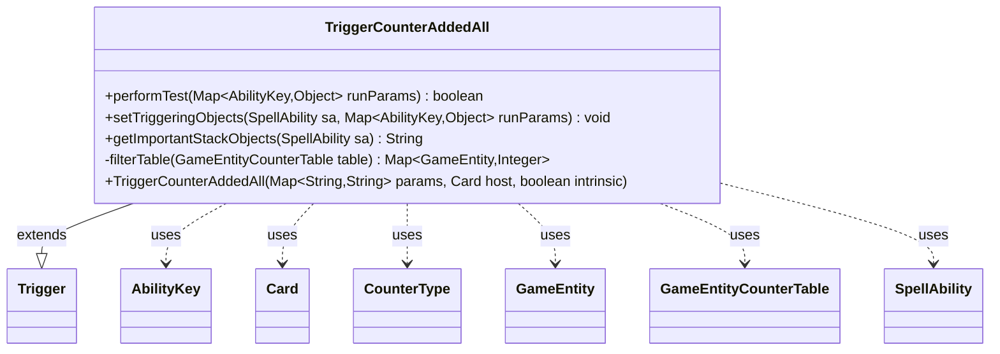

---
aliases:
  - TriggerCounterAddedAll
tags:
  - java/class
  - module/forge-game
  - pkg/forge/game/trigger
fqn: forge.game.trigger.TriggerCounterAddedAll
package: forge.game.trigger
module: forge-game
kind: Class
---

# TriggerCounterAddedAll

**Package:** `forge.game.trigger` &nbsp; **Module:** `forge-game` &nbsp; **Kind:** Class



## Relationships
**Extends:**
- [[forge.game.trigger.Trigger|Trigger]]
**Uses:**
- [[forge.game.GameEntity|GameEntity]]
- [[forge.game.GameEntityCounterTable|GameEntityCounterTable]]
- [[forge.game.ability.AbilityKey|AbilityKey]]
- [[forge.game.card.Card|Card]]
- [[forge.game.card.CounterType|CounterType]]
- [[forge.game.spellability.SpellAbility|SpellAbility]]

## Source
`forge-game/src/main/java/forge/game/trigger/TriggerCounterAddedAll.java`

```java
package forge.game.trigger;

import java.util.Map;

import com.google.common.collect.Lists;

import forge.game.GameEntity;
import forge.game.GameEntityCounterTable;
import forge.game.ability.AbilityKey;
import forge.game.card.Card;
import forge.game.card.CounterType;
import forge.game.spellability.SpellAbility;
import forge.util.Localizer;

public class TriggerCounterAddedAll extends Trigger {

    public TriggerCounterAddedAll(Map<String, String> params, Card host, boolean intrinsic) {
        super(params, host, intrinsic);
    }

    @Override
    public boolean performTest(Map<AbilityKey, Object> runParams) {
        final GameEntityCounterTable table = (GameEntityCounterTable) runParams.get(AbilityKey.Objects);

        return !filterTable(table).isEmpty();
    }

    @Override
    public void setTriggeringObjects(SpellAbility sa, Map<AbilityKey, Object> runParams) {
        final GameEntityCounterTable table = (GameEntityCounterTable) runParams.get(AbilityKey.Objects);

        Map<GameEntity, Integer> all = this.filterTable(table);

        int amount = 0;
        for (final Integer v : all.values()) {
            amount += v;
        }

        sa.setTriggeringObject(AbilityKey.Objects, Lists.newArrayList(all.keySet()));
        sa.setTriggeringObject(AbilityKey.Amount, amount);
    }

    @Override
    public String getImportantStackObjects(SpellAbility sa) {
        StringBuilder sb = new StringBuilder();
        sb.append(Localizer.getInstance().getMessage("lblAmount")).append(": ").append(sa.getTriggeringObject(AbilityKey.Amount));
        return sb.toString();
    }

    private Map<GameEntity, Integer> filterTable(GameEntityCounterTable table) {
        CounterType counterType = CounterType.getType(getParam("CounterType"));
        String valid = getParam("Valid");

        return table.filterTable(counterType, valid, getHostCard(), this);
    }
}
```
