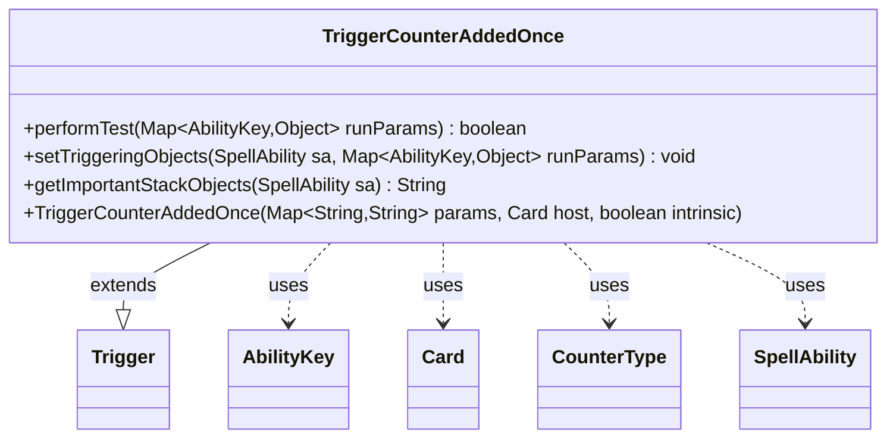

---
aliases:
  - TriggerCounterAddedOnce
tags:
  - java/class
  - module/forge-game
  - pkg/forge/game/trigger
fqn: forge.game.trigger.TriggerCounterAddedOnce
package: forge.game.trigger
module: forge-game
kind: Class
---

# TriggerCounterAddedOnce

**Package:** `forge.game.trigger`   **Module:** `forge-game`   **Kind:** Class



## Relationships
**Extends:**
- [[forge.game.trigger.Trigger|Trigger]]
**Uses:**
- [[forge.game.ability.AbilityKey|AbilityKey]]
- [[forge.game.card.Card|Card]]
- [[forge.game.card.CounterType|CounterType]]
- [[forge.game.spellability.SpellAbility|SpellAbility]]

## Design Description

TriggerCounterAddedOnce is a concrete trigger that fires once when one or more counters are placed on a card or player, modeling Magic effects keyed to a single counter-addition event. As a subclass of Trigger, it implements the engine's trigger contract: performTest filters the event against optional declarative parameters—matching a specific CounterType, validating the affected entity, card, player, and source, and honoring a FirstTime restriction—while setTriggeringObjects exposes the affected Card or Player and the counter Amount to the resolving SpellAbility.

The class collaborates with AbilityKey to read and write strongly typed run parameters from the event map, and with CounterType to compare counter kinds. getImportantStackObjects builds a localized, human-readable stack summary via Localizer, reflecting a design that keeps trigger conditions data-driven and the engine's parameter-matching logic centralized in the Trigger base class.

## Source
`forge-game/src/main/java/forge/game/trigger/TriggerCounterAddedOnce.java`

```java
/*
 * Forge: Play Magic: the Gathering.
 * Copyright (C) 2011  Forge Team
 *
 * This program is free software: you can redistribute it and/or modify
 * it under the terms of the GNU General Public License as published by
 * the Free Software Foundation, either version 3 of the License, or
 * (at your option) any later version.
 * 
 * This program is distributed in the hope that it will be useful,
 * but WITHOUT ANY WARRANTY; without even the implied warranty of
 * MERCHANTABILITY or FITNESS FOR A PARTICULAR PURPOSE.  See the
 * GNU General Public License for more details.
 * 
 * You should have received a copy of the GNU General Public License
 * along with this program.  If not, see <http://www.gnu.org/licenses/>.
 */
package forge.game.trigger;

import java.util.Map;

import forge.game.ability.AbilityKey;
import forge.game.card.Card;
import forge.game.card.CounterType;
import forge.game.spellability.SpellAbility;
import forge.util.Localizer;

/**
 * <p>
 * Trigger_CounterAdded class.
 * </p>
 * 
 * @author Forge
 * @version $Id: TriggerCounterAdded.java 23787 2013-11-24 07:09:23Z Max mtg $
 */
public class TriggerCounterAddedOnce extends Trigger {

    /**
     * <p>
     * Constructor for Trigger_CounterAddedOnce.
     * </p>
     * 
     * @param params
     *            a {@link java.util.HashMap} object.
     * @param host
     *            a {@link forge.game.card.Card} object.
     * @param intrinsic
     *            the intrinsic
     */
    public TriggerCounterAddedOnce(final Map<String, String> params, final Card host, final boolean intrinsic) {
        super(params, host, intrinsic);
    }

    /** {@inheritDoc}
     * @param runParams
    */
    @Override
    public final boolean performTest(final Map<AbilityKey, Object> runParams) {
        if (hasParam("CounterType")) {
            final CounterType addedType = (CounterType) runParams.get(AbilityKey.CounterType);
            final String type = getParam("CounterType");
            if (!type.equals(addedType.toString())) {
                return false;
            }
        }

        if (!matchesValidParam("ValidEntity", runParams.get(AbilityKey.Card)) && !matchesValidParam("ValidEntity", runParams.get(AbilityKey.Player))) {
            return false;
        }

        if (!matchesValidParam("ValidCard", runParams.get(AbilityKey.Card))) {
            return false;
        }
        if (!matchesValidParam("ValidPlayer", runParams.get(AbilityKey.Player))) {
            return false;
        }
        if (!matchesValidParam("ValidSource", runParams.get(AbilityKey.Source))) {
            return false;
        }

        if (hasParam("FirstTime")) {
            if (!(boolean) runParams.get(AbilityKey.FirstTime)) {
                return false;
            }
        }

        return true;
    }

    /** {@inheritDoc} */
    @Override
    public final void setTriggeringObjects(final SpellAbility sa, Map<AbilityKey, Object> runParams) {
        sa.setTriggeringObjectsFrom(runParams, AbilityKey.Card, AbilityKey.Player);
        sa.setTriggeringObject(AbilityKey.Amount, runParams.get(AbilityKey.CounterAmount));
    }

    @Override
    public String getImportantStackObjects(SpellAbility sa) {
        StringBuilder sb = new StringBuilder();
        sb.append(Localizer.getInstance().getMessage("lblAddedOnce")).append(": ");
        if (sa.hasTriggeringObject(AbilityKey.Card))
            sb.append(sa.getTriggeringObject(AbilityKey.Card));
        if (sa.hasTriggeringObject(AbilityKey.Player))
            sb.append(sa.getTriggeringObject(AbilityKey.Player));

        sb.append(" ").append(Localizer.getInstance().getMessage("lblAmount")).append(": ").append(sa.getTriggeringObject(AbilityKey.Amount));
        return sb.toString();
    }
}
```

## Python
`forge/game/trigger/TriggerCounterAddedOnce.py`

```python
from typing import Map

from forge.game.trigger.Trigger import Trigger
from forge.game.ability.AbilityKey import AbilityKey
from forge.game.card.Card import Card
from forge.game.card.CounterType import CounterType
from forge.game.spellability.SpellAbility import SpellAbility
from forge.util.Localizer import Localizer


class TriggerCounterAddedOnce(Trigger):

    def __init__(self, params: dict[str, str], host: Card, intrinsic: bool):
        super().__init__(params, host, intrinsic)

    def performTest(self, runParams: dict[AbilityKey, object]) -> bool:
        if self.hasParam("CounterType"):
            addedType = runParams.get(AbilityKey.CounterType)
            type = self.getParam("CounterType")
            if type != str(addedType):
                return False

        if not self.matchesValidParam("ValidEntity", runParams.get(AbilityKey.Card)) and not self.matchesValidParam("ValidEntity", runParams.get(AbilityKey.Player)):
            return False

        if not self.matchesValidParam("ValidCard", runParams.get(AbilityKey.Card)):
            return False
        if not self.matchesValidParam("ValidPlayer", runParams.get(AbilityKey.Player)):
            return False
        if not self.matchesValidParam("ValidSource", runParams.get(AbilityKey.Source)):
            return False

        if self.hasParam("FirstTime"):
            if not runParams.get(AbilityKey.FirstTime):
                return False

        return True

    def setTriggeringObjects(self, sa: SpellAbility, runParams: dict[AbilityKey, object]) -> None:
        sa.setTriggeringObjectsFrom(runParams, AbilityKey.Card, AbilityKey.Player)
        sa.setTriggeringObject(AbilityKey.Amount, runParams.get(AbilityKey.CounterAmount))

    def getImportantStackObjects(self, sa: SpellAbility) -> str:
        sb = []
        sb.append(Localizer.getInstance().getMessage("lblAddedOnce"))
        sb.append(": ")
        if sa.hasTriggeringObject(AbilityKey.Card):
            sb.append(str(sa.getTriggeringObject(AbilityKey.Card)))
        if sa.hasTriggeringObject(AbilityKey.Player):
            sb.append(str(sa.getTriggeringObject(AbilityKey.Player)))

        sb.append(" ")
        sb.append(Localizer.getInstance().getMessage("lblAmount"))
        sb.append(": ")
        sb.append(str(sa.getTriggeringObject(AbilityKey.Amount)))
        return "".join(sb)
```
