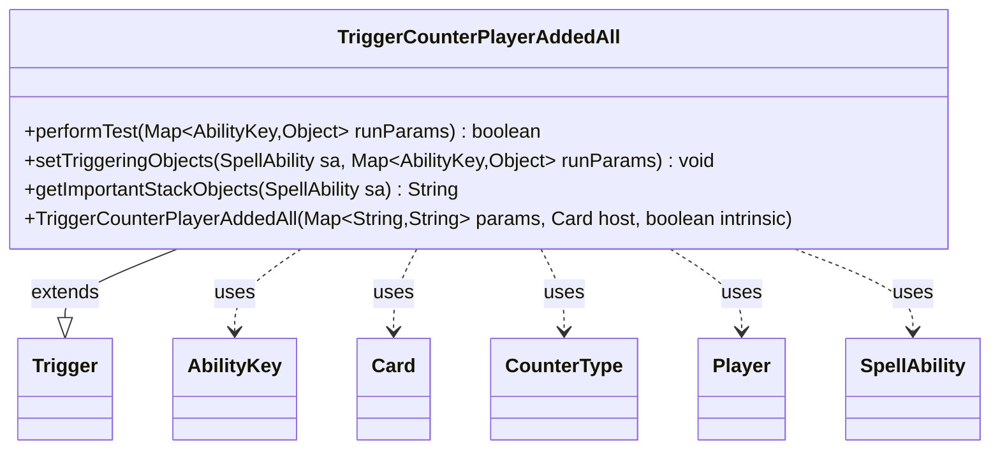

---
aliases:
  - TriggerCounterPlayerAddedAll
tags:
  - java/class
  - module/forge-game
  - pkg/forge/game/trigger
fqn: forge.game.trigger.TriggerCounterPlayerAddedAll
package: forge.game.trigger
module: forge-game
kind: Class
---

# TriggerCounterPlayerAddedAll

**Package:** `forge.game.trigger`   **Module:** `forge-game`   **Kind:** Class



## Relationships
**Extends:**
- [[forge.game.trigger.Trigger|Trigger]]
**Uses:**
- [[forge.game.ability.AbilityKey|AbilityKey]]
- [[forge.game.card.Card|Card]]
- [[forge.game.card.CounterType|CounterType]]
- [[forge.game.player.Player|Player]]
- [[forge.game.spellability.SpellAbility|SpellAbility]]

## Design Description

TriggerCounterPlayerAddedAll is a concrete trigger that fires when counters are added to a player (or matching object), extending the abstract `Trigger` base class within Forge's event-driven triggered-ability framework. It overrides `performTest` to gate activation on the configured `ValidSource`, `ValidObject`, and optional `ValidObjectToSource` constraints, ensuring only relevant counter-addition events match.

On a match, `setTriggeringObjects` populates the firing `SpellAbility` with the source, affected object, and counter map drawn from the `AbilityKey`-keyed run parameters, additionally deriving an `Amount` by summing all `CounterType` values via `Aggregates.sum`. The `getImportantStackObjects` override builds a localized, human-readable stack summary. The design follows Forge's data-driven trigger pattern—behavior parameterized through the inherited `Map<String,String>` params rather than subclass logic—keeping the class a thin, declarative matcher and object-binder.

## Source
`forge-game/src/main/java/forge/game/trigger/TriggerCounterPlayerAddedAll.java`

```java
package forge.game.trigger;

import java.util.Map;

import forge.game.ability.AbilityKey;
import forge.game.card.Card;
import forge.game.card.CounterType;
import forge.game.player.Player;
import forge.game.spellability.SpellAbility;
import forge.util.Aggregates;
import forge.util.Localizer;

public class TriggerCounterPlayerAddedAll extends Trigger {

    public TriggerCounterPlayerAddedAll(Map<String, String> params, Card host, boolean intrinsic) {
        super(params, host, intrinsic);
    }

    @Override
    public boolean performTest(Map<AbilityKey, Object> runParams) {
        if (!matchesValidParam("ValidSource", runParams.get(AbilityKey.Source))) {
            return false;
        }
        if (!matchesValidParam("ValidObject", runParams.get(AbilityKey.Object))) {
            return false;
        }
        if (hasParam("ValidObjectToSource")) {
            if (!matchesValid(runParams.get(AbilityKey.Object), getParam("ValidObjectToSource").split(","), getHostCard(),
                    (Player)runParams.get(AbilityKey.Source))) {
                return false;
            }
        }
        return true;
    }

    @Override
    public void setTriggeringObjects(SpellAbility sa, Map<AbilityKey, Object> runParams) {
        sa.setTriggeringObjectsFrom(runParams, AbilityKey.Source, AbilityKey.Object, AbilityKey.CounterMap);
        sa.setTriggeringObject(AbilityKey.Amount, Aggregates.sum(((Map<CounterType, Integer>) runParams.get(AbilityKey.CounterMap)).values()));
    }

    @Override
    public String getImportantStackObjects(SpellAbility sa) {
        StringBuilder sb = new StringBuilder();
        sb.append(Localizer.getInstance().getMessage("lblAddedOnce")).append(": ");
        sb.append(sa.getTriggeringObject(AbilityKey.Source)).append(": ");
        sb.append(sa.getTriggeringObject(AbilityKey.Object));
        return sb.toString();
    }

}
```

## Python
`forge/game/trigger/TriggerCounterPlayerAddedAll.py`

```python
from typing import Map

from forge.game.ability.AbilityKey import AbilityKey
from forge.game.card.Card import Card
from forge.game.card.CounterType import CounterType
from forge.game.player.Player import Player
from forge.game.spellability.SpellAbility import SpellAbility
from forge.util.Aggregates import Aggregates
from forge.util.Localizer import Localizer
from forge.game.trigger.Trigger import Trigger


class TriggerCounterPlayerAddedAll(Trigger):

    def __init__(self, params: dict[str, str], host: Card, intrinsic: bool):
        super().__init__(params, host, intrinsic)

    def performTest(self, runParams: dict[AbilityKey, object]) -> bool:
        if not self.matchesValidParam("ValidSource", runParams.get(AbilityKey.Source)):
            return False
        if not self.matchesValidParam("ValidObject", runParams.get(AbilityKey.Object)):
            return False
        if self.hasParam("ValidObjectToSource"):
            if not self.matchesValid(runParams.get(AbilityKey.Object), self.getParam("ValidObjectToSource").split(","),
                    self.getHostCard(), runParams.get(AbilityKey.Source)):
                return False
        return True

    def setTriggeringObjects(self, sa: SpellAbility, runParams: dict[AbilityKey, object]) -> None:
        sa.setTriggeringObjectsFrom(runParams, AbilityKey.Source, AbilityKey.Object, AbilityKey.CounterMap)
        sa.setTriggeringObject(AbilityKey.Amount, Aggregates.sum(runParams.get(AbilityKey.CounterMap).values()))

    def getImportantStackObjects(self, sa: SpellAbility) -> str:
        sb = []
        sb.append(Localizer.getInstance().getMessage("lblAddedOnce"))
        sb.append(": ")
        sb.append(str(sa.getTriggeringObject(AbilityKey.Source)))
        sb.append(": ")
        sb.append(str(sa.getTriggeringObject(AbilityKey.Object)))
        return "".join(sb)
```
