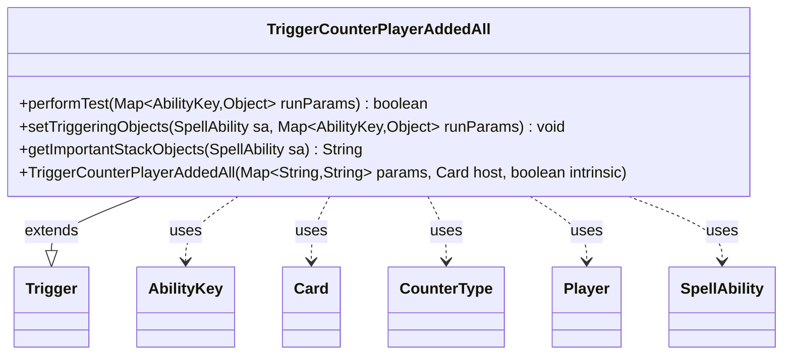

---
aliases:
  - TriggerCounterPlayerAddedAll
tags:
  - java/class
  - module/forge-game
  - pkg/forge/game/trigger
fqn: forge.game.trigger.TriggerCounterPlayerAddedAll
package: forge.game.trigger
module: forge-game
kind: Class
---

# TriggerCounterPlayerAddedAll

**Package:** `forge.game.trigger` &nbsp; **Module:** `forge-game` &nbsp; **Kind:** Class



## Relationships
**Extends:**
- [[forge.game.trigger.Trigger|Trigger]]
**Uses:**
- [[forge.game.ability.AbilityKey|AbilityKey]]
- [[forge.game.card.Card|Card]]
- [[forge.game.card.CounterType|CounterType]]
- [[forge.game.player.Player|Player]]
- [[forge.game.spellability.SpellAbility|SpellAbility]]

## Source
`forge-game/src/main/java/forge/game/trigger/TriggerCounterPlayerAddedAll.java`

```java
package forge.game.trigger;

import java.util.Map;

import forge.game.ability.AbilityKey;
import forge.game.card.Card;
import forge.game.card.CounterType;
import forge.game.player.Player;
import forge.game.spellability.SpellAbility;
import forge.util.Aggregates;
import forge.util.Localizer;

public class TriggerCounterPlayerAddedAll extends Trigger {

    public TriggerCounterPlayerAddedAll(Map<String, String> params, Card host, boolean intrinsic) {
        super(params, host, intrinsic);
    }

    @Override
    public boolean performTest(Map<AbilityKey, Object> runParams) {
        if (!matchesValidParam("ValidSource", runParams.get(AbilityKey.Source))) {
            return false;
        }
        if (!matchesValidParam("ValidObject", runParams.get(AbilityKey.Object))) {
            return false;
        }
        if (hasParam("ValidObjectToSource")) {
            if (!matchesValid(runParams.get(AbilityKey.Object), getParam("ValidObjectToSource").split(","), getHostCard(),
                    (Player)runParams.get(AbilityKey.Source))) {
                return false;
            }
        }
        return true;
    }

    @Override
    public void setTriggeringObjects(SpellAbility sa, Map<AbilityKey, Object> runParams) {
        sa.setTriggeringObjectsFrom(runParams, AbilityKey.Source, AbilityKey.Object, AbilityKey.CounterMap);
        sa.setTriggeringObject(AbilityKey.Amount, Aggregates.sum(((Map<CounterType, Integer>) runParams.get(AbilityKey.CounterMap)).values()));
    }

    @Override
    public String getImportantStackObjects(SpellAbility sa) {
        StringBuilder sb = new StringBuilder();
        sb.append(Localizer.getInstance().getMessage("lblAddedOnce")).append(": ");
        sb.append(sa.getTriggeringObject(AbilityKey.Source)).append(": ");
        sb.append(sa.getTriggeringObject(AbilityKey.Object));
        return sb.toString();
    }

}
```
