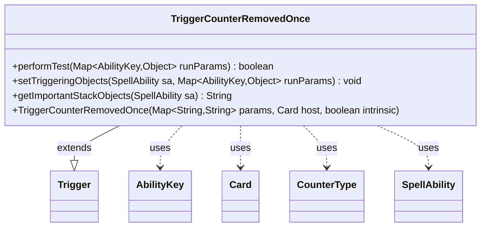

---
aliases:
  - TriggerCounterRemovedOnce
tags:
  - java/class
  - module/forge-game
  - pkg/forge/game/trigger
fqn: forge.game.trigger.TriggerCounterRemovedOnce
package: forge.game.trigger
module: forge-game
kind: Class
---

# TriggerCounterRemovedOnce

**Package:** `forge.game.trigger` &nbsp; **Module:** `forge-game` &nbsp; **Kind:** Class



## Relationships
**Extends:**
- [[forge.game.trigger.Trigger|Trigger]]
**Uses:**
- [[forge.game.ability.AbilityKey|AbilityKey]]
- [[forge.game.card.Card|Card]]
- [[forge.game.card.CounterType|CounterType]]
- [[forge.game.spellability.SpellAbility|SpellAbility]]

## Design Description

TriggerCounterRemovedOnce is a concrete trigger that fires when one or more counters are removed from a card in a single event, allowing card abilities to respond to counter removal. Extending the abstract `Trigger` base class, it overrides `performTest` to gate firing on the configured `ValidCard`, `CounterType`, and `Remaining` parameters against the runtime `AbilityKey` parameters, and `setTriggeringObjects` to expose the affected `Card` and removed counter `Amount` to the responding `SpellAbility`. It collaborates with `CounterType` to match the removed counter kind and overrides `getImportantStackObjects` to produce a localized, human-readable stack summary. The design follows the engine's parameter-driven, data-defined trigger pattern, keeping match logic declarative and delegating shared construction and validation to the supertype.

## Source
`forge-game/src/main/java/forge/game/trigger/TriggerCounterRemovedOnce.java`

```java
/*
 * Forge: Play Magic: the Gathering.
 * Copyright (C) 2011  Forge Team
 *
 * This program is free software: you can redistribute it and/or modify
 * it under the terms of the GNU General Public License as published by
 * the Free Software Foundation, either version 3 of the License, or
 * (at your option) any later version.
 * 
 * This program is distributed in the hope that it will be useful,
 * but WITHOUT ANY WARRANTY; without even the implied warranty of
 * MERCHANTABILITY or FITNESS FOR A PARTICULAR PURPOSE.  See the
 * GNU General Public License for more details.
 * 
 * You should have received a copy of the GNU General Public License
 * along with this program.  If not, see <http://www.gnu.org/licenses/>.
 */
package forge.game.trigger;

import java.util.Map;

import forge.game.ability.AbilityKey;
import forge.game.card.Card;
import forge.game.card.CounterType;
import forge.game.spellability.SpellAbility;
import forge.util.Localizer;

/**
 * <p>
 * Trigger_CounterRemovedOnce class.
 * </p>
 * 
 * @author Forge
 * @version $Id: TriggerCounterRemovedOnce.java 12297 2011-11-28 19:56:47Z jendave $
 */
public class TriggerCounterRemovedOnce extends Trigger {

    /**
     * <p>
     * Constructor for Trigger_CounterRemovedOnce.
     * </p>
     * 
     * @param params
     *            a {@link java.util.HashMap} object.
     * @param host
     *            a {@link forge.game.card.Card} object.
     * @param intrinsic
     *            the intrinsic
     */
    public TriggerCounterRemovedOnce(final Map<String, String> params, final Card host, final boolean intrinsic) {
        super(params, host, intrinsic);
    }

    /** {@inheritDoc}
     * @param runParams*/
    @Override
    public final boolean performTest(final Map<AbilityKey, Object> runParams) {
        final CounterType removedType = (CounterType) runParams.get(AbilityKey.CounterType);

        if (!matchesValidParam("ValidCard", runParams.get(AbilityKey.Card))) {
            return false;
        }

        if (hasParam("CounterType")) {
            final String type = getParam("CounterType");
            if (!type.equals(removedType.toString())) {
                return false;
            }
        }

        if (hasParam("Remaining")) {
            final int remaining = Integer.parseInt(getParam("Remaining"));

            if (remaining != (int) runParams.get(AbilityKey.NewCounterAmount)) {
                return false;
            }
        }

        return true;
    }

    /** {@inheritDoc} */
    @Override
    public final void setTriggeringObjects(final SpellAbility sa, Map<AbilityKey, Object> runParams) {
        sa.setTriggeringObjectsFrom(runParams, AbilityKey.Card);
        sa.setTriggeringObject(AbilityKey.Amount, runParams.get(AbilityKey.CounterAmount));
    }

    @Override
    public String getImportantStackObjects(SpellAbility sa) {
        StringBuilder sb = new StringBuilder();
        sb.append(Localizer.getInstance().getMessage("lblRemovedFrom")).append(": ").append(sa.getTriggeringObject(AbilityKey.Card));
        sb.append(" ").append(Localizer.getInstance().getMessage("lblAmount")).append(": ").append(sa.getTriggeringObject(AbilityKey.Amount));
        return sb.toString();
    }
}
```

## Python
`forge/game/trigger/TriggerCounterRemovedOnce.py`

```python
from typing import Map

from forge.game.ability.AbilityKey import AbilityKey
from forge.game.card.Card import Card
from forge.game.card.CounterType import CounterType
from forge.game.spellability.SpellAbility import SpellAbility
from forge.util.Localizer import Localizer
from forge.game.trigger.Trigger import Trigger


class TriggerCounterRemovedOnce(Trigger):

    def __init__(self, params: dict[str, str], host: Card, intrinsic: bool):
        super().__init__(params, host, intrinsic)

    def performTest(self, runParams: dict[AbilityKey, object]) -> bool:
        removedType = runParams.get(AbilityKey.CounterType)

        if not self.matchesValidParam("ValidCard", runParams.get(AbilityKey.Card)):
            return False

        if self.hasParam("CounterType"):
            type = self.getParam("CounterType")
            if type != str(removedType):
                return False

        if self.hasParam("Remaining"):
            remaining = int(self.getParam("Remaining"))

            if remaining != int(runParams.get(AbilityKey.NewCounterAmount)):
                return False

        return True

    def setTriggeringObjects(self, sa: SpellAbility, runParams: dict[AbilityKey, object]) -> None:
        sa.setTriggeringObjectsFrom(runParams, AbilityKey.Card)
        sa.setTriggeringObject(AbilityKey.Amount, runParams.get(AbilityKey.CounterAmount))

    def getImportantStackObjects(self, sa: SpellAbility) -> str:
        sb = []
        sb.append(Localizer.getInstance().getMessage("lblRemovedFrom"))
        sb.append(": ")
        sb.append(str(sa.getTriggeringObject(AbilityKey.Card)))
        sb.append(" ")
        sb.append(Localizer.getInstance().getMessage("lblAmount"))
        sb.append(": ")
        sb.append(str(sa.getTriggeringObject(AbilityKey.Amount)))
        return "".join(sb)
```
