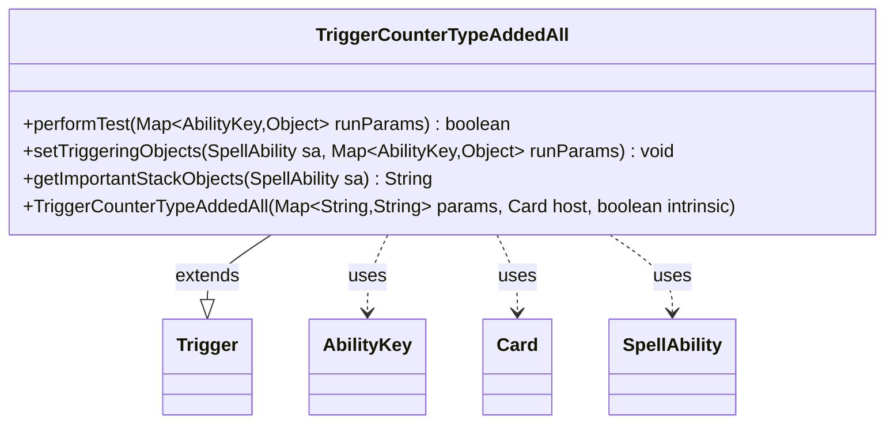

---
aliases:
  - TriggerCounterTypeAddedAll
tags:
  - java/class
  - module/forge-game
  - pkg/forge/game/trigger
fqn: forge.game.trigger.TriggerCounterTypeAddedAll
package: forge.game.trigger
module: forge-game
kind: Class
---

# TriggerCounterTypeAddedAll

**Package:** `forge.game.trigger` &nbsp; **Module:** `forge-game` &nbsp; **Kind:** Class



## Relationships
**Extends:**
- [[forge.game.trigger.Trigger|Trigger]]
**Uses:**
- [[forge.game.ability.AbilityKey|AbilityKey]]
- [[forge.game.card.Card|Card]]
- [[forge.game.spellability.SpellAbility|SpellAbility]]

## Design Description

TriggerCounterTypeAddedAll is a concrete trigger that fires in response to counters of a given type being added across all matching objects, encapsulating the condition logic and triggering-object bookkeeping for that game event. Extending the abstract Trigger base class, it implements the standard hooks: performTest screens events via the ValidObject filter and an optional FirstTime constraint, setTriggeringObjects exposes the affected object to the resolving SpellAbility through AbilityKey, and getImportantStackObjects renders a localized stack description. It collaborates with Card as its host, SpellAbility as the ability it parameterizes, and the AbilityKey map for run parameters. The design follows Forge's data-driven trigger pattern, keeping per-trigger behavior thin and declarative while delegating shared lifecycle and parameter matching to the supertype.

## Source
`forge-game/src/main/java/forge/game/trigger/TriggerCounterTypeAddedAll.java`

```java
package forge.game.trigger;

import java.util.Map;

import forge.game.ability.AbilityKey;
import forge.game.card.Card;
import forge.game.spellability.SpellAbility;
import forge.util.Localizer;

public class TriggerCounterTypeAddedAll extends Trigger {

    public TriggerCounterTypeAddedAll(Map<String, String> params, Card host, boolean intrinsic) {
        super(params, host, intrinsic);
    }

    @Override
    public boolean performTest(Map<AbilityKey, Object> runParams) {
        if (!matchesValidParam("ValidObject", runParams.get(AbilityKey.Object))) {
            return false;
        }

        if (hasParam("FirstTime")) {
            if (!(boolean) runParams.get(AbilityKey.FirstTime)) {
                return false;
            }
        }

        return true;
    }

    @Override
    public void setTriggeringObjects(SpellAbility sa, Map<AbilityKey, Object> runParams) {
        sa.setTriggeringObjectsFrom(runParams, AbilityKey.Object);
    }

    @Override
    public String getImportantStackObjects(SpellAbility sa) {
        StringBuilder sb = new StringBuilder();
        sb.append(Localizer.getInstance().getMessage("lblAddedOnce")).append(": ");
        sb.append(sa.getTriggeringObject(AbilityKey.Object));
        return sb.toString();
    }

}
```

## Python
`forge/game/trigger/TriggerCounterTypeAddedAll.py`

```python
from typing import Map

from forge.game.ability.AbilityKey import AbilityKey
from forge.game.card.Card import Card
from forge.game.spellability.SpellAbility import SpellAbility
from forge.game.trigger.Trigger import Trigger
from forge.util.Localizer import Localizer


class TriggerCounterTypeAddedAll(Trigger):

    def __init__(self, params: dict[str, str], host: Card, intrinsic: bool):
        super().__init__(params, host, intrinsic)

    def performTest(self, runParams: dict[AbilityKey, object]) -> bool:
        if not self.matchesValidParam("ValidObject", runParams.get(AbilityKey.Object)):
            return False

        if self.hasParam("FirstTime"):
            if not runParams.get(AbilityKey.FirstTime):
                return False

        return True

    def setTriggeringObjects(self, sa: SpellAbility, runParams: dict[AbilityKey, object]) -> None:
        sa.setTriggeringObjectsFrom(runParams, AbilityKey.Object)

    def getImportantStackObjects(self, sa: SpellAbility) -> str:
        sb = []
        sb.append(Localizer.getInstance().getMessage("lblAddedOnce"))
        sb.append(": ")
        sb.append(str(sa.getTriggeringObject(AbilityKey.Object)))
        return "".join(sb)
```
