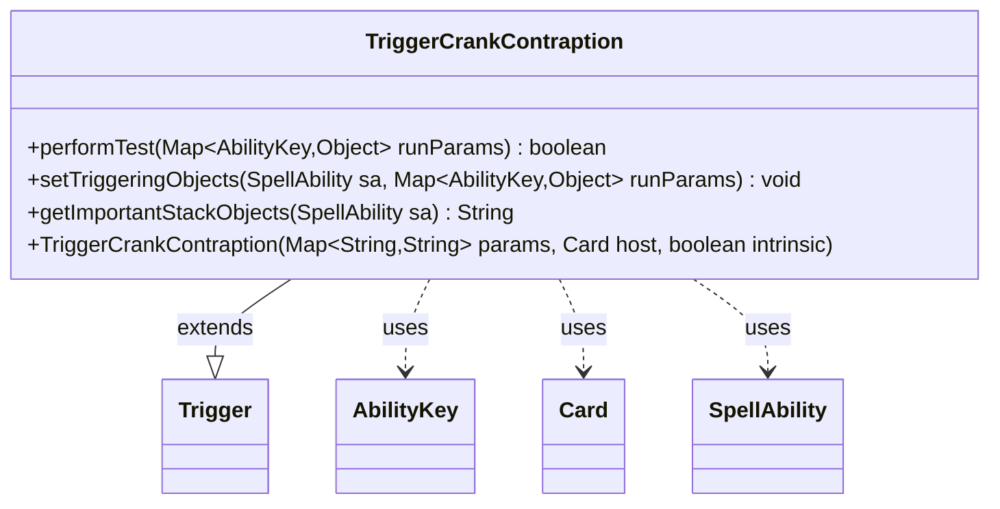

---
aliases:
  - TriggerCrankContraption
tags:
  - java/class
  - module/forge-game
  - pkg/forge/game/trigger
fqn: forge.game.trigger.TriggerCrankContraption
package: forge.game.trigger
module: forge-game
kind: Class
---

# TriggerCrankContraption

**Package:** `forge.game.trigger` &nbsp; **Module:** `forge-game` &nbsp; **Kind:** Class



## Relationships
**Extends:**
- [[forge.game.trigger.Trigger|Trigger]]
**Uses:**
- [[forge.game.ability.AbilityKey|AbilityKey]]
- [[forge.game.card.Card|Card]]
- [[forge.game.spellability.SpellAbility|SpellAbility]]

## Design Description

Crank!, a Contraption-sprocket mechanic, triggers whenever a player cranks a Contraption with a matching card. As a concrete subclass of `Trigger`, `TriggerCrankContraption` specializes the abstract trigger framework for this event, supplying the three hooks the engine expects: `performTest` gates firing by validating the triggering `Card` and `Player` against the `ValidCard`/`ValidPlayer` parameters, `setTriggeringObjects` copies those objects onto the resolving `SpellAbility`, and `getImportantStackObjects` produces a localized stack description.

The class collaborates with `AbilityKey` to read and key runtime parameters in a type-safe map, `Card` and `SpellAbility` for the trigger's subject and ability, and routes user-facing text through `Localizer`. Its design mirrors Forge's data-driven trigger pattern: behavior is declared via the `params` map passed to the superclass constructor, keeping the subclass a thin, declarative adapter that only overrides the event-specific matching and binding logic.

## Source
`forge-game/src/main/java/forge/game/trigger/TriggerCrankContraption.java`

```java
package forge.game.trigger;

import forge.game.ability.AbilityKey;
import forge.game.card.Card;
import forge.game.spellability.SpellAbility;
import forge.util.Localizer;

import java.util.Map;

public class TriggerCrankContraption extends Trigger {

    public TriggerCrankContraption(Map<String, String> params, Card host, boolean intrinsic) {
        super(params, host, intrinsic);
    }

    @Override
    public boolean performTest(Map<AbilityKey, Object> runParams) {
        if (!matchesValidParam("ValidCard", runParams.get(AbilityKey.Card))) {
            return false;
        }
        if (!matchesValidParam("ValidPlayer", runParams.get(AbilityKey.Player))) {
            return false;
        }
        return true;
    }

    @Override
    public void setTriggeringObjects(SpellAbility sa, Map<AbilityKey, Object> runParams) {
        sa.setTriggeringObjectsFrom(runParams, AbilityKey.Player, AbilityKey.Card);
    }

    @Override
    public String getImportantStackObjects(SpellAbility sa) {
        return Localizer.getInstance().getMessage("lblCranked") + ": " +
                sa.getTriggeringObject(AbilityKey.Card);
    }
}
```

## Python
`forge/game/trigger/TriggerCrankContraption.py`

```python
from forge.game.trigger.Trigger import Trigger
from forge.game.ability.AbilityKey import AbilityKey
from forge.game.card.Card import Card
from forge.game.spellability.SpellAbility import SpellAbility
from forge.util.Localizer import Localizer

from typing import Map


class TriggerCrankContraption(Trigger):

    def __init__(self, params: dict[str, str], host: Card, intrinsic: bool):
        super().__init__(params, host, intrinsic)

    def performTest(self, runParams: dict[AbilityKey, object]) -> bool:
        if not self.matchesValidParam("ValidCard", runParams.get(AbilityKey.Card)):
            return False
        if not self.matchesValidParam("ValidPlayer", runParams.get(AbilityKey.Player)):
            return False
        return True

    def setTriggeringObjects(self, sa: SpellAbility, runParams: dict[AbilityKey, object]) -> None:
        sa.setTriggeringObjectsFrom(runParams, AbilityKey.Player, AbilityKey.Card)

    def getImportantStackObjects(self, sa: SpellAbility) -> str:
        return Localizer.getInstance().getMessage("lblCranked") + ": " + \
            str(sa.getTriggeringObject(AbilityKey.Card))
```
