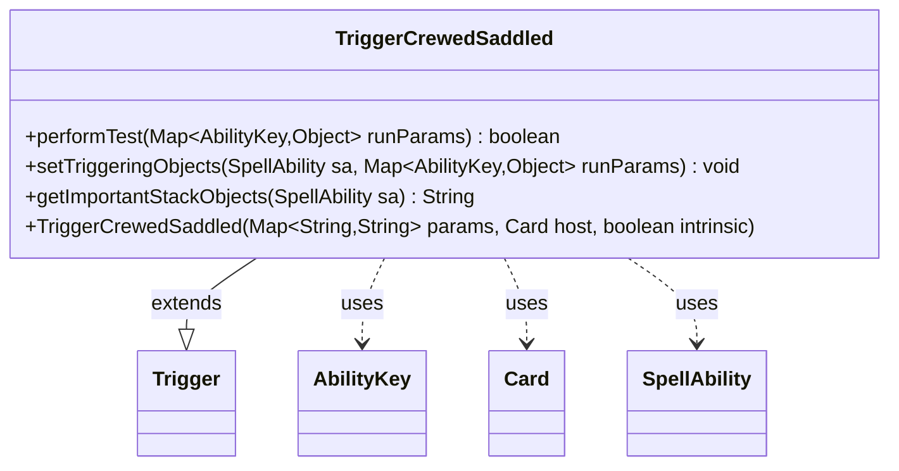

---
aliases:
  - TriggerCrewedSaddled
tags:
  - java/class
  - module/forge-game
  - pkg/forge/game/trigger
fqn: forge.game.trigger.TriggerCrewedSaddled
package: forge.game.trigger
module: forge-game
kind: Class
---

# TriggerCrewedSaddled

**Package:** `forge.game.trigger` &nbsp; **Module:** `forge-game` &nbsp; **Kind:** Class



## Relationships
**Extends:**
- [[forge.game.trigger.Trigger|Trigger]]
**Uses:**
- [[forge.game.ability.AbilityKey|AbilityKey]]
- [[forge.game.card.Card|Card]]
- [[forge.game.spellability.SpellAbility|SpellAbility]]

## Design Description

TriggerCrewedSaddled is a concrete trigger that fires when a Vehicle is crewed or a Mount is saddled, detecting these game events and exposing the participating card and crewing creatures to the triggered ability. As a subclass of Trigger, it supplies the three hooks the trigger framework requires: performTest filters events against the optional ValidCard and ValidCrew restrictions, setTriggeringObjects publishes the relevant objects (keyed by AbilityKey.Card and AbilityKey.Crew) into the SpellAbility, and getImportantStackObjects renders a localized, human-readable summary for the stack. It collaborates with AbilityKey to address run parameters, Card as the trigger's host, and SpellAbility as the consuming ability. The design follows the engine's data-driven pattern: behavior is parameterized through the inherited params map and the shared matchesValidParam matching logic, keeping the class a thin, declarative specialization rather than embedding bespoke event handling.

## Source
`forge-game/src/main/java/forge/game/trigger/TriggerCrewedSaddled.java`

```java
package forge.game.trigger;

import java.util.Map;

import forge.game.ability.AbilityKey;
import forge.game.card.Card;
import forge.game.spellability.SpellAbility;
import forge.util.Localizer;

public class TriggerCrewedSaddled extends Trigger {

    public TriggerCrewedSaddled(final Map<String, String> params, final Card host, final boolean intrinsic) {
        super(params, host, intrinsic);
    }

    @Override
    public boolean performTest(Map<AbilityKey, Object> runParams) {
        if (!matchesValidParam("ValidCard", runParams.get(AbilityKey.Card))) {
            return false;
        }
        if (!matchesValidParam("ValidCrew", runParams.get(AbilityKey.Crew))) {
            return false;
        }
        return true;
    }

    @Override
    public void setTriggeringObjects(SpellAbility sa, Map<AbilityKey, Object> runParams) {
        sa.setTriggeringObjectsFrom(runParams, AbilityKey.Card, AbilityKey.Crew);
    }

    @Override
    public String getImportantStackObjects(SpellAbility sa) {
        StringBuilder sb = new StringBuilder();
        sb.append(Localizer.getInstance().getMessage("lblCard")).append(": ").append(sa.getTriggeringObject(AbilityKey.Card));
        sb.append("  ");
        sb.append(Localizer.getInstance().getMessage("lblCrew")).append(": ").append(sa.getTriggeringObject(AbilityKey.Crew));
        return sb.toString();
    }
}
```

## Python
`forge/game/trigger/TriggerCrewedSaddled.py`

```python
from typing import Dict

from forge.game.ability.AbilityKey import AbilityKey
from forge.game.card.Card import Card
from forge.game.spellability.SpellAbility import SpellAbility
from forge.game.trigger.Trigger import Trigger
from forge.util.Localizer import Localizer


class TriggerCrewedSaddled(Trigger):

    def __init__(self, params: dict[str, str], host: Card, intrinsic: bool):
        super().__init__(params, host, intrinsic)

    def performTest(self, runParams: dict[AbilityKey, object]) -> bool:
        if not self.matchesValidParam("ValidCard", runParams.get(AbilityKey.Card)):
            return False
        if not self.matchesValidParam("ValidCrew", runParams.get(AbilityKey.Crew)):
            return False
        return True

    def setTriggeringObjects(self, sa: SpellAbility, runParams: dict[AbilityKey, object]) -> None:
        sa.setTriggeringObjectsFrom(runParams, AbilityKey.Card, AbilityKey.Crew)

    def getImportantStackObjects(self, sa: SpellAbility) -> str:
        sb = []
        sb.append(Localizer.getInstance().getMessage("lblCard"))
        sb.append(": ")
        sb.append(str(sa.getTriggeringObject(AbilityKey.Card)))
        sb.append("  ")
        sb.append(Localizer.getInstance().getMessage("lblCrew"))
        sb.append(": ")
        sb.append(str(sa.getTriggeringObject(AbilityKey.Crew)))
        return "".join(sb)
```
