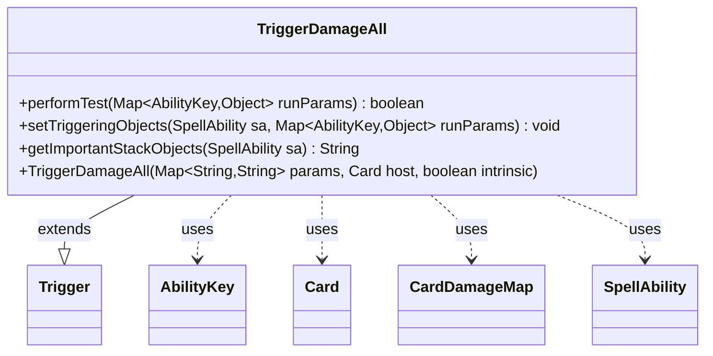

---
aliases:
  - TriggerDamageAll
tags:
  - java/class
  - module/forge-game
  - pkg/forge/game/trigger
fqn: forge.game.trigger.TriggerDamageAll
package: forge.game.trigger
module: forge-game
kind: Class
---

# TriggerDamageAll

**Package:** `forge.game.trigger` &nbsp; **Module:** `forge-game` &nbsp; **Kind:** Class



## Relationships
**Extends:**
- [[forge.game.trigger.Trigger|Trigger]]
**Uses:**
- [[forge.game.ability.AbilityKey|AbilityKey]]
- [[forge.game.card.Card|Card]]
- [[forge.game.card.CardDamageMap|CardDamageMap]]
- [[forge.game.spellability.SpellAbility|SpellAbility]]

## Source
`forge-game/src/main/java/forge/game/trigger/TriggerDamageAll.java`

```java
package forge.game.trigger;

import java.util.Map;

import forge.game.ability.AbilityKey;
import forge.game.card.Card;
import forge.game.card.CardDamageMap;
import forge.game.spellability.SpellAbility;
import forge.util.Localizer;

public class TriggerDamageAll extends Trigger {

    public TriggerDamageAll(Map<String, String> params, Card host, boolean intrinsic) {
        super(params, host, intrinsic);
    }

    @Override
    public boolean performTest(Map<AbilityKey, Object> runParams) {
        if (hasParam("CombatDamage")) {
            if (getParam("CombatDamage").equals("True") != (Boolean) runParams.get(AbilityKey.IsCombatDamage)) {
                return false;
            }
        }
        final CardDamageMap table = (CardDamageMap) runParams.get(AbilityKey.DamageMap);
        return !table.filteredMap(getParam("ValidSource"), getParam("ValidTarget"), getHostCard(), this).isEmpty();
    }

    @Override
    public void setTriggeringObjects(SpellAbility sa, Map<AbilityKey, Object> runParams) {
        CardDamageMap table = (CardDamageMap) runParams.get(AbilityKey.DamageMap);
        table = table.filteredMap(getParam("ValidSource"), getParam("ValidTarget"), getHostCard(), this);

        sa.setTriggeringObject(AbilityKey.DamageAmount, table.totalAmount());
        sa.setTriggeringObject(AbilityKey.Sources, table.rowKeySet());
        sa.setTriggeringObject(AbilityKey.Targets, table.columnKeySet());
    }

    @Override
    public String getImportantStackObjects(SpellAbility sa) {
        StringBuilder sb = new StringBuilder();
        sb.append(Localizer.getInstance().getMessage("lblDamageSource")).append(": ").append(sa.getTriggeringObject(AbilityKey.Sources)).append(", ");
        sb.append(Localizer.getInstance().getMessage("lblDamaged")).append(": ").append(sa.getTriggeringObject(AbilityKey.Targets)).append(", ");
        sb.append(Localizer.getInstance().getMessage("lblAmount")).append(": ").append(sa.getTriggeringObject(AbilityKey.DamageAmount));
        return sb.toString();
    }
}
```
