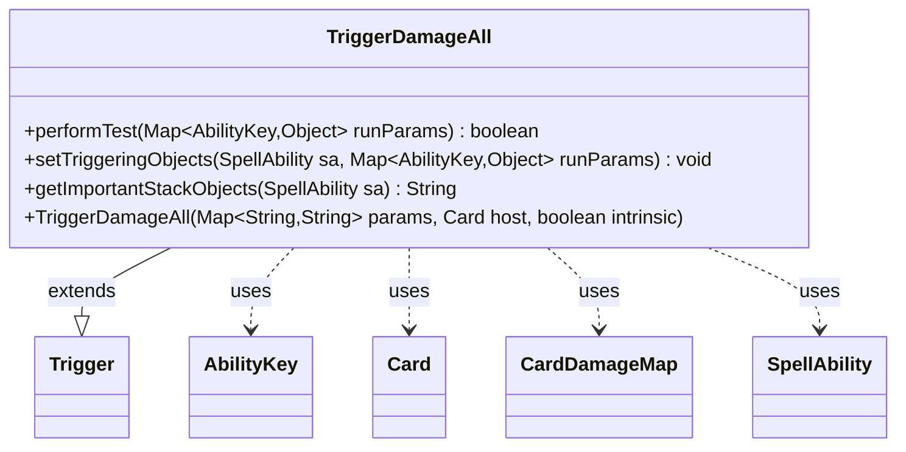

---
aliases:
  - TriggerDamageAll
tags:
  - java/class
  - module/forge-game
  - pkg/forge/game/trigger
fqn: forge.game.trigger.TriggerDamageAll
package: forge.game.trigger
module: forge-game
kind: Class
---

# TriggerDamageAll

**Package:** `forge.game.trigger`   **Module:** `forge-game`   **Kind:** Class



## Relationships
**Extends:**
- [[forge.game.trigger.Trigger|Trigger]]
**Uses:**
- [[forge.game.ability.AbilityKey|AbilityKey]]
- [[forge.game.card.Card|Card]]
- [[forge.game.card.CardDamageMap|CardDamageMap]]
- [[forge.game.spellability.SpellAbility|SpellAbility]]

## Design Description

TriggerDamageAll is a concrete trigger that fires in response to damage dealt across the board, detecting events where one or more sources damage one or more targets simultaneously. Extending the abstract Trigger base class, it implements the standard trigger contract—performTest to gate firing, setTriggeringObjects to expose results, and getImportantStackObjects for display. Its central collaborator is CardDamageMap, a tabular structure of damage sources and recipients that it filters via ValidSource/ValidTarget parameters (optionally constrained to combat damage) against the host Card; a non-empty filtered map means the trigger condition is met. On firing, it populates the SpellAbility with aggregate triggering data—total DamageAmount, the set of Sources, and the set of Targets—keyed by AbilityKey, reflecting a design that summarizes a batch of damage into a single trigger event rather than firing per individual instance.

## Source
`forge-game/src/main/java/forge/game/trigger/TriggerDamageAll.java`

```java
package forge.game.trigger;

import java.util.Map;

import forge.game.ability.AbilityKey;
import forge.game.card.Card;
import forge.game.card.CardDamageMap;
import forge.game.spellability.SpellAbility;
import forge.util.Localizer;

public class TriggerDamageAll extends Trigger {

    public TriggerDamageAll(Map<String, String> params, Card host, boolean intrinsic) {
        super(params, host, intrinsic);
    }

    @Override
    public boolean performTest(Map<AbilityKey, Object> runParams) {
        if (hasParam("CombatDamage")) {
            if (getParam("CombatDamage").equals("True") != (Boolean) runParams.get(AbilityKey.IsCombatDamage)) {
                return false;
            }
        }
        final CardDamageMap table = (CardDamageMap) runParams.get(AbilityKey.DamageMap);
        return !table.filteredMap(getParam("ValidSource"), getParam("ValidTarget"), getHostCard(), this).isEmpty();
    }

    @Override
    public void setTriggeringObjects(SpellAbility sa, Map<AbilityKey, Object> runParams) {
        CardDamageMap table = (CardDamageMap) runParams.get(AbilityKey.DamageMap);
        table = table.filteredMap(getParam("ValidSource"), getParam("ValidTarget"), getHostCard(), this);

        sa.setTriggeringObject(AbilityKey.DamageAmount, table.totalAmount());
        sa.setTriggeringObject(AbilityKey.Sources, table.rowKeySet());
        sa.setTriggeringObject(AbilityKey.Targets, table.columnKeySet());
    }

    @Override
    public String getImportantStackObjects(SpellAbility sa) {
        StringBuilder sb = new StringBuilder();
        sb.append(Localizer.getInstance().getMessage("lblDamageSource")).append(": ").append(sa.getTriggeringObject(AbilityKey.Sources)).append(", ");
        sb.append(Localizer.getInstance().getMessage("lblDamaged")).append(": ").append(sa.getTriggeringObject(AbilityKey.Targets)).append(", ");
        sb.append(Localizer.getInstance().getMessage("lblAmount")).append(": ").append(sa.getTriggeringObject(AbilityKey.DamageAmount));
        return sb.toString();
    }
}
```

## Python
`forge/game/trigger/TriggerDamageAll.py`

```python
from forge.game.ability.AbilityKey import AbilityKey
from forge.game.card.Card import Card
from forge.game.card.CardDamageMap import CardDamageMap
from forge.game.spellability.SpellAbility import SpellAbility
from forge.game.trigger.Trigger import Trigger
from forge.util.Localizer import Localizer


class TriggerDamageAll(Trigger):

    def __init__(self, params: dict[str, str], host: Card, intrinsic: bool):
        super().__init__(params, host, intrinsic)

    def performTest(self, runParams: dict[AbilityKey, object]) -> bool:
        if self.hasParam("CombatDamage"):
            if (self.getParam("CombatDamage") == "True") != bool(runParams.get(AbilityKey.IsCombatDamage)):
                return False
        table = runParams.get(AbilityKey.DamageMap)
        return not table.filteredMap(self.getParam("ValidSource"), self.getParam("ValidTarget"), self.getHostCard(), self).isEmpty()

    def setTriggeringObjects(self, sa: SpellAbility, runParams: dict[AbilityKey, object]) -> None:
        table = runParams.get(AbilityKey.DamageMap)
        table = table.filteredMap(self.getParam("ValidSource"), self.getParam("ValidTarget"), self.getHostCard(), self)

        sa.setTriggeringObject(AbilityKey.DamageAmount, table.totalAmount())
        sa.setTriggeringObject(AbilityKey.Sources, table.rowKeySet())
        sa.setTriggeringObject(AbilityKey.Targets, table.columnKeySet())

    def getImportantStackObjects(self, sa: SpellAbility) -> str:
        sb = []
        sb.append(Localizer.getInstance().getMessage("lblDamageSource"))
        sb.append(": ")
        sb.append(str(sa.getTriggeringObject(AbilityKey.Sources)))
        sb.append(", ")
        sb.append(Localizer.getInstance().getMessage("lblDamaged"))
        sb.append(": ")
        sb.append(str(sa.getTriggeringObject(AbilityKey.Targets)))
        sb.append(", ")
        sb.append(Localizer.getInstance().getMessage("lblAmount"))
        sb.append(": ")
        sb.append(str(sa.getTriggeringObject(AbilityKey.DamageAmount)))
        return "".join(sb)
```
