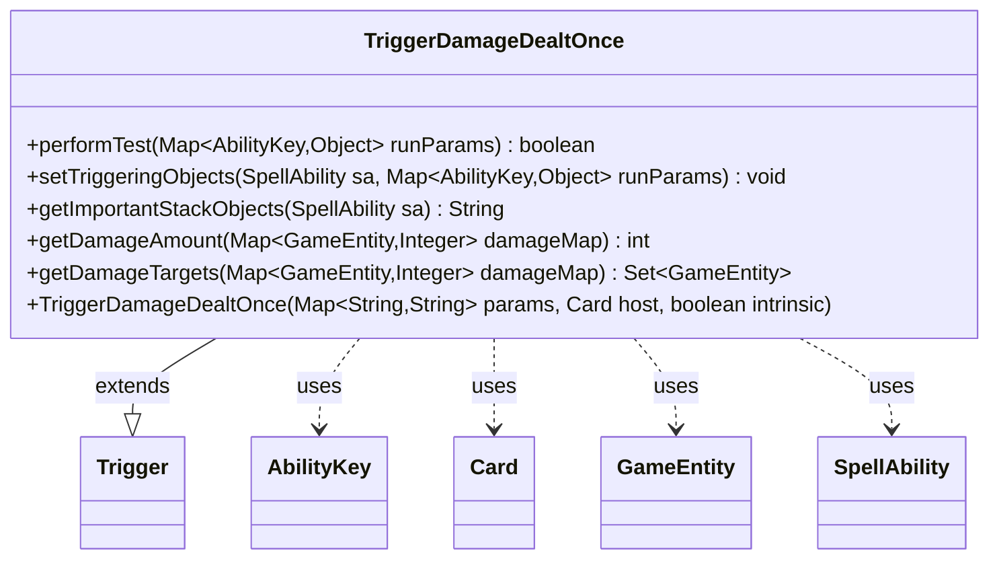

---
aliases:
  - TriggerDamageDealtOnce
tags:
  - java/class
  - module/forge-game
  - pkg/forge/game/trigger
fqn: forge.game.trigger.TriggerDamageDealtOnce
package: forge.game.trigger
module: forge-game
kind: Class
---

# TriggerDamageDealtOnce

**Package:** `forge.game.trigger`   **Module:** `forge-game`   **Kind:** Class



## Relationships
**Extends:**
- [[forge.game.trigger.Trigger|Trigger]]
**Uses:**
- [[forge.game.GameEntity|GameEntity]]
- [[forge.game.ability.AbilityKey|AbilityKey]]
- [[forge.game.card.Card|Card]]
- [[forge.game.spellability.SpellAbility|SpellAbility]]

## Design Description

TriggerDamageDealtOnce is a concrete trigger that fires a single time when damage is dealt, aggregating all simultaneous damage into one event rather than firing per recipient. Extending the abstract Trigger base class, it overrides performTest to gate firing on configured parameters—CombatDamage, ValidSource, and ValidTarget—and setTriggeringObjects to expose the damage source, the set of valid targets, and the summed damage amount to the responding SpellAbility via AbilityKey-keyed entries.

It collaborates with the engine's DamageMap (a Map of GameEntity to Integer) supplied through runParams, providing helper methods getDamageAmount and getDamageTargets that filter and total damage against the ValidTarget restriction. The "Once" design intent is visible in this aggregation: damage to multiple GameEntities is collapsed into a single trigger carrying a target set and combined total, and getImportantStackObjects uses Localizer to render a human-readable, localized summary of that event on the stack.

## Source
`forge-game/src/main/java/forge/game/trigger/TriggerDamageDealtOnce.java`

```java
/*
 * Forge: Play Magic: the Gathering.
 * Copyright (C) 2011  Forge Team
 *
 * This program is free software: you can redistribute it and/or modify
 * it under the terms of the GNU General Public License as published by
 * the Free Software Foundation, either version 3 of the License, or
 * (at your option) any later version.
 * 
 * This program is distributed in the hope that it will be useful,
 * but WITHOUT ANY WARRANTY; without even the implied warranty of
 * MERCHANTABILITY or FITNESS FOR A PARTICULAR PURPOSE.  See the
 * GNU General Public License for more details.
 * 
 * You should have received a copy of the GNU General Public License
 * along with this program.  If not, see <http://www.gnu.org/licenses/>.
 */
package forge.game.trigger;

import java.util.Map;
import java.util.Set;

import com.google.common.collect.Sets;

import forge.game.GameEntity;
import forge.game.ability.AbilityKey;
import forge.game.card.Card;
import forge.game.spellability.SpellAbility;
import forge.util.Localizer;

/**
 * <p>
 * Trigger_DamageDone class.
 * </p>
 * 
 * @author Forge
 * @version $Id: TriggerDamageDone.java 21390 2013-05-08 07:44:50Z Max mtg $
 */
public class TriggerDamageDealtOnce extends Trigger {

    /**
     * <p>
     * Constructor for TriggerDamageDealtOnce.
     * </p>
     * 
     * @param params
     *            a {@link java.util.HashMap} object.
     * @param host
     *            a {@link forge.game.card.Card} object.
     * @param intrinsic
     *            the intrinsic
     */
    public TriggerDamageDealtOnce(final Map<String, String> params, final Card host, final boolean intrinsic) {
        super(params, host, intrinsic);
    }

    /** {@inheritDoc}
     * @param runParams*/
    @SuppressWarnings("unchecked")
    @Override
    public final boolean performTest(final Map<AbilityKey, Object> runParams) {
        if (hasParam("CombatDamage")) {
            if (getParam("CombatDamage").equals("True") != (Boolean) runParams.get(AbilityKey.IsCombatDamage)) {
                return false;
            }
        }

        if (hasParam("ValidTarget")) {
            final Map<GameEntity, Integer> damageMap = (Map<GameEntity, Integer>) runParams.get(AbilityKey.DamageMap);

            if (getDamageAmount(damageMap) <= 0) {
                return false;
            }
        }

        if (!matchesValidParam("ValidSource", runParams.get(AbilityKey.DamageSource))) {
            return false;
        }

        return true;
    }

    /** {@inheritDoc} */
    @Override
    public final void setTriggeringObjects(final SpellAbility sa, Map<AbilityKey, Object> runParams) {
        @SuppressWarnings("unchecked")
        final Map<GameEntity, Integer> damageMap = (Map<GameEntity, Integer>) runParams.get(AbilityKey.DamageMap);

        sa.setTriggeringObject(AbilityKey.Source, runParams.get(AbilityKey.DamageSource));
        sa.setTriggeringObject(AbilityKey.Targets, getDamageTargets(damageMap));
        sa.setTriggeringObject(AbilityKey.DamageAmount, getDamageAmount(damageMap));
    }

    @Override
    public String getImportantStackObjects(SpellAbility sa) {
        StringBuilder sb = new StringBuilder();
        sb.append(Localizer.getInstance().getMessage("lblDamageSource")).append(": ").append(sa.getTriggeringObject(AbilityKey.Source)).append(", ");
        sb.append(Localizer.getInstance().getMessage("lblDamaged")).append(": ").append(sa.getTriggeringObject(AbilityKey.Targets)).append(", ");
        sb.append(Localizer.getInstance().getMessage("lblAmount")).append(": ").append(sa.getTriggeringObject(AbilityKey.DamageAmount));
        return sb.toString();
    }

    public int getDamageAmount(Map<GameEntity, Integer> damageMap) {
        int result = 0;
        for (Map.Entry<GameEntity, Integer> e : damageMap.entrySet()) {
            if (matchesValidParam("ValidTarget", e.getKey())) {
                result += e.getValue();
            }
        }
        return result;
    }

    public Set<GameEntity> getDamageTargets(Map<GameEntity, Integer> damageMap) {
        if (!hasParam("ValidTarget")) {
            return Sets.newHashSet(damageMap.keySet());
        }
        Set<GameEntity> result = Sets.newHashSet();
        for (GameEntity e : damageMap.keySet()) {
            if (matchesValidParam("ValidTarget", e)) {
                result.add(e);
            }
        }
        return result;
    }
}
```

## Python
`forge/game/trigger/TriggerDamageDealtOnce.py`

```python
from typing import Map, Set
from forge.game.trigger.Trigger import Trigger
from forge.game.GameEntity import GameEntity
from forge.game.ability.AbilityKey import AbilityKey
from forge.game.card.Card import Card
from forge.game.spellability.SpellAbility import SpellAbility
from forge.util.Localizer import Localizer


class TriggerDamageDealtOnce(Trigger):

    def __init__(self, params: dict[str, str], host: Card, intrinsic: bool):
        super().__init__(params, host, intrinsic)

    def performTest(self, runParams: dict[AbilityKey, object]) -> bool:
        if self.hasParam("CombatDamage"):
            if (self.getParam("CombatDamage") == "True") != runParams.get(AbilityKey.IsCombatDamage):
                return False

        if self.hasParam("ValidTarget"):
            damageMap: dict[GameEntity, int] = runParams.get(AbilityKey.DamageMap)

            if self.getDamageAmount(damageMap) <= 0:
                return False

        if not self.matchesValidParam("ValidSource", runParams.get(AbilityKey.DamageSource)):
            return False

        return True

    def setTriggeringObjects(self, sa: SpellAbility, runParams: dict[AbilityKey, object]) -> None:
        damageMap: dict[GameEntity, int] = runParams.get(AbilityKey.DamageMap)

        sa.setTriggeringObject(AbilityKey.Source, runParams.get(AbilityKey.DamageSource))
        sa.setTriggeringObject(AbilityKey.Targets, self.getDamageTargets(damageMap))
        sa.setTriggeringObject(AbilityKey.DamageAmount, self.getDamageAmount(damageMap))

    def getImportantStackObjects(self, sa: SpellAbility) -> str:
        sb = []
        sb.append(Localizer.getInstance().getMessage("lblDamageSource"))
        sb.append(": ")
        sb.append(str(sa.getTriggeringObject(AbilityKey.Source)))
        sb.append(", ")
        sb.append(Localizer.getInstance().getMessage("lblDamaged"))
        sb.append(": ")
        sb.append(str(sa.getTriggeringObject(AbilityKey.Targets)))
        sb.append(", ")
        sb.append(Localizer.getInstance().getMessage("lblAmount"))
        sb.append(": ")
        sb.append(str(sa.getTriggeringObject(AbilityKey.DamageAmount)))
        return "".join(sb)

    def getDamageAmount(self, damageMap: dict[GameEntity, int]) -> int:
        result = 0
        for key, value in damageMap.items():
            if self.matchesValidParam("ValidTarget", key):
                result += value
        return result

    def getDamageTargets(self, damageMap: dict[GameEntity, int]) -> set[GameEntity]:
        if not self.hasParam("ValidTarget"):
            return set(damageMap.keys())
        result: set[GameEntity] = set()
        for e in damageMap.keys():
            if self.matchesValidParam("ValidTarget", e):
                result.add(e)
        return result
```
