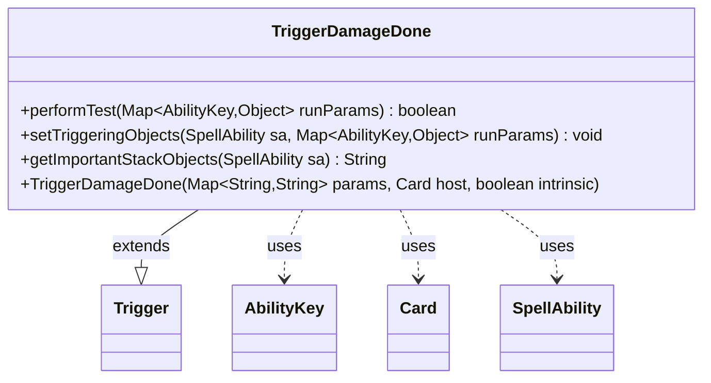

---
aliases:
  - TriggerDamageDone
tags:
  - java/class
  - module/forge-game
  - pkg/forge/game/trigger
fqn: forge.game.trigger.TriggerDamageDone
package: forge.game.trigger
module: forge-game
kind: Class
---

# TriggerDamageDone

**Package:** `forge.game.trigger`   **Module:** `forge-game`   **Kind:** Class



## Relationships
**Extends:**
- [[forge.game.trigger.Trigger|Trigger]]
**Uses:**
- [[forge.game.ability.AbilityKey|AbilityKey]]
- [[forge.game.card.Card|Card]]
- [[forge.game.spellability.SpellAbility|SpellAbility]]

## Design Description

TriggerDamageDone is a concrete trigger that fires whenever damage is dealt, encapsulating the matching logic and triggering-object setup for damage events. As a subclass of Trigger, it overrides performTest to evaluate the event's run parameters against the trigger's declared conditions—validating the damage source, target, and cause, distinguishing combat from non-combat damage, comparing the target relative to the cause or source, and testing the damage amount (supporting a dynamic comparison against the target's toughness).

On a successful match, setTriggeringObjects populates the SpellAbility with the relevant objects—notably capturing a last-known-information copy of the damage source via CardCopyService so the trigger reflects the source's state at the moment of damage rather than its current state. It collaborates with AbilityKey to address run parameters in a type-safe map, and getImportantStackObjects builds a localized, human-readable summary of the source, target, and amount for display. The design keeps damage-event semantics declarative and data-driven, driven entirely by the params supplied at construction.

## Source
`forge-game/src/main/java/forge/game/trigger/TriggerDamageDone.java`

```java
/*
 * Forge: Play Magic: the Gathering.
 * Copyright (C) 2011  Forge Team
 *
 * This program is free software: you can redistribute it and/or modify
 * it under the terms of the GNU General Public License as published by
 * the Free Software Foundation, either version 3 of the License, or
 * (at your option) any later version.
 *
 * This program is distributed in the hope that it will be useful,
 * but WITHOUT ANY WARRANTY; without even the implied warranty of
 * MERCHANTABILITY or FITNESS FOR A PARTICULAR PURPOSE.  See the
 * GNU General Public License for more details.
 *
 * You should have received a copy of the GNU General Public License
 * along with this program.  If not, see <http://www.gnu.org/licenses/>.
 */
package forge.game.trigger;

import java.util.Map;

import forge.game.ability.AbilityKey;
import forge.game.card.Card;
import forge.game.card.CardCopyService;
import forge.game.spellability.SpellAbility;
import forge.util.Expressions;
import forge.util.Localizer;

/**
 * <p>
 * Trigger_DamageDone class.
 * </p>
 *
 * @author Forge
 * @version $Id$
 */
public class TriggerDamageDone extends Trigger {

    /**
     * <p>
     * Constructor for Trigger_DamageDone.
     * </p>
     *
     * @param params
     *            a {@link java.util.HashMap} object.
     * @param host
     *            a {@link forge.game.card.Card} object.
     * @param intrinsic
     *            the intrinsic
     */
    public TriggerDamageDone(final Map<String, String> params, final Card host, final boolean intrinsic) {
        super(params, host, intrinsic);
    }

    /** {@inheritDoc}
     * @param runParams
     */
    @Override
    public final boolean performTest(final Map<AbilityKey, Object> runParams) {
        if (!matchesValidParam("ValidSource", runParams.get(AbilityKey.DamageSource))) {
            return false;
        }
        if (!matchesValidParam("ValidTarget", runParams.get(AbilityKey.DamageTarget))) {
            return false;
        }
        if (!matchesValidParam("ValidCause", runParams.get(AbilityKey.Cause))) {
            return false;
        }

        if (hasParam("CombatDamage")) {
            if (getParam("CombatDamage").equalsIgnoreCase("True") != (Boolean) runParams.get(AbilityKey.IsCombatDamage)) {
                return false;
            }
        }

        if (hasParam("TargetRelativeToCause")) {
            SpellAbility cause = (SpellAbility) runParams.get(AbilityKey.Cause);
            if (cause == null) {
                return false;
            }
            if (!cause.matchesValid(runParams.get(AbilityKey.DamageTarget), getParam("TargetRelativeToCause").split(","))) {
                return false;
            }
        }

        if (!matchesValidParam("TargetRelativeToSource", runParams.get(AbilityKey.DamageTarget),
                (Card) runParams.get(AbilityKey.DamageSource))) {
            return false;
        }

        if (hasParam("DamageAmount")) {
            final String fullParam = getParam("DamageAmount");

            final String operator = fullParam.substring(0, 2);
            int operand;
            if (fullParam.substring(2).equals("TargetToughness")) {
                final Card target = (Card) runParams.get(AbilityKey.DamageTarget);
                operand = target.getNetToughness();
            } else operand = Integer.parseInt(fullParam.substring(2));
            final int actualAmount = (Integer) runParams.get(AbilityKey.DamageAmount);

            if (!Expressions.compare(actualAmount, operator, operand)) {
                return false;
            }
        }

        return true;
    }

    /** {@inheritDoc} */
    @Override
    public final void setTriggeringObjects(final SpellAbility sa, Map<AbilityKey, Object> runParams) {
        // TODO try to reuse LKI of CardDamageHistory.registerDamage
        sa.setTriggeringObject(AbilityKey.Source, CardCopyService.getLKICopy((Card)runParams.get(AbilityKey.DamageSource)));
        sa.setTriggeringObject(AbilityKey.Target, runParams.get(AbilityKey.DamageTarget));
        sa.setTriggeringObjectsFrom(
            runParams,
            AbilityKey.Cause,
            AbilityKey.DamageAmount,
            // This parameter is here because LKI information related to combat doesn't work properly
            AbilityKey.DefendingPlayer
        );
    }

    @Override
    public String getImportantStackObjects(SpellAbility sa) {
        StringBuilder sb = new StringBuilder();
        sb.append(Localizer.getInstance().getMessage("lblDamageSource")).append(": ").append(sa.getTriggeringObject(AbilityKey.Source)).append(", ");
        sb.append(Localizer.getInstance().getMessage("lblDamaged")).append(": ").append(sa.getTriggeringObject(AbilityKey.Target)).append(", ");
        sb.append(Localizer.getInstance().getMessage("lblAmount")).append(": ").append(sa.getTriggeringObject(AbilityKey.DamageAmount));
        return sb.toString();
    }
}
```

## Python
`forge/game/trigger/TriggerDamageDone.py`

```python
from typing import Map  # noqa
from forge.game.trigger.Trigger import Trigger
from forge.game.ability.AbilityKey import AbilityKey
from forge.game.card.Card import Card
from forge.game.card.CardCopyService import CardCopyService
from forge.game.spellability.SpellAbility import SpellAbility
from forge.util.Expressions import Expressions
from forge.util.Localizer import Localizer


class TriggerDamageDone(Trigger):

    def __init__(self, params: dict[str, str], host: Card, intrinsic: bool):
        super().__init__(params, host, intrinsic)

    def performTest(self, runParams: dict[AbilityKey, object]) -> bool:
        if not self.matchesValidParam("ValidSource", runParams.get(AbilityKey.DamageSource)):
            return False
        if not self.matchesValidParam("ValidTarget", runParams.get(AbilityKey.DamageTarget)):
            return False
        if not self.matchesValidParam("ValidCause", runParams.get(AbilityKey.Cause)):
            return False

        if self.hasParam("CombatDamage"):
            if (self.getParam("CombatDamage").lower() == "true") != runParams.get(AbilityKey.IsCombatDamage):
                return False

        if self.hasParam("TargetRelativeToCause"):
            cause = runParams.get(AbilityKey.Cause)
            if cause is None:
                return False
            if not cause.matchesValid(runParams.get(AbilityKey.DamageTarget), self.getParam("TargetRelativeToCause").split(",")):
                return False

        if not self.matchesValidParam("TargetRelativeToSource", runParams.get(AbilityKey.DamageTarget),
                runParams.get(AbilityKey.DamageSource)):
            return False

        if self.hasParam("DamageAmount"):
            fullParam = self.getParam("DamageAmount")

            operator = fullParam[0:2]
            if fullParam[2:] == "TargetToughness":
                target = runParams.get(AbilityKey.DamageTarget)
                operand = target.getNetToughness()
            else:
                operand = int(fullParam[2:])
            actualAmount = runParams.get(AbilityKey.DamageAmount)

            if not Expressions.compare(actualAmount, operator, operand):
                return False

        return True

    def setTriggeringObjects(self, sa: SpellAbility, runParams: dict[AbilityKey, object]) -> None:
        # TODO try to reuse LKI of CardDamageHistory.registerDamage
        sa.setTriggeringObject(AbilityKey.Source, CardCopyService.getLKICopy(runParams.get(AbilityKey.DamageSource)))
        sa.setTriggeringObject(AbilityKey.Target, runParams.get(AbilityKey.DamageTarget))
        sa.setTriggeringObjectsFrom(
            runParams,
            AbilityKey.Cause,
            AbilityKey.DamageAmount,
            # This parameter is here because LKI information related to combat doesn't work properly
            AbilityKey.DefendingPlayer
        )

    def getImportantStackObjects(self, sa: SpellAbility) -> str:
        sb = []
        sb.append(Localizer.getInstance().getMessage("lblDamageSource"))
        sb.append(": ")
        sb.append(str(sa.getTriggeringObject(AbilityKey.Source)))
        sb.append(", ")
        sb.append(Localizer.getInstance().getMessage("lblDamaged"))
        sb.append(": ")
        sb.append(str(sa.getTriggeringObject(AbilityKey.Target)))
        sb.append(", ")
        sb.append(Localizer.getInstance().getMessage("lblAmount"))
        sb.append(": ")
        sb.append(str(sa.getTriggeringObject(AbilityKey.DamageAmount)))
        return "".join(sb)
```
