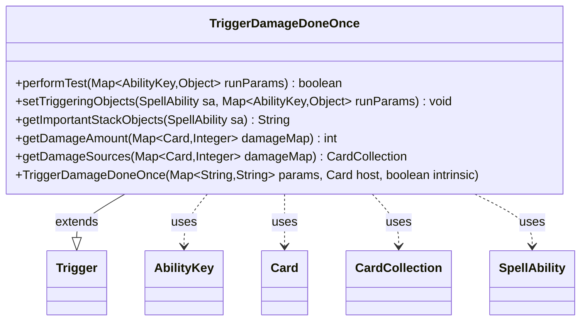

---
aliases:
  - TriggerDamageDoneOnce
tags:
  - java/class
  - module/forge-game
  - pkg/forge/game/trigger
fqn: forge.game.trigger.TriggerDamageDoneOnce
package: forge.game.trigger
module: forge-game
kind: Class
---

# TriggerDamageDoneOnce

**Package:** `forge.game.trigger` &nbsp; **Module:** `forge-game` &nbsp; **Kind:** Class



## Relationships
**Extends:**
- [[forge.game.trigger.Trigger|Trigger]]
**Uses:**
- [[forge.game.ability.AbilityKey|AbilityKey]]
- [[forge.game.card.Card|Card]]
- [[forge.game.card.CardCollection|CardCollection]]
- [[forge.game.spellability.SpellAbility|SpellAbility]]

## Source
`forge-game/src/main/java/forge/game/trigger/TriggerDamageDoneOnce.java`

```java
package forge.game.trigger;

import java.util.Map;

import forge.game.ability.AbilityKey;
import forge.game.card.Card;
import forge.game.card.CardCollection;
import forge.game.card.CardCopyService;
import forge.game.spellability.SpellAbility;
import forge.util.Expressions;
import forge.util.Localizer;

public class TriggerDamageDoneOnce extends Trigger {

    public TriggerDamageDoneOnce(Map<String, String> params, Card host, boolean intrinsic) {
        super(params, host, intrinsic);
    }

    @SuppressWarnings("unchecked")
    @Override
    public boolean performTest(Map<AbilityKey, Object> runParams) {
        if (hasParam("CombatDamage")) {
            if (getParam("CombatDamage").equals("True") != (Boolean) runParams.get(AbilityKey.IsCombatDamage)) {
                return false;
            }
        }

        if (!matchesValidParam("ValidTarget", runParams.get(AbilityKey.DamageTarget))) {
            return false;
        }

        final int damageAmount = getDamageAmount((Map<Card, Integer>) runParams.get(AbilityKey.DamageMap));

        if (hasParam("ValidSource")) {
            if (damageAmount <= 0) return false;
        }

        if (hasParam("DamageAmount")) {
            final String fullParam = getParam("DamageAmount");

            final String operator = fullParam.substring(0, 2);
            final int operand = Integer.parseInt(fullParam.substring(2));

            if (!Expressions.compare(damageAmount, operator, operand)) return false;
        }

        return true;
    }

    @Override
    public void setTriggeringObjects(SpellAbility sa, Map<AbilityKey, Object> runParams) {
        @SuppressWarnings("unchecked")
        final Map<Card, Integer> damageMap = (Map<Card, Integer>) runParams.get(AbilityKey.DamageMap);

        Object target = runParams.get(AbilityKey.DamageTarget);
        if (target instanceof Card) {
            target = CardCopyService.getLKICopy((Card)runParams.get(AbilityKey.DamageTarget));
        }
        sa.setTriggeringObject(AbilityKey.Target, target);
        sa.setTriggeringObject(AbilityKey.Sources, getDamageSources(damageMap));
        for (final Map.Entry<Card, Integer> entry : damageMap.entrySet()) {
            sa.setTriggeringObject(AbilityKey.AttackingPlayer, entry.getKey().getController());
            break;
        }
        sa.setTriggeringObject(AbilityKey.DamageAmount, getDamageAmount(damageMap));
    }

    @Override
    public String getImportantStackObjects(SpellAbility sa) {
        StringBuilder sb = new StringBuilder();
        if (sa.getTriggeringObject(AbilityKey.Target) != null) {
            sb.append(Localizer.getInstance().getMessage("lblDamaged")).append(": ").append(sa.getTriggeringObject(AbilityKey.Target)).append(", ");
        }
        sb.append(Localizer.getInstance().getMessage("lblAmount")).append(": ").append(sa.getTriggeringObject(AbilityKey.DamageAmount));
        return sb.toString();
    }

    public int getDamageAmount(Map<Card, Integer> damageMap) {
        int result = 0;
        for (Map.Entry<Card, Integer> e : damageMap.entrySet()) {
            if (matchesValidParam("ValidSource", e.getKey())) {
                result += e.getValue();
            }
        }
        return result;
    }

    public CardCollection getDamageSources(Map<Card, Integer> damageMap) {
        if (!hasParam("ValidSource")) {
            return new CardCollection(damageMap.keySet());
        }
        CardCollection result = new CardCollection();
        for (Card c : damageMap.keySet()) {
            if (matchesValidParam("ValidSource", c)) {
                result.add(c);
            }
        }
        return result;
    }
}
```
