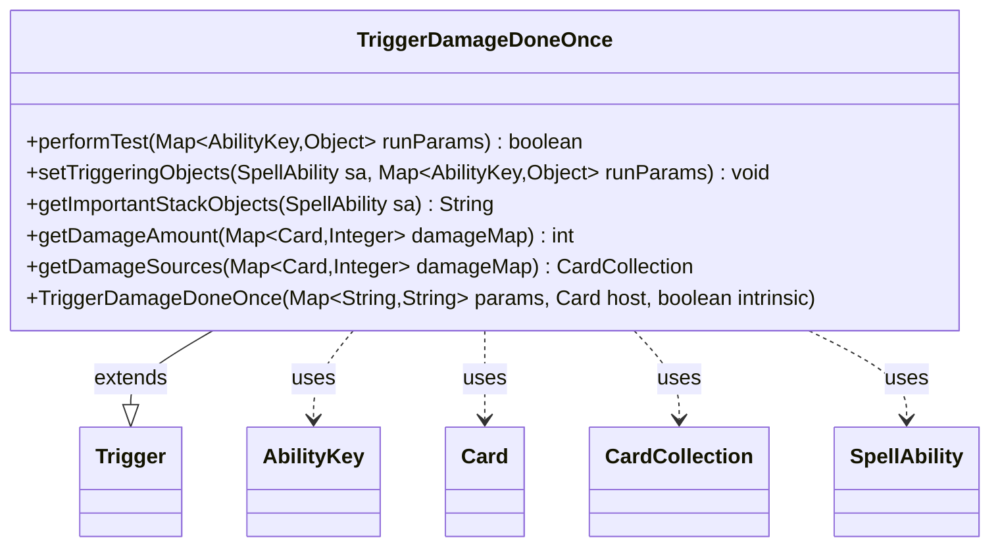

---
aliases:
  - TriggerDamageDoneOnce
tags:
  - java/class
  - module/forge-game
  - pkg/forge/game/trigger
fqn: forge.game.trigger.TriggerDamageDoneOnce
package: forge.game.trigger
module: forge-game
kind: Class
---

# TriggerDamageDoneOnce

**Package:** `forge.game.trigger` &nbsp; **Module:** `forge-game` &nbsp; **Kind:** Class



## Relationships
**Extends:**
- [[forge.game.trigger.Trigger|Trigger]]
**Uses:**
- [[forge.game.ability.AbilityKey|AbilityKey]]
- [[forge.game.card.Card|Card]]
- [[forge.game.card.CardCollection|CardCollection]]
- [[forge.game.spellability.SpellAbility|SpellAbility]]

## Design Description

Trigger that fires once for an aggregated batch of damage rather than per individual damage event. As a concrete subclass of `Trigger`, it overrides `performTest` to filter activations by combat-damage flag, target validity, and a thresholded damage amount, summing only the damage from sources matching the `ValidSource` predicate. `setTriggeringObjects` populates the firing `SpellAbility` with the target (captured as a last-known-information copy via `CardCopyService` for stability), the contributing source cards as a `CardCollection`, the attacking player, and the total amount.

The design centralizes damage aggregation in two reusable helpers, `getDamageAmount` and `getDamageSources`, both keyed off the shared `ValidSource` parameter so filtering stays consistent. It reads its inputs from the `AbilityKey`-keyed run-parameter map and defers comparison logic to `Expressions`, keeping the trigger declarative and data-driven.

## Source
`forge-game/src/main/java/forge/game/trigger/TriggerDamageDoneOnce.java`

```java
package forge.game.trigger;

import java.util.Map;

import forge.game.ability.AbilityKey;
import forge.game.card.Card;
import forge.game.card.CardCollection;
import forge.game.card.CardCopyService;
import forge.game.spellability.SpellAbility;
import forge.util.Expressions;
import forge.util.Localizer;

public class TriggerDamageDoneOnce extends Trigger {

    public TriggerDamageDoneOnce(Map<String, String> params, Card host, boolean intrinsic) {
        super(params, host, intrinsic);
    }

    @SuppressWarnings("unchecked")
    @Override
    public boolean performTest(Map<AbilityKey, Object> runParams) {
        if (hasParam("CombatDamage")) {
            if (getParam("CombatDamage").equals("True") != (Boolean) runParams.get(AbilityKey.IsCombatDamage)) {
                return false;
            }
        }

        if (!matchesValidParam("ValidTarget", runParams.get(AbilityKey.DamageTarget))) {
            return false;
        }

        final int damageAmount = getDamageAmount((Map<Card, Integer>) runParams.get(AbilityKey.DamageMap));

        if (hasParam("ValidSource")) {
            if (damageAmount <= 0) return false;
        }

        if (hasParam("DamageAmount")) {
            final String fullParam = getParam("DamageAmount");

            final String operator = fullParam.substring(0, 2);
            final int operand = Integer.parseInt(fullParam.substring(2));

            if (!Expressions.compare(damageAmount, operator, operand)) return false;
        }

        return true;
    }

    @Override
    public void setTriggeringObjects(SpellAbility sa, Map<AbilityKey, Object> runParams) {
        @SuppressWarnings("unchecked")
        final Map<Card, Integer> damageMap = (Map<Card, Integer>) runParams.get(AbilityKey.DamageMap);

        Object target = runParams.get(AbilityKey.DamageTarget);
        if (target instanceof Card) {
            target = CardCopyService.getLKICopy((Card)runParams.get(AbilityKey.DamageTarget));
        }
        sa.setTriggeringObject(AbilityKey.Target, target);
        sa.setTriggeringObject(AbilityKey.Sources, getDamageSources(damageMap));
        for (final Map.Entry<Card, Integer> entry : damageMap.entrySet()) {
            sa.setTriggeringObject(AbilityKey.AttackingPlayer, entry.getKey().getController());
            break;
        }
        sa.setTriggeringObject(AbilityKey.DamageAmount, getDamageAmount(damageMap));
    }

    @Override
    public String getImportantStackObjects(SpellAbility sa) {
        StringBuilder sb = new StringBuilder();
        if (sa.getTriggeringObject(AbilityKey.Target) != null) {
            sb.append(Localizer.getInstance().getMessage("lblDamaged")).append(": ").append(sa.getTriggeringObject(AbilityKey.Target)).append(", ");
        }
        sb.append(Localizer.getInstance().getMessage("lblAmount")).append(": ").append(sa.getTriggeringObject(AbilityKey.DamageAmount));
        return sb.toString();
    }

    public int getDamageAmount(Map<Card, Integer> damageMap) {
        int result = 0;
        for (Map.Entry<Card, Integer> e : damageMap.entrySet()) {
            if (matchesValidParam("ValidSource", e.getKey())) {
                result += e.getValue();
            }
        }
        return result;
    }

    public CardCollection getDamageSources(Map<Card, Integer> damageMap) {
        if (!hasParam("ValidSource")) {
            return new CardCollection(damageMap.keySet());
        }
        CardCollection result = new CardCollection();
        for (Card c : damageMap.keySet()) {
            if (matchesValidParam("ValidSource", c)) {
                result.add(c);
            }
        }
        return result;
    }
}
```

## Python
`forge/game/trigger/TriggerDamageDoneOnce.py`

```python
from forge.game.trigger.Trigger import Trigger
from forge.game.ability.AbilityKey import AbilityKey
from forge.game.card.Card import Card
from forge.game.card.CardCollection import CardCollection
from forge.game.card.CardCopyService import CardCopyService
from forge.game.spellability.SpellAbility import SpellAbility
from forge.util.Expressions import Expressions
from forge.util.Localizer import Localizer


class TriggerDamageDoneOnce(Trigger):

    def __init__(self, params: dict[str, str], host: Card, intrinsic: bool):
        super().__init__(params, host, intrinsic)

    def performTest(self, runParams: dict[AbilityKey, object]) -> bool:
        if self.hasParam("CombatDamage"):
            if (self.getParam("CombatDamage") == "True") != runParams.get(AbilityKey.IsCombatDamage):
                return False

        if not self.matchesValidParam("ValidTarget", runParams.get(AbilityKey.DamageTarget)):
            return False

        damageAmount = self.getDamageAmount(runParams.get(AbilityKey.DamageMap))

        if self.hasParam("ValidSource"):
            if damageAmount <= 0:
                return False

        if self.hasParam("DamageAmount"):
            fullParam = self.getParam("DamageAmount")

            operator = fullParam[0:2]
            operand = int(fullParam[2:])

            if not Expressions.compare(damageAmount, operator, operand):
                return False

        return True

    def setTriggeringObjects(self, sa: SpellAbility, runParams: dict[AbilityKey, object]) -> None:
        damageMap = runParams.get(AbilityKey.DamageMap)

        target = runParams.get(AbilityKey.DamageTarget)
        if isinstance(target, Card):
            target = CardCopyService.getLKICopy(runParams.get(AbilityKey.DamageTarget))
        sa.setTriggeringObject(AbilityKey.Target, target)
        sa.setTriggeringObject(AbilityKey.Sources, self.getDamageSources(damageMap))
        for entry in damageMap.items():
            sa.setTriggeringObject(AbilityKey.AttackingPlayer, entry[0].getController())
            break
        sa.setTriggeringObject(AbilityKey.DamageAmount, self.getDamageAmount(damageMap))

    def getImportantStackObjects(self, sa: SpellAbility) -> str:
        sb = []
        if sa.getTriggeringObject(AbilityKey.Target) is not None:
            sb.append(Localizer.getInstance().getMessage("lblDamaged"))
            sb.append(": ")
            sb.append(str(sa.getTriggeringObject(AbilityKey.Target)))
            sb.append(", ")
        sb.append(Localizer.getInstance().getMessage("lblAmount"))
        sb.append(": ")
        sb.append(str(sa.getTriggeringObject(AbilityKey.DamageAmount)))
        return "".join(sb)

    def getDamageAmount(self, damageMap: dict[Card, int]) -> int:
        result = 0
        for e in damageMap.items():
            if self.matchesValidParam("ValidSource", e[0]):
                result += e[1]
        return result

    def getDamageSources(self, damageMap: dict[Card, int]) -> CardCollection:
        if not self.hasParam("ValidSource"):
            return CardCollection(damageMap.keys())
        result = CardCollection()
        for c in damageMap.keys():
            if self.matchesValidParam("ValidSource", c):
                result.add(c)
        return result
```
