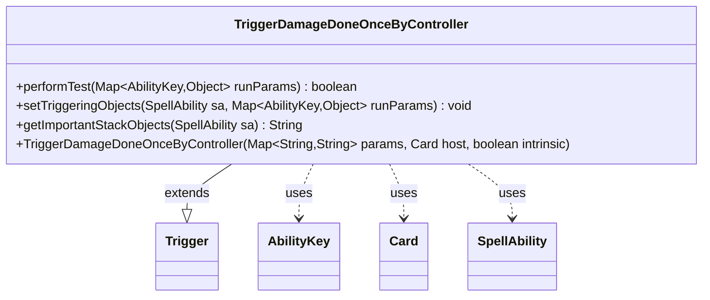

---
aliases:
  - TriggerDamageDoneOnceByController
tags:
  - java/class
  - module/forge-game
  - pkg/forge/game/trigger
fqn: forge.game.trigger.TriggerDamageDoneOnceByController
package: forge.game.trigger
module: forge-game
kind: Class
---

# TriggerDamageDoneOnceByController

**Package:** `forge.game.trigger`   **Module:** `forge-game`   **Kind:** Class



## Relationships
**Extends:**
- [[forge.game.trigger.Trigger|Trigger]]
**Uses:**
- [[forge.game.ability.AbilityKey|AbilityKey]]
- [[forge.game.card.Card|Card]]
- [[forge.game.spellability.SpellAbility|SpellAbility]]

## Design Description

TriggerDamageDoneOnceByController is a concrete trigger that fires when damage is dealt, specializing the abstract Trigger base class for the "damage done once by controller" event. It implements the standard trigger contract by overriding performTest to filter events—optionally constraining to combat damage and validating the damage target and source against the trigger's ValidTarget and ValidSource parameters—and setTriggeringObjects to expose the damaged target and damage source under the Target and Source AbilityKeys.

Collaborating with AbilityKey to read typed run parameters, Card for target identity, and SpellAbility as the trigger's executing ability, the class reflects two notable design choices: it snapshots a Card target via CardCopyService.getLKICopy so the triggered ability references last-known information rather than the live, mutable object, and it builds a localized, human-readable stack summary through Localizer in getImportantStackObjects.

## Source
`forge-game/src/main/java/forge/game/trigger/TriggerDamageDoneOnceByController.java`

```java
package forge.game.trigger;

import java.util.Map;

import forge.game.ability.AbilityKey;
import forge.game.card.Card;
import forge.game.card.CardCopyService;
import forge.game.spellability.SpellAbility;
import forge.util.Localizer;

public class TriggerDamageDoneOnceByController extends Trigger {

    public TriggerDamageDoneOnceByController(Map<String, String> params, Card host, boolean intrinsic) {
        super(params, host, intrinsic);

    }

    @Override
    public boolean performTest(Map<AbilityKey, Object> runParams) {
        if (hasParam("CombatDamage")) {
            if (getParam("CombatDamage").equals("True") != (Boolean) runParams.get(AbilityKey.IsCombatDamage)) {
                return false;
            }
        }

        if (!matchesValidParam("ValidTarget", runParams.get(AbilityKey.DamageTarget))) {
            return false;
        }

        if (!matchesValidParam("ValidSource", runParams.get(AbilityKey.DamageSource))) {
            return false;
        }

        return true;
    }

    @Override
    public void setTriggeringObjects(SpellAbility sa, Map<AbilityKey, Object> runParams) {
        Object target = runParams.get(AbilityKey.DamageTarget);
        if (target instanceof Card) {
            target = CardCopyService.getLKICopy((Card)runParams.get(AbilityKey.DamageTarget));
        }
        sa.setTriggeringObject(AbilityKey.Target, target);
        sa.setTriggeringObject(AbilityKey.Source, runParams.get(AbilityKey.DamageSource));
    }

    @Override
    public String getImportantStackObjects(SpellAbility sa) {
        StringBuilder sb = new StringBuilder();
        if (sa.getTriggeringObject(AbilityKey.Target) != null) {
            sb.append(Localizer.getInstance().getMessage("lblDamaged")).append(": ").append(sa.getTriggeringObject(AbilityKey.Target)).append(", ");
        }
        sb.append(Localizer.getInstance().getMessage("lblDamageSource")).append(": ").append(sa.getTriggeringObject(AbilityKey.Source));
        return sb.toString();
    }
}
```

## Python
`forge/game/trigger/TriggerDamageDoneOnceByController.py`

```python
from forge.game.trigger.Trigger import Trigger
from forge.game.ability.AbilityKey import AbilityKey
from forge.game.card.Card import Card
from forge.game.card.CardCopyService import CardCopyService
from forge.game.spellability.SpellAbility import SpellAbility
from forge.util.Localizer import Localizer


class TriggerDamageDoneOnceByController(Trigger):

    def __init__(self, params: dict[str, str], host: Card, intrinsic: bool):
        super().__init__(params, host, intrinsic)

    def performTest(self, runParams: dict[AbilityKey, object]) -> bool:
        if self.hasParam("CombatDamage"):
            if (self.getParam("CombatDamage") == "True") != runParams.get(AbilityKey.IsCombatDamage):
                return False

        if not self.matchesValidParam("ValidTarget", runParams.get(AbilityKey.DamageTarget)):
            return False

        if not self.matchesValidParam("ValidSource", runParams.get(AbilityKey.DamageSource)):
            return False

        return True

    def setTriggeringObjects(self, sa: SpellAbility, runParams: dict[AbilityKey, object]) -> None:
        target = runParams.get(AbilityKey.DamageTarget)
        if isinstance(target, Card):
            target = CardCopyService.getLKICopy(runParams.get(AbilityKey.DamageTarget))
        sa.setTriggeringObject(AbilityKey.Target, target)
        sa.setTriggeringObject(AbilityKey.Source, runParams.get(AbilityKey.DamageSource))

    def getImportantStackObjects(self, sa: SpellAbility) -> str:
        sb = []
        if sa.getTriggeringObject(AbilityKey.Target) is not None:
            sb.append(Localizer.getInstance().getMessage("lblDamaged"))
            sb.append(": ")
            sb.append(str(sa.getTriggeringObject(AbilityKey.Target)))
            sb.append(", ")
        sb.append(Localizer.getInstance().getMessage("lblDamageSource"))
        sb.append(": ")
        sb.append(str(sa.getTriggeringObject(AbilityKey.Source)))
        return "".join(sb)
```
