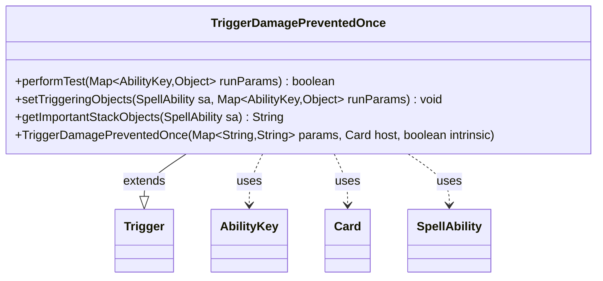

---
aliases:
  - TriggerDamagePreventedOnce
tags:
  - java/class
  - module/forge-game
  - pkg/forge/game/trigger
fqn: forge.game.trigger.TriggerDamagePreventedOnce
package: forge.game.trigger
module: forge-game
kind: Class
---

# TriggerDamagePreventedOnce

**Package:** `forge.game.trigger`   **Module:** `forge-game`   **Kind:** Class



## Relationships
**Extends:**
- [[forge.game.trigger.Trigger|Trigger]]
**Uses:**
- [[forge.game.ability.AbilityKey|AbilityKey]]
- [[forge.game.card.Card|Card]]
- [[forge.game.spellability.SpellAbility|SpellAbility]]

## Design Description

TriggerDamagePreventedOnce is a concrete trigger that fires when damage is prevented, screening events against the card's configured conditions and exposing the prevented-damage context to the resulting ability. As a subclass of Trigger, it implements the framework's template-method contract: `performTest` validates each damage event against optional parameters—the damage target (`ValidTarget`), whether it was combat damage, and a comparison on the damage amount via `Expressions`—while `setTriggeringObjects` populates the firing SpellAbility with the target and amount keyed by `AbilityKey`. It collaborates with Card as its host, SpellAbility as the triggered effect, and the AbilityKey map as the run-parameter protocol shared across all triggers. Design intent is evident in its declarative, parameter-driven matching and its delegation of localized, human-readable stack descriptions to `getImportantStackObjects`, keeping the class data-configurable rather than hard-coding specific card behavior.

## Source
`forge-game/src/main/java/forge/game/trigger/TriggerDamagePreventedOnce.java`

```java
/*
 * Forge: Play Magic: the Gathering.
 * Copyright (C) 2011  Forge Team
 *
 * This program is free software: you can redistribute it and/or modify
 * it under the terms of the GNU General Public License as published by
 * the Free Software Foundation, either version 3 of the License, or
 * (at your option) any later version.
 * 
 * This program is distributed in the hope that it will be useful,
 * but WITHOUT ANY WARRANTY; without even the implied warranty of
 * MERCHANTABILITY or FITNESS FOR A PARTICULAR PURPOSE.  See the
 * GNU General Public License for more details.
 * 
 * You should have received a copy of the GNU General Public License
 * along with this program.  If not, see <http://www.gnu.org/licenses/>.
 */
package forge.game.trigger;

import java.util.Map;

import forge.game.ability.AbilityKey;
import forge.game.card.Card;
import forge.game.spellability.SpellAbility;
import forge.util.Expressions;
import forge.util.Localizer;

/**
 * <p>
 * Trigger_DamageDone class.
 * </p>
 * 
 * @author Forge
 * @version $Id: TriggerDamageDone.java 32373 2016-10-19 10:36:17Z Hanmac $
 */
public class TriggerDamagePreventedOnce extends Trigger {

    /**
     * <p>
     * Constructor for Trigger_DamageDone.
     * </p>
     * 
     * @param params
     *            a {@link java.util.HashMap} object.
     * @param host
     *            a {@link forge.game.card.Card} object.
     * @param intrinsic
     *            the intrinsic
     */
    public TriggerDamagePreventedOnce(final Map<String, String> params, final Card host, final boolean intrinsic) {
        super(params, host, intrinsic);
    }

    /** {@inheritDoc}
     * @param runParams*/
    @Override
    public final boolean performTest(final Map<AbilityKey, Object> runParams) {
        if (!matchesValidParam("ValidTarget", runParams.get(AbilityKey.DamageTarget))) {
            return false;
        }

        if (hasParam("CombatDamage")) {
            if (getParam("CombatDamage").equals("True") != ((Boolean) runParams.get(AbilityKey.IsCombatDamage))) {
                return false;
            }
        }

        if (hasParam("DamageAmount")) {
            final String fullParam = getParam("DamageAmount");

            final String operator = fullParam.substring(0, 2);
            final int operand = Integer.parseInt(fullParam.substring(2));
            final int actualAmount = (Integer) runParams.get(AbilityKey.DamageAmount);

            if (!Expressions.compare(actualAmount, operator, operand)) {
                return false;
            }
        }

        return true;
    }

    /** {@inheritDoc} */
    @Override
    public final void setTriggeringObjects(final SpellAbility sa, Map<AbilityKey, Object> runParams) {
        sa.setTriggeringObject(AbilityKey.Target, runParams.get(AbilityKey.DamageTarget));
        sa.setTriggeringObjectsFrom(runParams, AbilityKey.DamageAmount);
    }

    @Override
    public String getImportantStackObjects(SpellAbility sa) {
        StringBuilder sb = new StringBuilder();
        sb.append(Localizer.getInstance().getMessage("lblDamageTarget")).append(": ").append(sa.getTriggeringObject(AbilityKey.Target)).append(", ");
        sb.append(Localizer.getInstance().getMessage("lblAmount")).append(": ").append(sa.getTriggeringObject(AbilityKey.DamageAmount));
        return sb.toString();
    }
}
```

## Python
`forge/game/trigger/TriggerDamagePreventedOnce.py`

```python
from forge.game.trigger.Trigger import Trigger
from forge.game.ability.AbilityKey import AbilityKey
from forge.game.card.Card import Card
from forge.game.spellability.SpellAbility import SpellAbility
from forge.util.Expressions import Expressions
from forge.util.Localizer import Localizer


class TriggerDamagePreventedOnce(Trigger):

    def __init__(self, params: dict[str, str], host: Card, intrinsic: bool):
        super().__init__(params, host, intrinsic)

    def performTest(self, runParams: dict[AbilityKey, object]) -> bool:
        if not self.matchesValidParam("ValidTarget", runParams.get(AbilityKey.DamageTarget)):
            return False

        if self.hasParam("CombatDamage"):
            if (self.getParam("CombatDamage") == "True") != runParams.get(AbilityKey.IsCombatDamage):
                return False

        if self.hasParam("DamageAmount"):
            fullParam = self.getParam("DamageAmount")

            operator = fullParam[0:2]
            operand = int(fullParam[2:])
            actualAmount = runParams.get(AbilityKey.DamageAmount)

            if not Expressions.compare(actualAmount, operator, operand):
                return False

        return True

    def setTriggeringObjects(self, sa: SpellAbility, runParams: dict[AbilityKey, object]) -> None:
        sa.setTriggeringObject(AbilityKey.Target, runParams.get(AbilityKey.DamageTarget))
        sa.setTriggeringObjectsFrom(runParams, AbilityKey.DamageAmount)

    def getImportantStackObjects(self, sa: SpellAbility) -> str:
        sb = []
        sb.append(Localizer.getInstance().getMessage("lblDamageTarget"))
        sb.append(": ")
        sb.append(str(sa.getTriggeringObject(AbilityKey.Target)))
        sb.append(", ")
        sb.append(Localizer.getInstance().getMessage("lblAmount"))
        sb.append(": ")
        sb.append(str(sa.getTriggeringObject(AbilityKey.DamageAmount)))
        return "".join(sb)
```
