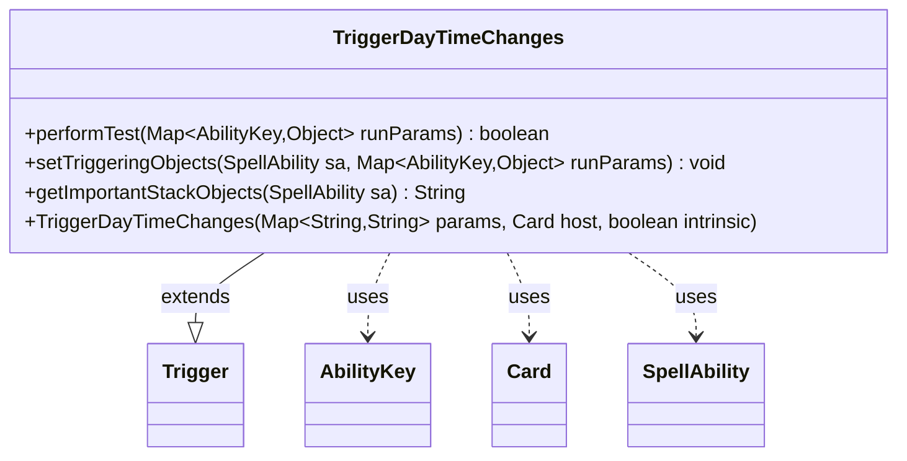

---
aliases:
  - TriggerDayTimeChanges
tags:
  - java/class
  - module/forge-game
  - pkg/forge/game/trigger
fqn: forge.game.trigger.TriggerDayTimeChanges
package: forge.game.trigger
module: forge-game
kind: Class
---

# TriggerDayTimeChanges

**Package:** `forge.game.trigger` &nbsp; **Module:** `forge-game` &nbsp; **Kind:** Class



## Relationships
**Extends:**
- [[forge.game.trigger.Trigger|Trigger]]
**Uses:**
- [[forge.game.ability.AbilityKey|AbilityKey]]
- [[forge.game.card.Card|Card]]
- [[forge.game.spellability.SpellAbility|SpellAbility]]

## Design Description

Trigger that fires when the day/night designation of the game changes. As a concrete subclass of `Trigger`, it plugs into Forge's event-driven triggered-ability system, supplying the three hooks the framework invokes when evaluating triggers. `performTest` returns `true` unconditionally, since the day/time change is itself the complete condition and needs no further parameter checking; the contributed listing in `getImportantStackObjects` and the `setTriggeringObjects` body are empty because this trigger exposes no triggering objects beyond the event. The constructor merely forwards its parameter map, host `Card`, and intrinsic flag to the superclass, leaving all state management to `Trigger`. It collaborates with `AbilityKey` and `SpellAbility` only to satisfy the inherited method signatures, reflecting a deliberately minimal design in which the engine's day/time bookkeeping lives elsewhere and this class simply marks the firing point.

## Source
`forge-game/src/main/java/forge/game/trigger/TriggerDayTimeChanges.java`

```java
package forge.game.trigger;

import java.util.Map;

import forge.game.ability.AbilityKey;
import forge.game.card.Card;
import forge.game.spellability.SpellAbility;

public class TriggerDayTimeChanges extends Trigger {

    public TriggerDayTimeChanges(Map<String, String> params, Card host, boolean intrinsic) {
        super(params, host, intrinsic);
    }

    @Override
    public boolean performTest(Map<AbilityKey, Object> runParams) {
        return true;
    }

    @Override
    public void setTriggeringObjects(SpellAbility sa, Map<AbilityKey, Object> runParams) {
    }

    @Override
    public String getImportantStackObjects(SpellAbility sa) {
        return "";
    }

}
```

## Python
`forge/game/trigger/TriggerDayTimeChanges.py`

```python
from typing import Map  # noqa

from forge.game.ability.AbilityKey import AbilityKey
from forge.game.card.Card import Card
from forge.game.spellability.SpellAbility import SpellAbility
from forge.game.trigger.Trigger import Trigger


class TriggerDayTimeChanges(Trigger):

    def __init__(self, params: dict[str, str], host: Card, intrinsic: bool):
        super().__init__(params, host, intrinsic)

    def performTest(self, runParams: dict[AbilityKey, object]) -> bool:
        return True

    def setTriggeringObjects(self, sa: SpellAbility, runParams: dict[AbilityKey, object]) -> None:
        pass

    def getImportantStackObjects(self, sa: SpellAbility) -> str:
        return ""
```
