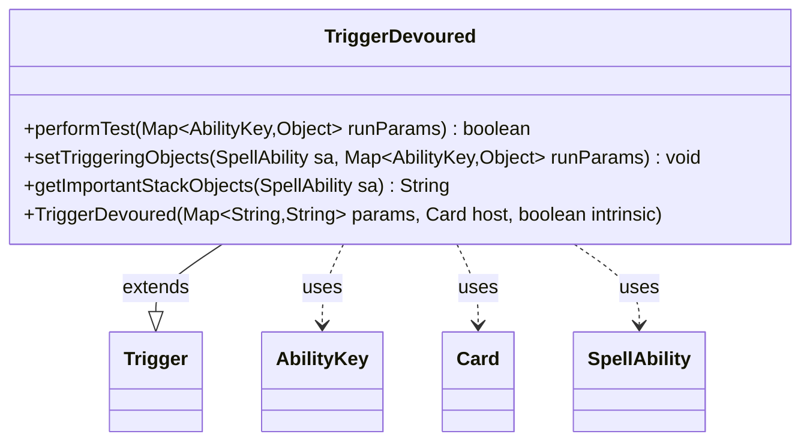

---
aliases:
  - TriggerDevoured
tags:
  - java/class
  - module/forge-game
  - pkg/forge/game/trigger
fqn: forge.game.trigger.TriggerDevoured
package: forge.game.trigger
module: forge-game
kind: Class
---

# TriggerDevoured

**Package:** `forge.game.trigger`   **Module:** `forge-game`   **Kind:** Class



## Relationships
**Extends:**
- [[forge.game.trigger.Trigger|Trigger]]
**Uses:**
- [[forge.game.ability.AbilityKey|AbilityKey]]
- [[forge.game.card.Card|Card]]
- [[forge.game.spellability.SpellAbility|SpellAbility]]

## Design Description

TriggerDevoured is a concrete trigger type that fires when a creature is devoured—sacrificed to another permanent as it enters the battlefield. Extending the abstract Trigger base class, it implements the engine's standard trigger contract: performTest gates firing by matching the configured "ValidDevoured" parameter against the devoured object supplied in the run parameters, while setTriggeringObjects publishes that object into the spell ability's triggering context under the AbilityKey.Devoured key.

It collaborates with Card (its host), SpellAbility (the resolving effect it feeds), and the AbilityKey enum that keys triggered-object lookups. The design follows Forge's data-driven trigger pattern, where each subclass supplies only event-specific matching and object-binding logic, deferring construction and lifecycle to the superclass. getImportantStackObjects adds a localized, human-readable stack summary, keeping presentation concerns isolated to a single overridable method.

## Source
`forge-game/src/main/java/forge/game/trigger/TriggerDevoured.java`

```java
/*
 * Forge: Play Magic: the Gathering.
 * Copyright (C) 2011  Forge Team
 *
 * This program is free software: you can redistribute it and/or modify
 * it under the terms of the GNU General Public License as published by
 * the Free Software Foundation, either version 3 of the License, or
 * (at your option) any later version.
 * 
 * This program is distributed in the hope that it will be useful,
 * but WITHOUT ANY WARRANTY; without even the implied warranty of
 * MERCHANTABILITY or FITNESS FOR A PARTICULAR PURPOSE.  See the
 * GNU General Public License for more details.
 * 
 * You should have received a copy of the GNU General Public License
 * along with this program.  If not, see <http://www.gnu.org/licenses/>.
 */
package forge.game.trigger;

import java.util.Map;

import forge.game.ability.AbilityKey;
import forge.game.card.Card;
import forge.game.spellability.SpellAbility;
import forge.util.Localizer;

/**
 * <p>
 * Trigger_Devoured class.
 * </p>
 * 
 * @author Forge
 * @version $Id: TriggerSacrificed.java 17802 2012-10-31 08:05:14Z Max mtg $
 */
public class TriggerDevoured extends Trigger {

    /**
     * <p>
     * Constructor for Trigger_Devoured.
     * </p>
     * 
     * @param params
     *            a {@link java.util.HashMap} object.
     * @param host
     *            a {@link forge.game.card.Card} object.
     * @param intrinsic
     *            the intrinsic
     */
    public TriggerDevoured(final Map<String, String> params, final Card host, final boolean intrinsic) {
        super(params, host, intrinsic);
    }

    /** {@inheritDoc}
     * @param runParams*/
    @Override
    public final boolean performTest(final Map<AbilityKey, Object> runParams) {
        if (!matchesValidParam("ValidDevoured", runParams.get(AbilityKey.Devoured))) {
            return false;
        }

        return true;
    }

    /** {@inheritDoc} */
    @Override
    public final void setTriggeringObjects(final SpellAbility sa, Map<AbilityKey, Object> runParams) {
        sa.setTriggeringObjectsFrom(runParams, AbilityKey.Devoured);
    }

    @Override
    public String getImportantStackObjects(SpellAbility sa) {
        StringBuilder sb = new StringBuilder();
        sb.append(Localizer.getInstance().getMessage("lblDevoured")).append(": ").append(sa.getTriggeringObject(AbilityKey.Devoured));
        return sb.toString();
    }
}
```

## Python
`forge/game/trigger/TriggerDevoured.py`

```python
package forge.game.trigger;

from typing import Map

from forge.game.ability.AbilityKey import AbilityKey
from forge.game.card.Card import Card
from forge.game.spellability.SpellAbility import SpellAbility
from forge.util.Localizer import Localizer
from forge.game.trigger.Trigger import Trigger


class TriggerDevoured(Trigger):

    def __init__(self, params: dict[str, str], host: Card, intrinsic: bool):
        super().__init__(params, host, intrinsic)

    def performTest(self, runParams: dict[AbilityKey, object]) -> bool:
        if not self.matchesValidParam("ValidDevoured", runParams.get(AbilityKey.Devoured)):
            return False

        return True

    def setTriggeringObjects(self, sa: SpellAbility, runParams: dict[AbilityKey, object]) -> None:
        sa.setTriggeringObjectsFrom(runParams, AbilityKey.Devoured)

    def getImportantStackObjects(self, sa: SpellAbility) -> str:
        sb = []
        sb.append(Localizer.getInstance().getMessage("lblDevoured"))
        sb.append(": ")
        sb.append(str(sa.getTriggeringObject(AbilityKey.Devoured)))
        return "".join(sb)
```
