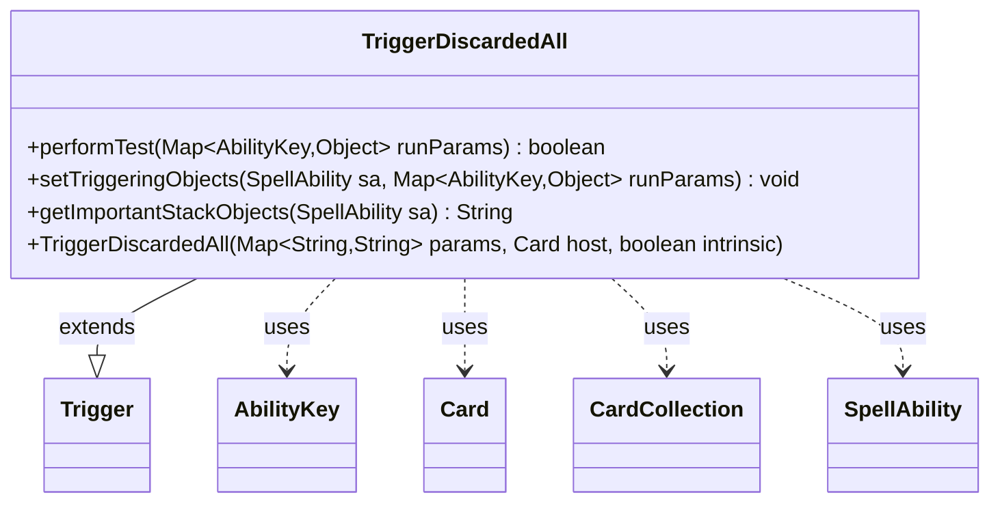

---
aliases:
  - TriggerDiscardedAll
tags:
  - java/class
  - module/forge-game
  - pkg/forge/game/trigger
fqn: forge.game.trigger.TriggerDiscardedAll
package: forge.game.trigger
module: forge-game
kind: Class
---

# TriggerDiscardedAll

**Package:** `forge.game.trigger`   **Module:** `forge-game`   **Kind:** Class



## Relationships
**Extends:**
- [[forge.game.trigger.Trigger|Trigger]]
**Uses:**
- [[forge.game.ability.AbilityKey|AbilityKey]]
- [[forge.game.card.Card|Card]]
- [[forge.game.card.CardCollection|CardCollection]]
- [[forge.game.spellability.SpellAbility|SpellAbility]]

## Design Description

TriggerDiscardedAll is a concrete trigger that fires when cards are discarded as a batch, recognizing the game event and gating it against the trigger's declared conditions. As a subclass of Trigger, it implements the standard trigger contract: performTest validates the runtime parameters—the discarding Player, the Cause, and the discarded Cards—against the optional ValidPlayer, ValidCause, and ValidCard restrictions, and additionally supports a FirstTime mode that suppresses the trigger if any qualifying card was already discarded earlier in the turn. setTriggeringObjects then filters the discarded CardCollection through the same ValidCard predicate and exposes the matching cards, their count, and the source Player and Cause as triggering objects for the resulting SpellAbility.

It collaborates with AbilityKey to key into the run parameters, leans on CardLists for the shared valid-card filtering logic, and surfaces a localized, human-readable summary of the player and amount through getImportantStackObjects—reflecting a design that keeps card-matching declarative and consistent with the broader trigger framework.

## Source
`forge-game/src/main/java/forge/game/trigger/TriggerDiscardedAll.java`

```java
package forge.game.trigger;

import java.util.List;
import java.util.Map;

import forge.game.ability.AbilityKey;
import forge.game.card.Card;
import forge.game.card.CardCollection;
import forge.game.card.CardLists;
import forge.game.spellability.SpellAbility;
import forge.util.Localizer;

public class TriggerDiscardedAll extends Trigger {

    public TriggerDiscardedAll(Map<String, String> params, Card host, boolean intrinsic) {
        super(params, host, intrinsic);
    }

    @Override
    public boolean performTest(Map<AbilityKey, Object> runParams) {
        if (!matchesValidParam("ValidPlayer", runParams.get(AbilityKey.Player))) {
            return false;
        }
        if (!matchesValidParam("ValidCause", runParams.get(AbilityKey.Cause))) {
            return false;
        }
        if (!matchesValidParam("ValidCard", runParams.get(AbilityKey.Cards))) {
            return false;
        }

        if (hasParam("FirstTime")) {
            List<Card> discardedBefore = (List<Card>) runParams.get(AbilityKey.DiscardedBefore);
            if (hasParam("ValidCard")) {
                discardedBefore = CardLists.getValidCardsAsList(discardedBefore, getParam("ValidCard"), getHostCard().getController(), getHostCard(), this);
            }
            if (discardedBefore.size() > 0) {
                return false;
            }
        }
        return true;
    }

    @Override
    public void setTriggeringObjects(SpellAbility sa, Map<AbilityKey, Object> runParams) {
        CardCollection cards = (CardCollection) runParams.get(AbilityKey.Cards);

        if (hasParam("ValidCard")) {
            cards = CardLists.getValidCards(cards, getParam("ValidCard"), getHostCard().getController(), getHostCard(), this);
        }

        sa.setTriggeringObject(AbilityKey.Cards, cards);
        sa.setTriggeringObject(AbilityKey.Amount, cards.size());
        sa.setTriggeringObjectsFrom(runParams, AbilityKey.Player, AbilityKey.Cause);
    }

    @Override
    public String getImportantStackObjects(SpellAbility sa) {
        StringBuilder sb = new StringBuilder();
        sb.append(Localizer.getInstance().getMessage("lblPlayer")).append(": ").append(sa.getTriggeringObject(AbilityKey.Player)).append(", ");
        sb.append(Localizer.getInstance().getMessage("lblAmount")).append(": ").append(sa.getTriggeringObject(AbilityKey.Amount));
        return sb.toString();
    }

}
```

## Python
`forge/game/trigger/TriggerDiscardedAll.py`

```python
from forge.game.ability.AbilityKey import AbilityKey
from forge.game.card.Card import Card
from forge.game.card.CardCollection import CardCollection
from forge.game.card.CardLists import CardLists
from forge.game.spellability.SpellAbility import SpellAbility
from forge.game.trigger.Trigger import Trigger
from forge.util.Localizer import Localizer


class TriggerDiscardedAll(Trigger):

    def __init__(self, params: dict[str, str], host: Card, intrinsic: bool):
        super().__init__(params, host, intrinsic)

    def performTest(self, runParams: dict[AbilityKey, object]) -> bool:
        if not self.matchesValidParam("ValidPlayer", runParams.get(AbilityKey.Player)):
            return False
        if not self.matchesValidParam("ValidCause", runParams.get(AbilityKey.Cause)):
            return False
        if not self.matchesValidParam("ValidCard", runParams.get(AbilityKey.Cards)):
            return False

        if self.hasParam("FirstTime"):
            discardedBefore = runParams.get(AbilityKey.DiscardedBefore)
            if self.hasParam("ValidCard"):
                discardedBefore = CardLists.getValidCardsAsList(discardedBefore, self.getParam("ValidCard"), self.getHostCard().getController(), self.getHostCard(), self)
            if len(discardedBefore) > 0:
                return False
        return True

    def setTriggeringObjects(self, sa: SpellAbility, runParams: dict[AbilityKey, object]) -> None:
        cards = runParams.get(AbilityKey.Cards)

        if self.hasParam("ValidCard"):
            cards = CardLists.getValidCards(cards, self.getParam("ValidCard"), self.getHostCard().getController(), self.getHostCard(), self)

        sa.setTriggeringObject(AbilityKey.Cards, cards)
        sa.setTriggeringObject(AbilityKey.Amount, cards.size())
        sa.setTriggeringObjectsFrom(runParams, AbilityKey.Player, AbilityKey.Cause)

    def getImportantStackObjects(self, sa: SpellAbility) -> str:
        sb = []
        sb.append(Localizer.getInstance().getMessage("lblPlayer")).append(": ").append(sa.getTriggeringObject(AbilityKey.Player)).append(", ")
        sb.append(Localizer.getInstance().getMessage("lblAmount")).append(": ").append(sa.getTriggeringObject(AbilityKey.Amount))
        return "".join(str(x) for x in sb)
```
