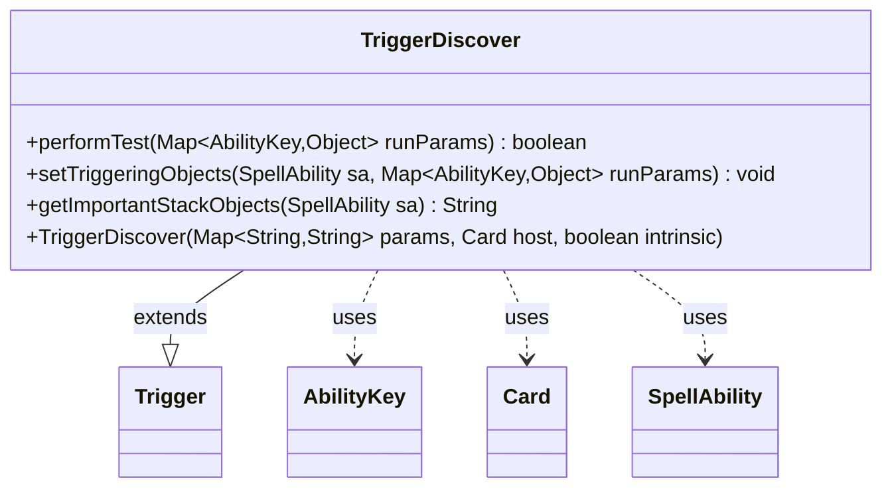

---
aliases:
  - TriggerDiscover
tags:
  - java/class
  - module/forge-game
  - pkg/forge/game/trigger
fqn: forge.game.trigger.TriggerDiscover
package: forge.game.trigger
module: forge-game
kind: Class
---

# TriggerDiscover

**Package:** `forge.game.trigger`   **Module:** `forge-game`   **Kind:** Class



## Relationships
**Extends:**
- [[forge.game.trigger.Trigger|Trigger]]
**Uses:**
- [[forge.game.ability.AbilityKey|AbilityKey]]
- [[forge.game.card.Card|Card]]
- [[forge.game.spellability.SpellAbility|SpellAbility]]

## Design Description

TriggerDiscover is a concrete trigger that fires in response to a "discover" event, matching when a player performs a discover action. As a subclass of Trigger, it implements the engine's standard trigger contract: performTest filters the event against the trigger's optional ValidPlayer restriction, setTriggeringObjects captures the relevant Player and Amount from the run parameters into the firing SpellAbility, and getImportantStackObjects produces a localized, human-readable summary of those objects for display on the stack.

The class collaborates with AbilityKey to address run parameters and triggering objects by well-known key, with Card as its host permanent, and with SpellAbility as the ability the trigger executes. Its design follows the data-driven pattern shared across Forge triggers — minimal per-trigger logic, configuration supplied through the params map passed to the constructor, and localization via Localizer to keep displayed text language-independent.

## Source
`forge-game/src/main/java/forge/game/trigger/TriggerDiscover.java`

```java
package forge.game.trigger;

import forge.game.ability.AbilityKey;
import forge.game.card.Card;
import forge.game.spellability.SpellAbility;
import forge.util.Localizer;

import java.util.Map;

public class TriggerDiscover extends Trigger {
    public TriggerDiscover(final Map<String, String> params, final Card host, final boolean intrinsic) {
        super(params, host, intrinsic);
    }

    @Override
    public boolean performTest(Map<AbilityKey, Object> runParams) {
        if (!matchesValidParam("ValidPlayer", runParams.get(AbilityKey.Player))) {
            return false;
        }
        return true;
    }

    @Override
    public void setTriggeringObjects(SpellAbility sa, Map<AbilityKey, Object> runParams) {
        sa.setTriggeringObjectsFrom(runParams, AbilityKey.Player, AbilityKey.Amount);
    }

    @Override
    public String getImportantStackObjects(SpellAbility sa) {
        StringBuilder sb = new StringBuilder();
        sb.append(Localizer.getInstance().getMessage("lblPlayer")).append(": ");
        sb.append(sa.getTriggeringObject(AbilityKey.Player)).append(", ");
        sb.append(Localizer.getInstance().getMessage("lblAmount")).append(": ");
        sb.append(sa.getTriggeringObject(AbilityKey.Amount));
        return sb.toString();
    }

}
```

## Python
`forge/game/trigger/TriggerDiscover.py`

```python
from forge.game.trigger.Trigger import Trigger
from forge.game.ability.AbilityKey import AbilityKey
from forge.game.card.Card import Card
from forge.game.spellability.SpellAbility import SpellAbility
from forge.util.Localizer import Localizer

from typing import Map


class TriggerDiscover(Trigger):
    def __init__(self, params: dict[str, str], host: Card, intrinsic: bool):
        super().__init__(params, host, intrinsic)

    def performTest(self, runParams: dict[AbilityKey, object]) -> bool:
        if not self.matchesValidParam("ValidPlayer", runParams.get(AbilityKey.Player)):
            return False
        return True

    def setTriggeringObjects(self, sa: SpellAbility, runParams: dict[AbilityKey, object]) -> None:
        sa.setTriggeringObjectsFrom(runParams, AbilityKey.Player, AbilityKey.Amount)

    def getImportantStackObjects(self, sa: SpellAbility) -> str:
        sb = []
        sb.append(Localizer.getInstance().getMessage("lblPlayer"))
        sb.append(": ")
        sb.append(str(sa.getTriggeringObject(AbilityKey.Player)))
        sb.append(", ")
        sb.append(Localizer.getInstance().getMessage("lblAmount"))
        sb.append(": ")
        sb.append(str(sa.getTriggeringObject(AbilityKey.Amount)))
        return "".join(sb)
```
