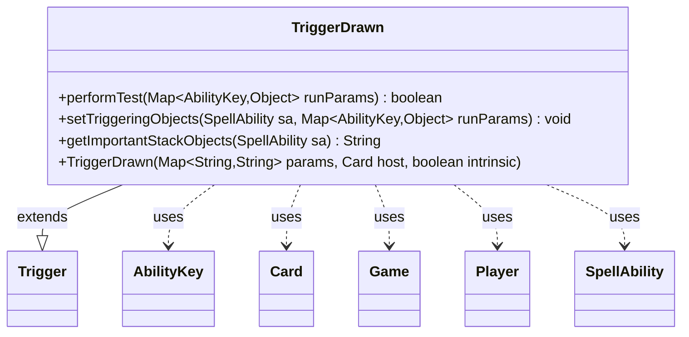

---
aliases:
  - TriggerDrawn
tags:
  - java/class
  - module/forge-game
  - pkg/forge/game/trigger
fqn: forge.game.trigger.TriggerDrawn
package: forge.game.trigger
module: forge-game
kind: Class
---

# TriggerDrawn

**Package:** `forge.game.trigger`   **Module:** `forge-game`   **Kind:** Class



## Relationships
**Extends:**
- [[forge.game.trigger.Trigger|Trigger]]
**Uses:**
- [[forge.game.Game|Game]]
- [[forge.game.ability.AbilityKey|AbilityKey]]
- [[forge.game.card.Card|Card]]
- [[forge.game.player.Player|Player]]
- [[forge.game.spellability.SpellAbility|SpellAbility]]

## Design Description

TriggerDrawn is a concrete trigger that fires when a card is drawn, extending the abstract `Trigger` base class within Forge's event-driven trigger framework. It overrides `performTest` to decide whether a draw event satisfies the trigger's configured conditions—validating the drawing player and card, matching an optional drawn-count, distinguishing the first card of the draw step, suppressing firing during the Mulligan stage, and honoring reveal constraints—by inspecting the `runParams` map keyed by `AbilityKey`.

It collaborates with `Game` and its phase handler to query game state, `Player` and `Card` as the event's subjects, and `SpellAbility` when binding triggering objects via `setTriggeringObjects` and reporting them through `getImportantStackObjects`. The design follows the template-method pattern of its supertype, keeping draw-specific matching logic isolated behind the parameter-driven, declarative interface shared by all triggers, with user-facing text localized through `Localizer`.

## Source
`forge-game/src/main/java/forge/game/trigger/TriggerDrawn.java`

```java
/*
 * Forge: Play Magic: the Gathering.
 * Copyright (C) 2011  Forge Team
 *
 * This program is free software: you can redistribute it and/or modify
 * it under the terms of the GNU General Public License as published by
 * the Free Software Foundation, either version 3 of the License, or
 * (at your option) any later version.
 * 
 * This program is distributed in the hope that it will be useful,
 * but WITHOUT ANY WARRANTY; without even the implied warranty of
 * MERCHANTABILITY or FITNESS FOR A PARTICULAR PURPOSE.  See the
 * GNU General Public License for more details.
 * 
 * You should have received a copy of the GNU General Public License
 * along with this program.  If not, see <http://www.gnu.org/licenses/>.
 */
package forge.game.trigger;

import java.util.Map;

import forge.game.Game;
import forge.game.GameStage;
import forge.game.ability.AbilityKey;
import forge.game.card.Card;
import forge.game.phase.PhaseType;
import forge.game.player.Player;
import forge.game.spellability.SpellAbility;
import forge.util.Localizer;

/**
 * <p>
 * Trigger_Drawn class.
 * </p>
 * 
 * @author Forge
 * @version $Id$
 */
public class TriggerDrawn extends Trigger {

    /**
     * <p>
     * Constructor for Trigger_Drawn.
     * </p>
     * 
     * @param params
     *            a {@link java.util.HashMap} object.
     * @param host
     *            a {@link forge.game.card.Card} object.
     * @param intrinsic
     *            the intrinsic
     */
    public TriggerDrawn(final Map<String, String> params, final Card host, final boolean intrinsic) {
        super(params, host, intrinsic);
    }

    /** {@inheritDoc}
     * @param runParams*/
    @Override
    public final boolean performTest(final Map<AbilityKey, Object> runParams) {
        final Game game = getHostCard().getGame();
        final int number = ((Integer) runParams.get(AbilityKey.Number));

        if (!matchesValidParam("ValidCard", runParams.get(AbilityKey.Card))) {
            return false;
        }
        if (!matchesValidParam("ValidPlayer", runParams.get(AbilityKey.Player))) {
            return false;
        }

        if (hasParam("Number")) {
            if (number != Integer.parseInt(getParam("Number"))) {
                return false;
            }
        }

        if (hasParam("FirstCardInDrawStep")) {
            final Player p = ((Player)runParams.get(AbilityKey.Player));
            if (getParam("FirstCardInDrawStep").equals("True")) {
                if (!game.getPhaseHandler().is(PhaseType.DRAW, p) || p.numDrawnThisDrawStep() > 1) {
                    return false;
                }
            } else {
                if (p.numDrawnThisDrawStep() == 1 && game.getPhaseHandler().is(PhaseType.DRAW, p)) {
                    return false;
                }
            }
        }

        // trigger should not happen while Mulligan
        if (game.getAge() == GameStage.Mulligan) {
            return false;
        }

        if (runParams.containsKey(AbilityKey.CanReveal)) {
            // while drawing this is only set if false
            boolean canReveal = (boolean) runParams.get(AbilityKey.CanReveal);
            if (hasParam("ForReveal")) {
                if (!canReveal) {
                    return false;
                }
            } else if (canReveal) {
                return false;
            }
        }

        return true;
    }

    /** {@inheritDoc} */
    @Override
    public final void setTriggeringObjects(final SpellAbility sa, Map<AbilityKey, Object> runParams) {
        sa.setTriggeringObjectsFrom(runParams, AbilityKey.Card, AbilityKey.Player);
    }

    @Override
    public String getImportantStackObjects(SpellAbility sa) {
        StringBuilder sb = new StringBuilder();
        sb.append(Localizer.getInstance().getMessage("lblPlayer")).append(": ").append(sa.getTriggeringObject(AbilityKey.Player));
        return sb.toString();
    }
}
```

## Python
`forge/game/trigger/TriggerDrawn.py`

```python
from forge.game.trigger.Trigger import Trigger
from forge.game.Game import Game
from forge.game.GameStage import GameStage
from forge.game.ability.AbilityKey import AbilityKey
from forge.game.card.Card import Card
from forge.game.phase.PhaseType import PhaseType
from forge.game.player.Player import Player
from forge.game.spellability.SpellAbility import SpellAbility
from forge.util.Localizer import Localizer
import typing


class TriggerDrawn(Trigger):
    """
    Trigger_Drawn class.

    @author Forge
    @version $Id$
    """

    def __init__(self, params: typing.Mapping[str, str], host: Card, intrinsic: bool):
        super().__init__(params, host, intrinsic)

    def performTest(self, runParams: typing.Mapping[AbilityKey, object]) -> bool:
        game = self.getHostCard().getGame()
        number = runParams.get(AbilityKey.Number)

        if not self.matchesValidParam("ValidCard", runParams.get(AbilityKey.Card)):
            return False
        if not self.matchesValidParam("ValidPlayer", runParams.get(AbilityKey.Player)):
            return False

        if self.hasParam("Number"):
            if number != int(self.getParam("Number")):
                return False

        if self.hasParam("FirstCardInDrawStep"):
            p = runParams.get(AbilityKey.Player)
            if self.getParam("FirstCardInDrawStep") == "True":
                if not game.getPhaseHandler().is_(PhaseType.DRAW, p) or p.numDrawnThisDrawStep() > 1:
                    return False
            else:
                if p.numDrawnThisDrawStep() == 1 and game.getPhaseHandler().is_(PhaseType.DRAW, p):
                    return False

        # trigger should not happen while Mulligan
        if game.getAge() == GameStage.Mulligan:
            return False

        if AbilityKey.CanReveal in runParams:
            # while drawing this is only set if false
            canReveal = runParams.get(AbilityKey.CanReveal)
            if self.hasParam("ForReveal"):
                if not canReveal:
                    return False
            elif canReveal:
                return False

        return True

    def setTriggeringObjects(self, sa: SpellAbility, runParams: typing.Mapping[AbilityKey, object]) -> None:
        sa.setTriggeringObjectsFrom(runParams, AbilityKey.Card, AbilityKey.Player)

    def getImportantStackObjects(self, sa: SpellAbility) -> str:
        sb = []
        sb.append(Localizer.getInstance().getMessage("lblPlayer"))
        sb.append(": ")
        sb.append(str(sa.getTriggeringObject(AbilityKey.Player)))
        return "".join(sb)
```
