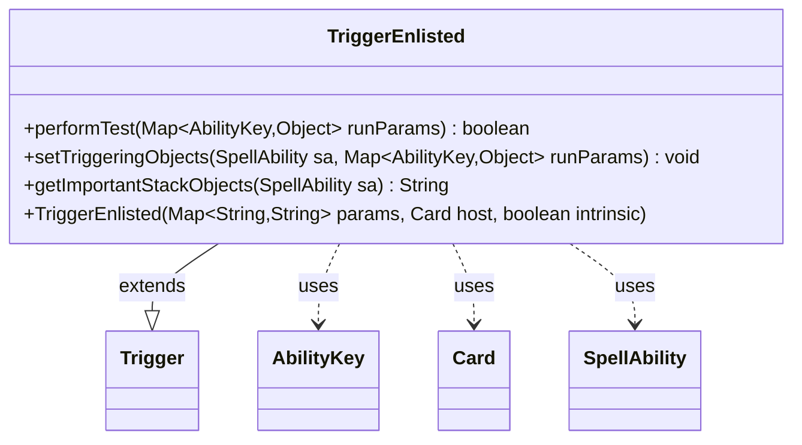

---
aliases:
  - TriggerEnlisted
tags:
  - java/class
  - module/forge-game
  - pkg/forge/game/trigger
fqn: forge.game.trigger.TriggerEnlisted
package: forge.game.trigger
module: forge-game
kind: Class
---

# TriggerEnlisted

**Package:** `forge.game.trigger` &nbsp; **Module:** `forge-game` &nbsp; **Kind:** Class



## Relationships
**Extends:**
- [[forge.game.trigger.Trigger|Trigger]]
**Uses:**
- [[forge.game.ability.AbilityKey|AbilityKey]]
- [[forge.game.card.Card|Card]]
- [[forge.game.spellability.SpellAbility|SpellAbility]]

## Design Description

TriggerEnlisted is a concrete trigger that fires in response to a creature being enlisted, a tap-an-untapped-creature mechanic. As a subclass of Trigger, it specializes the engine's trigger framework by implementing the template-method hooks its parent defines: performTest validates the event against the trigger's ValidCard and ValidEnlisted constraints, setTriggeringObjects exposes the relevant Card and Enlisted objects to the resolving ability, and getImportantStackObjects produces a localized stack description. It collaborates with AbilityKey to key into the runtime parameter map, operates on the SpellAbility being processed, and is owned by a host Card passed through to the superclass constructor. The design follows Forge's convention of one lightweight, stateless Trigger subclass per game event, delegating all shared bookkeeping to Trigger and keeping event-specific logic minimal and declarative.

## Source
`forge-game/src/main/java/forge/game/trigger/TriggerEnlisted.java`

```java
package forge.game.trigger;

import java.util.HashMap;
import java.util.Map;

import forge.game.ability.AbilityKey;
import forge.game.card.Card;
import forge.game.spellability.SpellAbility;
import forge.util.Localizer;

public class TriggerEnlisted extends Trigger {
    /**
     * <p>
     * Constructor for Trigger.
     * </p>
     *
     * @param params    a {@link HashMap} object.
     * @param host      a {@link Card} object.
     * @param intrinsic
     */
    public TriggerEnlisted(Map<String, String> params, Card host, boolean intrinsic) {
        super(params, host, intrinsic);
    }

    @Override
    public boolean performTest(Map<AbilityKey, Object> runParams) {
        if (!matchesValidParam("ValidCard", runParams.get(AbilityKey.Card))) {
            return false;
        }
        if (!matchesValidParam("ValidEnlisted", runParams.get(AbilityKey.Enlisted))) {
            return false;
        }
        return true;
    }

    @Override
    public void setTriggeringObjects(SpellAbility sa, Map<AbilityKey, Object> runParams) {
        sa.setTriggeringObjectsFrom(runParams, AbilityKey.Card, AbilityKey.Enlisted);
    }

    @Override
    public String getImportantStackObjects(SpellAbility sa) {
        StringBuilder sb = new StringBuilder();
        sb.append(Localizer.getInstance().getMessage("lblEnlisted")).append(": ").append(sa.getTriggeringObject(AbilityKey.Card));
        return sb.toString();
    }
}
```

## Python
`forge/game/trigger/TriggerEnlisted.py`

```python
from forge.game.trigger.Trigger import Trigger
from forge.game.ability.AbilityKey import AbilityKey
from forge.game.card.Card import Card
from forge.game.spellability.SpellAbility import SpellAbility
from forge.util.Localizer import Localizer


class TriggerEnlisted(Trigger):
    """
    Constructor for Trigger.

    @param params    a {@link HashMap} object.
    @param host      a {@link Card} object.
    @param intrinsic
    """
    def __init__(self, params: dict[str, str], host: Card, intrinsic: bool):
        super().__init__(params, host, intrinsic)

    def performTest(self, runParams: dict[AbilityKey, object]) -> bool:
        if not self.matchesValidParam("ValidCard", runParams.get(AbilityKey.Card)):
            return False
        if not self.matchesValidParam("ValidEnlisted", runParams.get(AbilityKey.Enlisted)):
            return False
        return True

    def setTriggeringObjects(self, sa: SpellAbility, runParams: dict[AbilityKey, object]) -> None:
        sa.setTriggeringObjectsFrom(runParams, AbilityKey.Card, AbilityKey.Enlisted)

    def getImportantStackObjects(self, sa: SpellAbility) -> str:
        sb = []
        sb.append(Localizer.getInstance().getMessage("lblEnlisted"))
        sb.append(": ")
        sb.append(str(sa.getTriggeringObject(AbilityKey.Card)))
        return "".join(sb)
```
