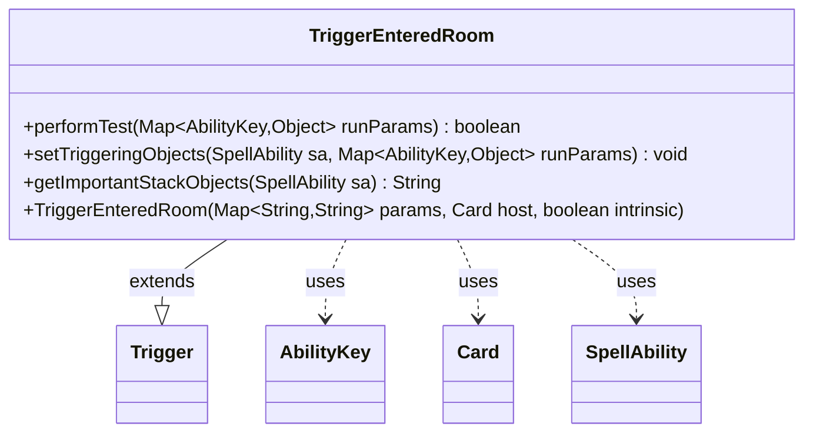

---
aliases:
  - TriggerEnteredRoom
tags:
  - java/class
  - module/forge-game
  - pkg/forge/game/trigger
fqn: forge.game.trigger.TriggerEnteredRoom
package: forge.game.trigger
module: forge-game
kind: Class
---

# TriggerEnteredRoom

**Package:** `forge.game.trigger` &nbsp; **Module:** `forge-game` &nbsp; **Kind:** Class



## Relationships
**Extends:**
- [[forge.game.trigger.Trigger|Trigger]]
**Uses:**
- [[forge.game.ability.AbilityKey|AbilityKey]]
- [[forge.game.card.Card|Card]]
- [[forge.game.spellability.SpellAbility|SpellAbility]]

## Source
`forge-game/src/main/java/forge/game/trigger/TriggerEnteredRoom.java`

```java
package forge.game.trigger;

import java.util.Map;

import forge.game.ability.AbilityKey;
import forge.game.card.Card;
import forge.game.spellability.SpellAbility;

public class TriggerEnteredRoom extends Trigger {

    public TriggerEnteredRoom(final Map<String, String> params, final Card host, final boolean intrinsic) {
        super(params, host, intrinsic);
    }

    @Override
    public final boolean performTest(final Map<AbilityKey, Object> runParams) {
        if (!matchesValidParam("ValidCard", runParams.get(AbilityKey.Card))) {
            return false;
        }

        if (!matchesValidParam("ValidRoom", runParams.get(AbilityKey.RoomName))) {
            return false;
        }

        return true;
    }

    @Override
    public final void setTriggeringObjects(final SpellAbility sa, Map<AbilityKey, Object> runParams) {
        sa.setTriggeringObjectsFrom(runParams, AbilityKey.RoomName);
    }

    public String getImportantStackObjects(SpellAbility sa) {
        Object roomName = sa.getTriggeringObject(AbilityKey.RoomName);
        if (roomName != null) {
            StringBuilder sb = new StringBuilder("Room: ");
            sb.append(roomName);
            return sb.toString();
        }
        return "";
    }
}
```
