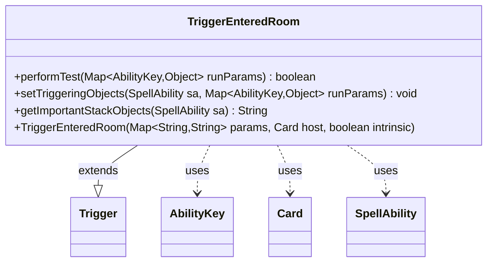

---
aliases:
  - TriggerEnteredRoom
tags:
  - java/class
  - module/forge-game
  - pkg/forge/game/trigger
fqn: forge.game.trigger.TriggerEnteredRoom
package: forge.game.trigger
module: forge-game
kind: Class
---

# TriggerEnteredRoom

**Package:** `forge.game.trigger`   **Module:** `forge-game`   **Kind:** Class



## Relationships
**Extends:**
- [[forge.game.trigger.Trigger|Trigger]]
**Uses:**
- [[forge.game.ability.AbilityKey|AbilityKey]]
- [[forge.game.card.Card|Card]]
- [[forge.game.spellability.SpellAbility|SpellAbility]]

## Design Description

TriggerEntered the Room? Let me write the description.

The `TriggerEnteredRoom` class is a concrete trigger that fires when a card enters a Room, supporting Magic: The Gathering's Room enchantment mechanic. As a subclass of `Trigger`, it specializes the engine's event-driven trigger framework by implementing the abstract contract for one specific game event. Its `performTest` method gates activation by validating the entering `Card` and the room name against the trigger's `ValidCard` and `ValidRoom` parameters, while `setTriggeringObjects` exposes the relevant `RoomName` to the resolving `SpellAbility`. It collaborates with `AbilityKey` as a typed key into the runtime parameter map, `Card` as the entering object, and `SpellAbility` as the ability being triggered. The overridden `getImportantStackObjects` formats a human-readable "Room: …" label for stack display, reflecting a design intent of keeping per-trigger presentation and matching logic encapsulated within each trigger subclass.

## Source
`forge-game/src/main/java/forge/game/trigger/TriggerEnteredRoom.java`

```java
package forge.game.trigger;

import java.util.Map;

import forge.game.ability.AbilityKey;
import forge.game.card.Card;
import forge.game.spellability.SpellAbility;

public class TriggerEnteredRoom extends Trigger {

    public TriggerEnteredRoom(final Map<String, String> params, final Card host, final boolean intrinsic) {
        super(params, host, intrinsic);
    }

    @Override
    public final boolean performTest(final Map<AbilityKey, Object> runParams) {
        if (!matchesValidParam("ValidCard", runParams.get(AbilityKey.Card))) {
            return false;
        }

        if (!matchesValidParam("ValidRoom", runParams.get(AbilityKey.RoomName))) {
            return false;
        }

        return true;
    }

    @Override
    public final void setTriggeringObjects(final SpellAbility sa, Map<AbilityKey, Object> runParams) {
        sa.setTriggeringObjectsFrom(runParams, AbilityKey.RoomName);
    }

    public String getImportantStackObjects(SpellAbility sa) {
        Object roomName = sa.getTriggeringObject(AbilityKey.RoomName);
        if (roomName != null) {
            StringBuilder sb = new StringBuilder("Room: ");
            sb.append(roomName);
            return sb.toString();
        }
        return "";
    }
}
```

## Python
`forge/game/trigger/TriggerEnteredRoom.py`

```python
from forge.game.trigger.Trigger import Trigger
from forge.game.ability.AbilityKey import AbilityKey
from forge.game.card.Card import Card
from forge.game.spellability.SpellAbility import SpellAbility


class TriggerEnteredRoom(Trigger):

    def __init__(self, params: dict[str, str], host: Card, intrinsic: bool):
        super().__init__(params, host, intrinsic)

    def performTest(self, runParams: dict[AbilityKey, object]) -> bool:
        if not self.matchesValidParam("ValidCard", runParams.get(AbilityKey.Card)):
            return False

        if not self.matchesValidParam("ValidRoom", runParams.get(AbilityKey.RoomName)):
            return False

        return True

    def setTriggeringObjects(self, sa: SpellAbility, runParams: dict[AbilityKey, object]) -> None:
        sa.setTriggeringObjectsFrom(runParams, AbilityKey.RoomName)

    def getImportantStackObjects(self, sa: SpellAbility) -> str:
        roomName = sa.getTriggeringObject(AbilityKey.RoomName)
        if roomName is not None:
            sb = "Room: "
            sb += str(roomName)
            return sb
        return ""
```
