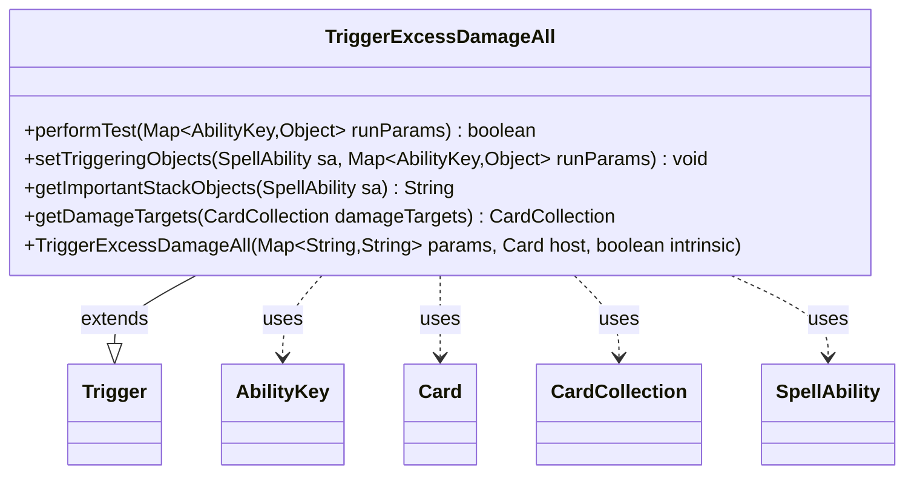

---
aliases:
  - TriggerExcessDamageAll
tags:
  - java/class
  - module/forge-game
  - pkg/forge/game/trigger
fqn: forge.game.trigger.TriggerExcessDamageAll
package: forge.game.trigger
module: forge-game
kind: Class
---

# TriggerExcessDamageAll

**Package:** `forge.game.trigger` &nbsp; **Module:** `forge-game` &nbsp; **Kind:** Class



## Relationships
**Extends:**
- [[forge.game.trigger.Trigger|Trigger]]
**Uses:**
- [[forge.game.ability.AbilityKey|AbilityKey]]
- [[forge.game.card.Card|Card]]
- [[forge.game.card.CardCollection|CardCollection]]
- [[forge.game.spellability.SpellAbility|SpellAbility]]

## Design Description

TriggerExcessDamageAll is a concrete trigger that fires when excess (or general) damage is dealt to a group of permanents, modeling Magic abilities that respond to "damage dealt to each" of a set of cards. As a subclass of Trigger, it implements the framework's template methods: performTest gates activation by optionally matching the CombatDamage condition and ensuring at least one valid damage target exists, while setTriggeringObjects exposes the surviving targets under AbilityKey.Targets for the resolving SpellAbility.

The class collaborates with the AbilityKey-keyed runParams map to read DamageTargets and combat-damage state, and centralizes filtering in getDamageTargets, which narrows a CardCollection to cards matching the optional ValidTarget restriction. This shared helper, reused by both the test and the triggering-object setup, keeps the filtering logic consistent, and getImportantStackObjects supplies a localized stack description, reflecting the engine's data-driven, parameterized trigger design.

## Source
`forge-game/src/main/java/forge/game/trigger/TriggerExcessDamageAll.java`

```java
package forge.game.trigger;

import java.util.Map;

import forge.game.ability.AbilityKey;
import forge.game.card.Card;
import forge.game.card.CardCollection;
import forge.game.spellability.SpellAbility;
import forge.util.Localizer;

public class TriggerExcessDamageAll extends Trigger {

    public TriggerExcessDamageAll(Map<String, String> params, Card host, boolean intrinsic) {
        super(params, host, intrinsic);
    }

    @Override
    public boolean performTest(Map<AbilityKey, Object> runParams) {
        if (hasParam("CombatDamage")) {
            if (getParam("CombatDamage").equalsIgnoreCase("True") != (Boolean) runParams.get(AbilityKey.IsCombatDamage)) {
                return false;
            }
        }
        if (getDamageTargets((CardCollection) runParams.get(AbilityKey.DamageTargets)).isEmpty()) {
            return false;
        }

        return true;
    }

    @Override
    public void setTriggeringObjects(SpellAbility sa, Map<AbilityKey, Object> runParams) {
        sa.setTriggeringObject(AbilityKey.Targets, getDamageTargets((CardCollection) runParams.get(AbilityKey.DamageTargets)));
    }

    @Override
    public String getImportantStackObjects(SpellAbility sa) {
        StringBuilder sb = new StringBuilder();
        sb.append(Localizer.getInstance().getMessage("lblDamaged")).append(": ").append(sa.getTriggeringObject(AbilityKey.Targets));
        return sb.toString();
    }

    public CardCollection getDamageTargets(CardCollection damageTargets) {
        if (!hasParam("ValidTarget")) {
            return damageTargets;
        }
        CardCollection result = new CardCollection();
        for (Card c : damageTargets) {
            if (matchesValidParam("ValidTarget", c)) {
                result.add(c);
            }
        }
        return result;
    }
}
```

## Python
`forge/game/trigger/TriggerExcessDamageAll.py`

```python
package="forge.game.trigger"

Let me produce the Python port.

The `Localizer` import is `forge.util.Localizer`.from forge.game.ability.AbilityKey import AbilityKey
from forge.game.card.Card import Card
from forge.game.card.CardCollection import CardCollection
from forge.game.spellability.SpellAbility import SpellAbility
from forge.game.trigger.Trigger import Trigger
from forge.util.Localizer import Localizer


class TriggerExcessDamageAll(Trigger):

    def __init__(self, params: dict[str, str], host: Card, intrinsic: bool):
        super().__init__(params, host, intrinsic)

    def performTest(self, runParams: dict[AbilityKey, object]) -> bool:
        if self.hasParam("CombatDamage"):
            if (self.getParam("CombatDamage").lower() == "true") != runParams.get(AbilityKey.IsCombatDamage):
                return False
        if len(self.getDamageTargets(runParams.get(AbilityKey.DamageTargets))) == 0:
            return False

        return True

    def setTriggeringObjects(self, sa: SpellAbility, runParams: dict[AbilityKey, object]) -> None:
        sa.setTriggeringObject(AbilityKey.Targets, self.getDamageTargets(runParams.get(AbilityKey.DamageTargets)))

    def getImportantStackObjects(self, sa: SpellAbility) -> str:
        sb = []
        sb.append(Localizer.getInstance().getMessage("lblDamaged"))
        sb.append(": ")
        sb.append(str(sa.getTriggeringObject(AbilityKey.Targets)))
        return "".join(sb)

    def getDamageTargets(self, damageTargets: CardCollection) -> CardCollection:
        if not self.hasParam("ValidTarget"):
            return damageTargets
        result = CardCollection()
        for c in damageTargets:
            if self.matchesValidParam("ValidTarget", c):
                result.add(c)
        return result
```
